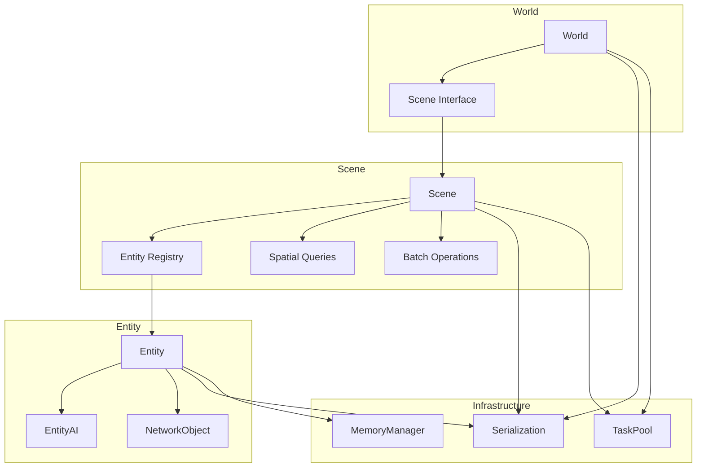
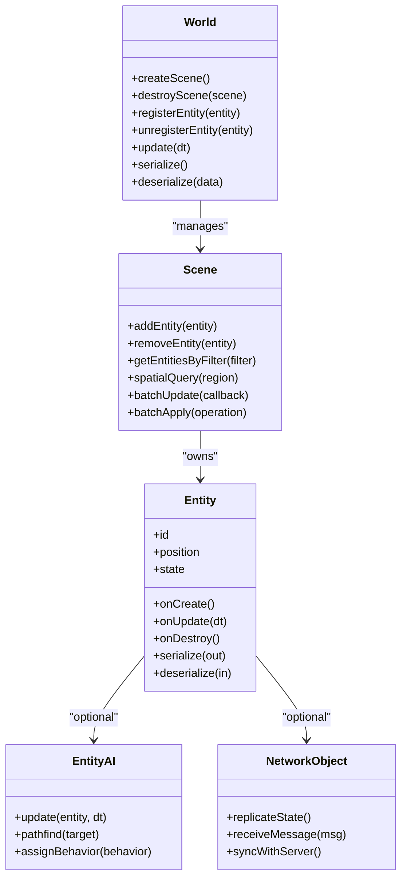
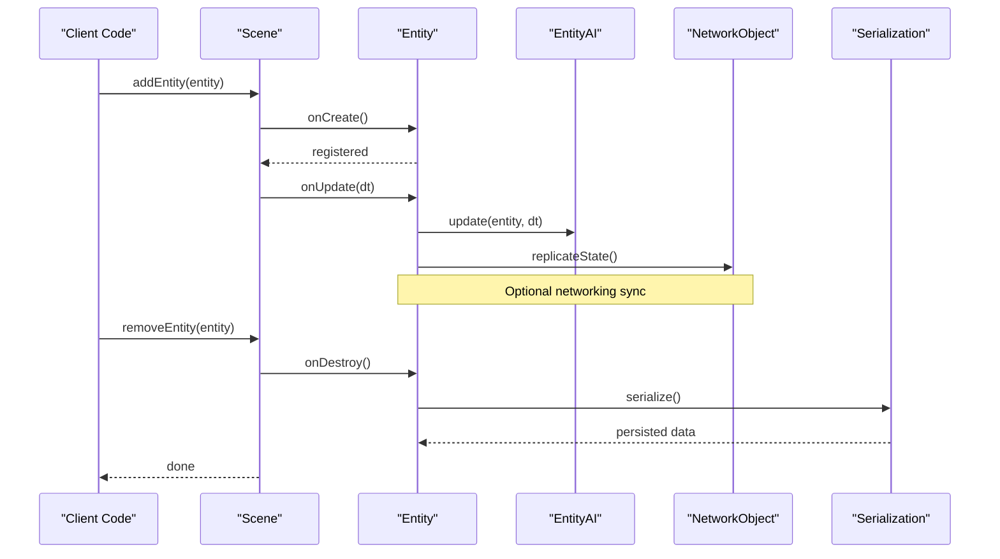
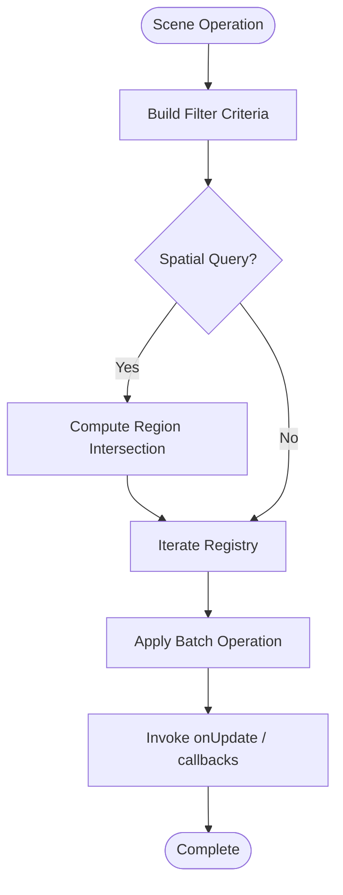
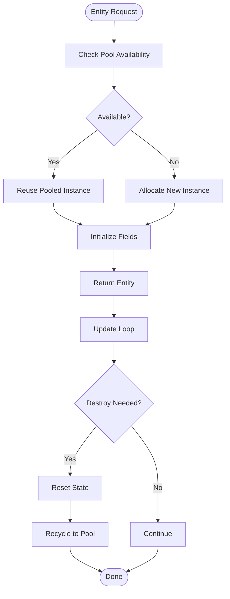
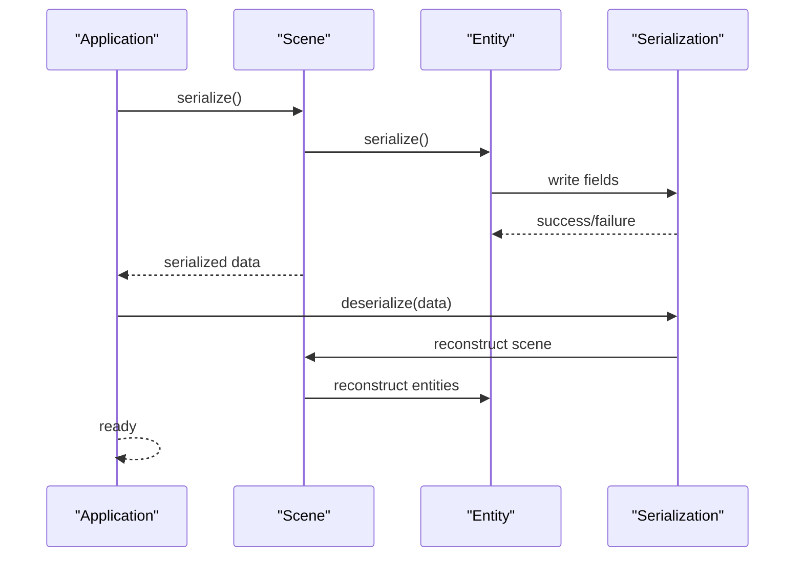
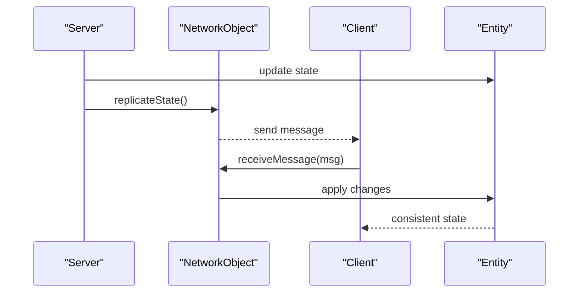
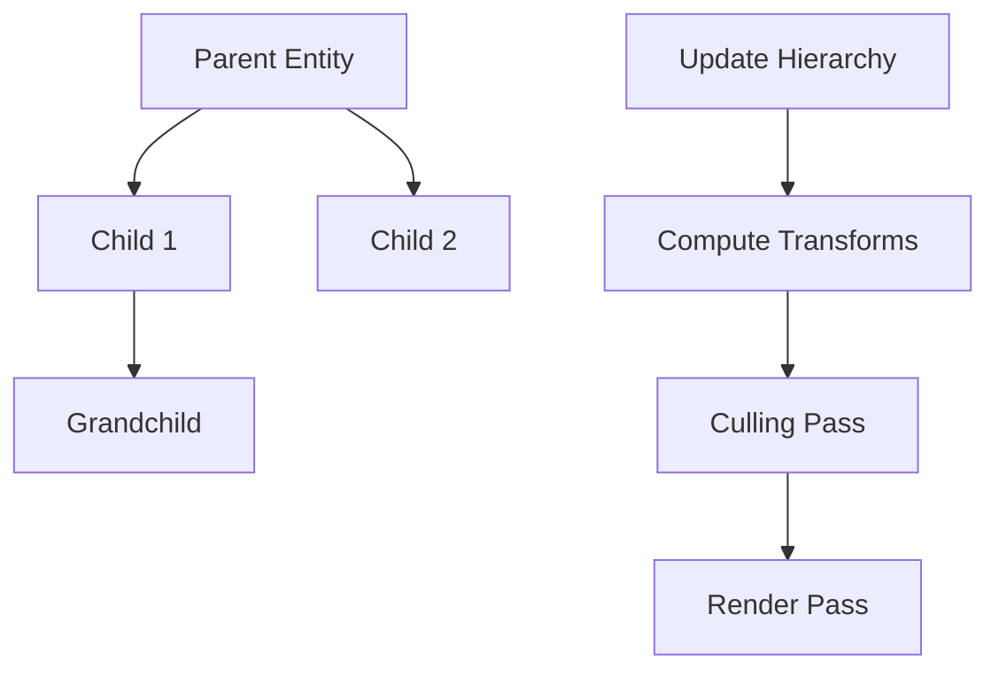
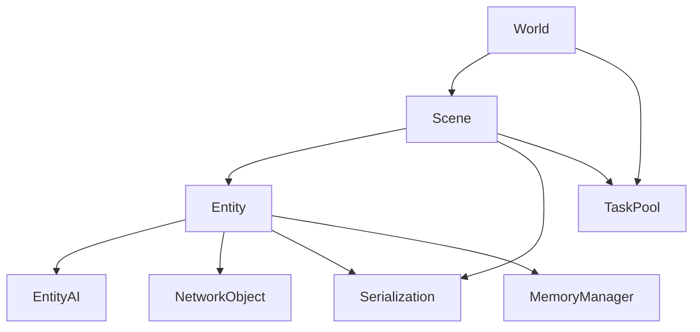

# Entity Lifecycle and Management

<cite>
**Referenced Files in This Document**
- [World.hpp](file://engine/Poseidon/World/World.hpp)
- [World.cpp](file://engine/Poseidon/World/World.cpp)
- [WorldImpl.cpp](file://engine/Poseidon/World/WorldImpl.cpp)
- [WorldInit.cpp](file://engine/Poseidon/World/WorldInit.cpp)
- [WorldShared.hpp](file://engine/Poseidon/World/WorldShared.hpp)
- [Scene.hpp](file://engine/Poseidon/World/Scene/Scene.hpp)
- [Scene.cpp](file://engine/Poseidon/World/Scene/Scene.cpp)
- [Entity.hpp](file://engine/Poseidon/World/Entities/Common/Entity.hpp)
- [Entity.cpp](file://engine/Poseidon/World/Entities/Common/Entity.cpp)
- [EntityAI.hpp](file://engine/Poseidon/AI/EntityAI.hpp)
- [EntityAI.cpp](file://engine/Poseidon/AI/EntityAI.cpp)
- [NetworkObject.hpp](file://engine/Poseidon/Network/NetworkObject.hpp)
- [NetworkMsg.hpp](file://engine/Poseidon/Network/NetworkMsg.hpp)
- [Serialization.hpp](file://engine/Poseidon/IO/Serialization/Serialization.hpp)
- [TaskPool.hpp](file://engine/Poseidon/Core/TaskPool.hpp)
- [MemoryManager.hpp](file://engine/Poseidon/Foundation/Memory/MemoryManager.hpp)
</cite>

## Table of Contents
1. [Introduction](#introduction)
2. [Project Structure](#project-structure)
3. [Core Components](#core-components)
4. [Architecture Overview](#architecture-overview)
5. [Detailed Component Analysis](#detailed-component-analysis)
6. [Dependency Analysis](#dependency-analysis)
7. [Performance Considerations](#performance-considerations)
8. [Troubleshooting Guide](#troubleshooting-guide)
9. [Conclusion](#conclusion)
10. [Appendices](#appendices)

## Introduction
This document explains how entities are created, initialized, updated, and destroyed within the game world, and how scenes organize and manage them. It covers entity registration, spatial queries, batch operations, pooling strategies, memory management, garbage collection, serialization for save/load, and network synchronization across clients. It also provides guidance on managing hierarchies, implementing custom managers, debugging performance issues, filtering and selection systems, and bulk operations.

## Project Structure
The entity system is centered around World and Scene abstractions that coordinate entity lifecycle and scene-level organization. Entities encapsulate behavior and state, with optional AI and networking components. Serialization utilities support persistence, while task pools and memory managers underpin performance and resource control.

**Diagram sources**
- [World.hpp](file://engine/Poseidon/World/World.hpp)
- [Scene.hpp](file://engine/Poseidon/World/Scene/Scene.hpp)
- [Entity.hpp](file://engine/Poseidon/World/Entities/Common/Entity.hpp)
- [EntityAI.hpp](file://engine/Poseidon/AI/EntityAI.hpp)
- [NetworkObject.hpp](file://engine/Poseidon/Network/NetworkObject.hpp)
- [Serialization.hpp](file://engine/Poseidon/IO/Serialization/Serialization.hpp)
- [TaskPool.hpp](file://engine/Poseidon/Core/TaskPool.hpp)
- [MemoryManager.hpp](file://engine/Poseidon/Foundation/Memory/MemoryManager.hpp)

**Section sources**
- [World.hpp](file://engine/Poseidon/World/World.hpp)
- [Scene.hpp](file://engine/Poseidon/World/Scene/Scene.hpp)
- [Entity.hpp](file://engine/Poseidon/World/Entities/Common/Entity.hpp)

## Core Components
- World: Top-level coordinator for simulation, scene management, and global services (serialization, task scheduling).
- Scene: Manages a set of entities, handles registration, spatial queries, and batch updates.
- Entity: Base unit of state and behavior; may include AI and networking components.
- EntityAI: Optional AI behavior layer attached to entities.
- NetworkObject: Networking facade for replication and synchronization.
- Serialization: Utilities for saving/loading entity and scene state.
- TaskPool: Parallel execution infrastructure for update loops and heavy tasks.
- MemoryManager: Allocation strategies and pooling hooks.

Key responsibilities:
- Creation and destruction of entities through World/Scene APIs.
- Registration into scene registry and spatial structures.
- Update pipeline integration via task pool or per-frame callbacks.
- Serialization hooks for persistence and network messages.

**Section sources**
- [World.cpp](file://engine/Poseidon/World/World.cpp)
- [WorldImpl.cpp](file://engine/Poseidon/World/WorldImpl.cpp)
- [Scene.cpp](file://engine/Poseidon/World/Scene/Scene.cpp)
- [Entity.cpp](file://engine/Poseidon/World/Entities/Common/Entity.cpp)

## Architecture Overview
The architecture separates concerns between world orchestration, scene organization, and entity behavior. Scenes encapsulate entity sets and provide efficient spatial queries and batch operations. Entities can optionally integrate AI and networking layers. Persistence and synchronization are handled by dedicated subsystems.

**Diagram sources**
- [World.hpp](file://engine/Poseidon/World/World.hpp)
- [Scene.hpp](file://engine/Poseidon/World/Scene/Scene.hpp)
- [Entity.hpp](file://engine/Poseidon/World/Entities/Common/Entity.hpp)
- [EntityAI.hpp](file://engine/Poseidon/AI/EntityAI.hpp)
- [NetworkObject.hpp](file://engine/Poseidon/Network/NetworkObject.hpp)

## Detailed Component Analysis

### Entity Lifecycle
Entities follow a strict lifecycle: creation, initialization, update, and destruction. The lifecycle integrates with scene registration and optional AI/networking hooks.

**Diagram sources**
- [Scene.cpp](file://engine/Poseidon/World/Scene/Scene.cpp)
- [Entity.cpp](file://engine/Poseidon/World/Entities/Common/Entity.cpp)
- [EntityAI.cpp](file://engine/Poseidon/AI/EntityAI.cpp)
- [NetworkObject.hpp](file://engine/Poseidon/Network/NetworkObject.hpp)
- [Serialization.hpp](file://engine/Poseidon/IO/Serialization/Serialization.hpp)

**Section sources**
- [Entity.cpp](file://engine/Poseidon/World/Entities/Common/Entity.cpp)
- [Scene.cpp](file://engine/Poseidon/World/Scene/Scene.cpp)

### Scene Responsibilities
Scenes manage entity registration, spatial queries, and batch operations. They expose APIs to filter entities, query by region, and apply operations efficiently across large sets.

Key capabilities:
- Registration/unregistration of entities.
- Spatial queries using bounding volumes or grids.
- Batch update and apply methods to minimize overhead.
- Filtering by tags, types, or component presence.

**Diagram sources**
- [Scene.hpp](file://engine/Poseidon/World/Scene/Scene.hpp)
- [Scene.cpp](file://engine/Poseidon/World/Scene/Scene.cpp)

**Section sources**
- [Scene.hpp](file://engine/Poseidon/World/Scene/Scene.hpp)
- [Scene.cpp](file://engine/Poseidon/World/Scene/Scene.cpp)

### Entity Pooling and Memory Management
Pooling reduces allocation churn and improves cache locality. MemoryManager provides allocation strategies and hooks for custom allocators. Entities should be pooled when frequently created/destroyed.

Recommendations:
- Use fixed-size pools for hot entities (e.g., projectiles).
- Implement object reuse with reset semantics.
- Avoid dynamic allocations inside update loops.
- Profile memory usage and fragmentation.

**Diagram sources**
- [MemoryManager.hpp](file://engine/Poseidon/Foundation/Memory/MemoryManager.hpp)
- [TaskPool.hpp](file://engine/Poseidon/Core/TaskPool.hpp)

**Section sources**
- [MemoryManager.hpp](file://engine/Poseidon/Foundation/Memory/MemoryManager.hpp)
- [TaskPool.hpp](file://engine/Poseidon/Core/TaskPool.hpp)

### Serialization and Save/Load
Serialization converts entity and scene state to persistent formats. It supports both local saves and network payloads.

Process:
- Serialize entity fields and relationships.
- Write scene metadata and entity lists.
- Deserialize on load or receive from network.

**Diagram sources**
- [Serialization.hpp](file://engine/Poseidon/IO/Serialization/Serialization.hpp)
- [Scene.cpp](file://engine/Poseidon/World/Scene/Scene.cpp)
- [Entity.cpp](file://engine/Poseidon/World/Entities/Common/Entity.cpp)

**Section sources**
- [Serialization.hpp](file://engine/Poseidon/IO/Serialization/Serialization.hpp)

### Network Synchronization
Networking replicates entity state across clients. NetworkObject provides interfaces for sending and receiving messages.

Flow:
- Server updates authoritative state.
- Clients receive deltas or full snapshots.
- Entities reconcile state locally.

**Diagram sources**
- [NetworkObject.hpp](file://engine/Poseidon/Network/NetworkObject.hpp)
- [NetworkMsg.hpp](file://engine/Poseidon/Network/NetworkMsg.hpp)
- [Entity.cpp](file://engine/Poseidon/World/Entities/Common/Entity.cpp)

**Section sources**
- [NetworkObject.hpp](file://engine/Poseidon/Network/NetworkObject.hpp)
- [NetworkMsg.hpp](file://engine/Poseidon/Network/NetworkMsg.hpp)

### Managing Hierarchies
Hierarchical relationships allow parent-child transformations and scoped updates. Scenes can maintain transform trees for efficient culling and rendering.

Guidelines:
- Use parent references for transforms.
- Propagate updates down the hierarchy.
- Cache computed matrices where possible.

[No sources needed since this diagram shows conceptual workflow, not actual code structure]

### Custom Entity Managers
Implement custom managers to extend functionality:
- Derive from base entity interface.
- Integrate with scene registry.
- Provide specialized update logic.

Best practices:
- Keep update loops tight and predictable.
- Avoid heavy allocations during updates.
- Use profiling tools to identify bottlenecks.

**Section sources**
- [Entity.hpp](file://engine/Poseidon/World/Entities/Common/Entity.hpp)
- [Scene.hpp](file://engine/Poseidon/World/Scene/Scene.hpp)

### Debugging Performance Issues
Common issues:
- Excessive allocations in update loops.
- Poor spatial query performance.
- Inefficient batch operations.

Tools:
- Memory profilers to detect leaks.
- Frame analyzers to identify slow paths.
- Logging to trace entity counts and operations.

**Section sources**
- [TaskPool.hpp](file://engine/Poseidon/Core/TaskPool.hpp)
- [MemoryManager.hpp](file://engine/Poseidon/Foundation/Memory/MemoryManager.hpp)

## Dependency Analysis
Dependencies between core components ensure clear separation of concerns. World coordinates scenes, scenes manage entities, and entities optionally depend on AI and networking.

**Diagram sources**
- [World.hpp](file://engine/Poseidon/World/World.hpp)
- [Scene.hpp](file://engine/Poseidon/World/Scene/Scene.hpp)
- [Entity.hpp](file://engine/Poseidon/World/Entities/Common/Entity.hpp)
- [EntityAI.hpp](file://engine/Poseidon/AI/EntityAI.hpp)
- [NetworkObject.hpp](file://engine/Poseidon/Network/NetworkObject.hpp)
- [Serialization.hpp](file://engine/Poseidon/IO/Serialization/Serialization.hpp)
- [TaskPool.hpp](file://engine/Poseidon/Core/TaskPool.hpp)
- [MemoryManager.hpp](file://engine/Poseidon/Foundation/Memory/MemoryManager.hpp)

**Section sources**
- [World.cpp](file://engine/Poseidon/World/World.cpp)
- [Scene.cpp](file://engine/Poseidon/World/Scene/Scene.cpp)
- [Entity.cpp](file://engine/Poseidon/World/Entities/Common/Entity.cpp)

## Performance Considerations
- Use pooling for high-frequency entities to reduce GC pressure.
- Optimize spatial queries with broad-phase culling.
- Batch operations to minimize function call overhead.
- Profile update loops and avoid dynamic allocations.
- Leverage task pools for parallelism where safe.

[No sources needed since this section provides general guidance]

## Troubleshooting Guide
- Memory leaks: Use sanitizers and memory profilers.
- Stuttering: Identify long update loops and optimize.
- Desync: Verify serialization consistency and network message ordering.
- Crashes: Check null pointers and invalid entity states.

**Section sources**
- [TaskPool.hpp](file://engine/Poseidon/Core/TaskPool.hpp)
- [Serialization.hpp](file://engine/Poseidon/IO/Serialization/Serialization.hpp)

## Conclusion
The entity system provides a robust foundation for game worlds through clear separation of concerns, efficient scene management, and flexible entity behavior. By following best practices for pooling, serialization, and networking, developers can build scalable and performant applications.

[No sources needed since this section summarizes without analyzing specific files]

## Appendices
- Examples of entity filtering and selection systems.
- Bulk operation patterns for efficient manipulation.
- Integration with AI and networking layers.

[No sources needed since this section provides general guidance]