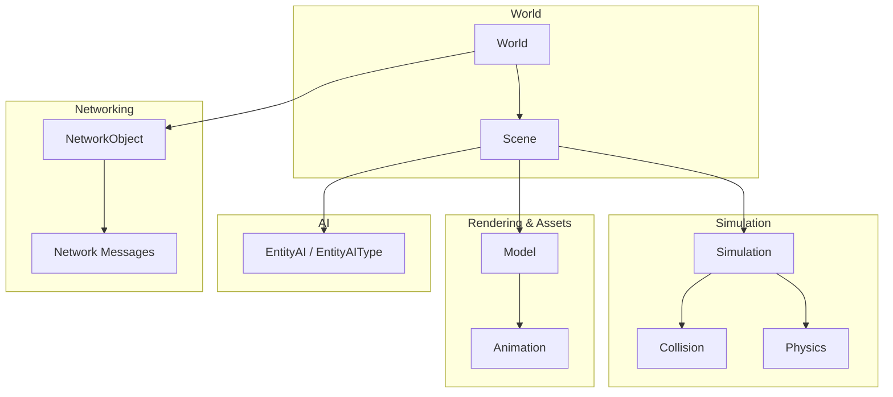
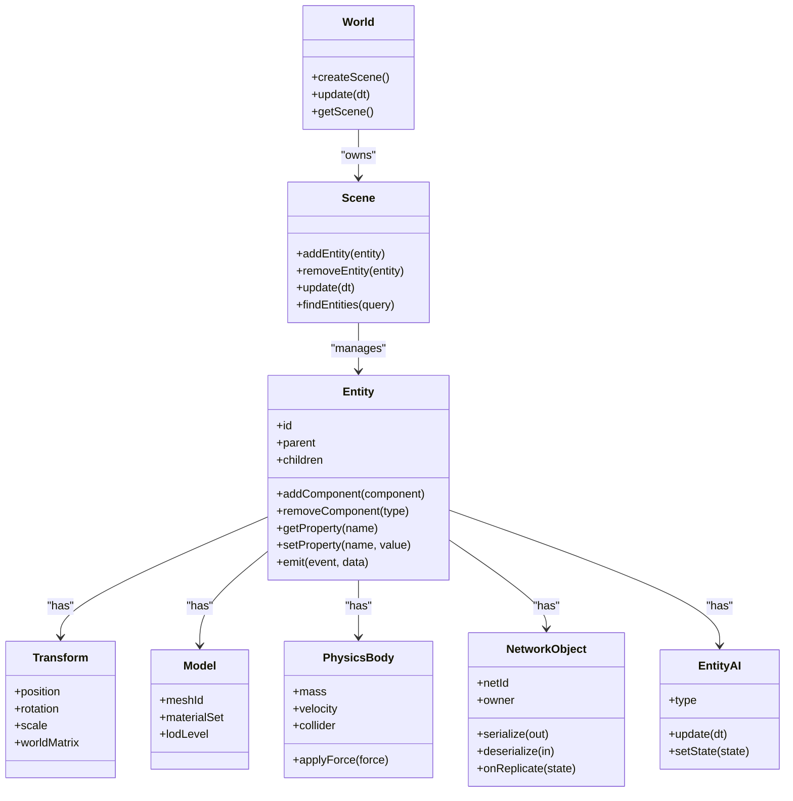
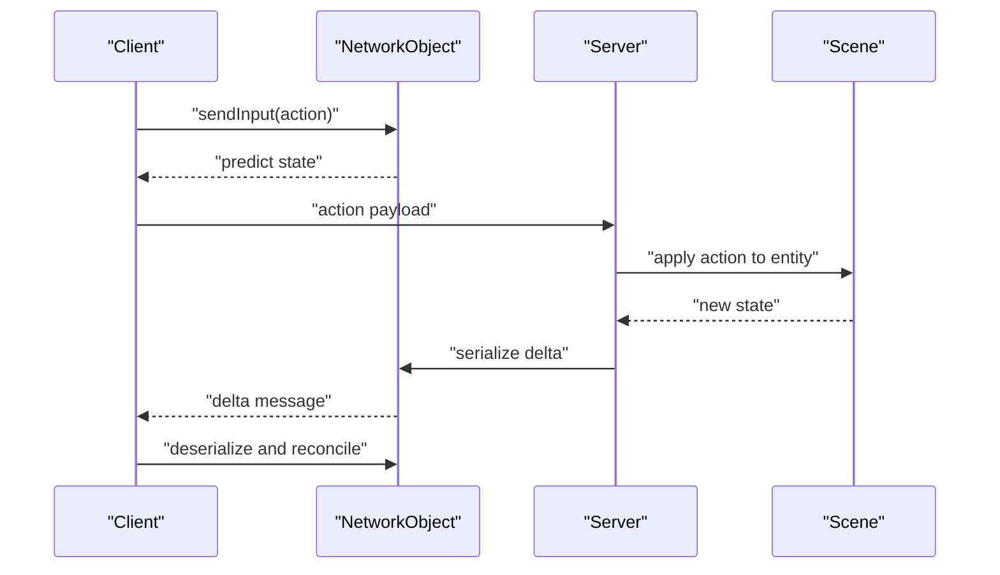
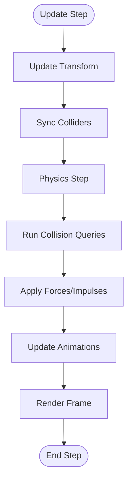
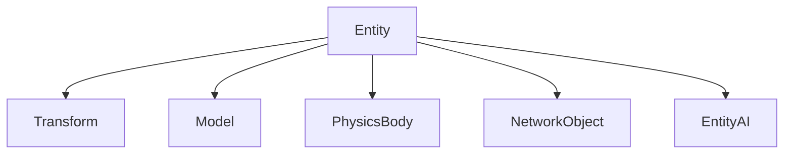
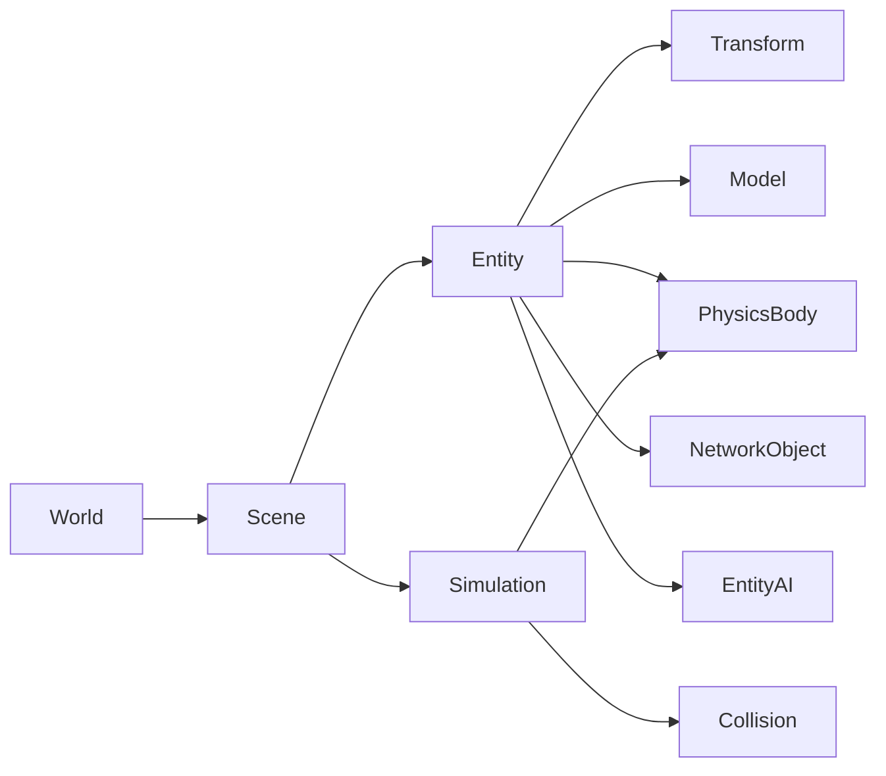

# Entity System

<cite>
**Referenced Files in This Document**
- [World.hpp](file://engine/Poseidon/World/World.hpp)
- [World.cpp](file://engine/Poseidon/World/World.cpp)
- [WorldImpl.cpp](file://engine/Poseidon/World/WorldImpl.cpp)
- [WorldInit.cpp](file://engine/Poseidon/World/WorldInit.cpp)
- [WorldShared.hpp](file://engine/Poseidon/World/WorldShared.hpp)
- [WorldSimHelpers.inc](file://engine/Poseidon/World/WorldSimHelpers.inc)
- [EntityAI.hpp](file://engine/Poseidon/AI/EntityAI.hpp)
- [EntityAI.cpp](file://engine/Poseidon/AI/EntityAI.cpp)
- [EntityAIType.hpp](file://engine/Poseidon/AI/EntityAIType.hpp)
- [NetworkObject.hpp](file://engine/Poseidon/Network/NetworkObject.hpp)
- [NetworkMsg.hpp](file://engine/Poseidon/Network/NetworkMsg.hpp)
- [NetworkMessages.cpp](file://engine/Poseidon/Network/NetworkMessages.cpp)
- [NetworkServerDispatch.hpp](file://engine/Poseidon/Network/NetworkServerDispatch.hpp)
- [NetworkClientOnMessage.cpp](file://engine/Poseidon/Network/NetworkClientOnMessage.cpp)
- [Scene.hpp](file://engine/Poseidon/World/Scene/Scene.hpp)
- [Simulation.hpp](file://engine/Poseidon/World/Simulation/Simulation.hpp)
- [Physics.hpp](file://engine/Poseidon/World/Simulation/Physics.hpp)
- [Collision.hpp](file://engine/Poseidon/World/Simulation/Collision.hpp)
- [Animation.hpp](file://engine/Poseidon/World/Model/Animation.hpp)
- [Model.hpp](file://engine/Poseidon/World/Model/Model.hpp)
- [TaskPool.hpp](file://engine/Poseidon/Core/TaskPool.hpp)
- [MemoryPool.hpp](file://engine/Poseidon/Foundation/Memory/MemoryPool.hpp)
</cite>

## Table of Contents
1. [Introduction](#introduction)
2. [Project Structure](#project-structure)
3. [Core Components](#core-components)
4. [Architecture Overview](#architecture-overview)
5. [Detailed Component Analysis](#detailed-component-analysis)
6. [Dependency Analysis](#dependency-analysis)
7. [Performance Considerations](#performance-considerations)
8. [Troubleshooting Guide](#troubleshooting-guide)
9. [Conclusion](#conclusion)
10. [Appendices](#appendices)

## Introduction
This document explains the entity system that manages all game objects in the simulation. It covers the base object hierarchy, entity creation and lifecycle, component-based architecture, serialization and network synchronization, event handling, and integration with physics, collision detection, and animation systems. Practical guidance is provided for creating custom entities, implementing behaviors, managing hierarchies, optimizing performance at scale, and debugging entity-related issues.

## Project Structure
The entity system spans several subsystems:
- World orchestration and scene management
- Simulation loop and step execution
- Physics and collision detection
- Model and animation systems
- Networking for multi-player synchronization
- AI and behavior components
- Memory and task utilities for performance

[No sources needed since this diagram shows conceptual workflow, not actual code structure]

## Core Components
- World: Central coordinator for scenes, simulation steps, and global services.
- Scene: Holds active entities, manages their lifecycle, and drives updates.
- Simulation: Executes per-frame logic, scheduling, and time-stepping.
- Physics and Collision: Provide rigid-body dynamics and intersection queries.
- Model and Animation: Represent visual meshes and skeletal animations.
- NetworkObject: Base for networked entities; handles serialization and replication.
- EntityAI and EntityAIType: Behavior abstractions and type descriptors for AI-driven entities.

Key responsibilities:
- Creation and destruction of entities
- Hierarchical parenting and transforms
- Property storage and access
- Event dispatching and subscriptions
- Serialization and deserialization
- Network synchronization (server authority, client prediction)
- Integration with physics, collision, and animation pipelines

**Section sources**
- [World.hpp](file://engine/Poseidon/World/World.hpp)
- [World.cpp](file://engine/Poseidon/World/World.cpp)
- [WorldImpl.cpp](file://engine/Poseidon/World/WorldImpl.cpp)
- [WorldInit.cpp](file://engine/Poseidon/World/WorldInit.cpp)
- [WorldShared.hpp](file://engine/Poseidon/World/WorldShared.hpp)
- [Scene.hpp](file://engine/Poseidon/World/Scene/Scene.hpp)
- [Simulation.hpp](file://engine/Poseidon/World/Simulation/Simulation.hpp)
- [Physics.hpp](file://engine/Poseidon/World/Simulation/Physics.hpp)
- [Collision.hpp](file://engine/Poseidon/World/Simulation/Collision.hpp)
- [Model.hpp](file://engine/Poseidon/World/Model/Model.hpp)
- [Animation.hpp](file://engine/Poseidon/World/Model/Animation.hpp)
- [NetworkObject.hpp](file://engine/Poseidon/Network/NetworkObject.hpp)
- [NetworkMsg.hpp](file://engine/Poseidon/Network/NetworkMsg.hpp)
- [NetworkMessages.cpp](file://engine/Poseidon/Network/NetworkMessages.cpp)
- [NetworkServerDispatch.hpp](file://engine/Poseidon/Network/NetworkServerDispatch.hpp)
- [NetworkClientOnMessage.cpp](file://engine/Poseidon/Network/NetworkClientOnMessage.cpp)
- [EntityAI.hpp](file://engine/Poseidon/AI/EntityAI.hpp)
- [EntityAI.cpp](file://engine/Poseidon/AI/EntityAI.cpp)
- [EntityAIType.hpp](file://engine/Poseidon/AI/EntityAIType.hpp)

## Architecture Overview
The entity system follows a component-oriented design where each entity is an ID-backed handle composed of reusable components (transform, model, physics, network, AI). The World owns Scenes, which own Entities. Simulation steps drive updates across all entities. Networking layers replicate state changes between server and clients.

**Diagram sources**
- [World.hpp](file://engine/Poseidon/World/World.hpp)
- [Scene.hpp](file://engine/Poseidon/World/Scene/Scene.hpp)
- [Model.hpp](file://engine/Poseidon/World/Model/Model.hpp)
- [Physics.hpp](file://engine/Poseidon/World/Simulation/Physics.hpp)
- [NetworkObject.hpp](file://engine/Poseidon/Network/NetworkObject.hpp)
- [EntityAI.hpp](file://engine/Poseidon/AI/EntityAI.hpp)

## Detailed Component Analysis

### Object Base Class Hierarchy and Entity Lifecycle
- Object base provides identity, parent-child relationships, and property storage.
- Entity extends Object to add component composition, event emission, and lifecycle hooks.
- Lifecycle stages: construction, initialization, update loop, and destruction.
- Destruction cascades to children and releases owned resources.

Implementation highlights:
- Creation APIs exposed via World or Scene managers.
- Reference counting or handle-based ownership to avoid dangling pointers.
- Deferred deletion to prevent invalidation during iteration.

Practical example:
- Create a new entity, attach transform/model/physics/network components, set properties, and emit spawn events.

**Section sources**
- [World.hpp](file://engine/Poseidon/World/World.hpp)
- [World.cpp](file://engine/Poseidon/World/World.cpp)
- [WorldImpl.cpp](file://engine/Poseidon/World/WorldImpl.cpp)
- [WorldInit.cpp](file://engine/Poseidon/World/WorldInit.cpp)
- [WorldShared.hpp](file://engine/Poseidon/World/WorldShared.hpp)

### Component-Based Architecture
- Components are small, focused units of functionality attached to entities.
- Common components include Transform, Model, PhysicsBody, NetworkObject, and EntityAI.
- Systems iterate over entities with required components to perform batched operations.

Best practices:
- Keep components data-only when possible.
- Use bitsets or sparse sets for efficient component queries.
- Avoid heavy allocations inside update loops.

**Section sources**
- [Model.hpp](file://engine/Poseidon/World/Model/Model.hpp)
- [Physics.hpp](file://engine/Poseidon/World/Simulation/Physics.hpp)
- [NetworkObject.hpp](file://engine/Poseidon/Network/NetworkObject.hpp)
- [EntityAI.hpp](file://engine/Poseidon/AI/EntityAI.hpp)

### Relationship Between Entities, Models, and Properties
- Entities reference models for rendering and may have multiple LOD levels.
- Properties are key-value pairs stored on entities for configuration and runtime state.
- Property changes can trigger events and network replication.

Data flow:
- Property setter -> validation -> event emission -> optional replication -> dependent systems react.

**Section sources**
- [Model.hpp](file://engine/Poseidon/World/Model/Model.hpp)
- [WorldShared.hpp](file://engine/Poseidon/World/WorldShared.hpp)

### Entity Serialization and Network Synchronization
- NetworkObject defines serialization interfaces for sending state over the wire.
- Server-authoritative model: server owns authoritative state; clients predict locally and reconcile.
- Delta compression and change tracking reduce bandwidth.

Sequence overview:
- Client input -> local prediction -> server receives -> server simulates -> server broadcasts deltas -> clients apply corrections.

**Diagram sources**
- [NetworkObject.hpp](file://engine/Poseidon/Network/NetworkObject.hpp)
- [NetworkMsg.hpp](file://engine/Poseidon/Network/NetworkMsg.hpp)
- [NetworkMessages.cpp](file://engine/Poseidon/Network/NetworkMessages.cpp)
- [NetworkServerDispatch.hpp](file://engine/Poseidon/Network/NetworkServerDispatch.hpp)
- [NetworkClientOnMessage.cpp](file://engine/Poseidon/Network/NetworkClientOnMessage.cpp)
- [Scene.hpp](file://engine/Poseidon/World/Scene/Scene.hpp)

**Section sources**
- [NetworkObject.hpp](file://engine/Poseidon/Network/NetworkObject.hpp)
- [NetworkMsg.hpp](file://engine/Poseidon/Network/NetworkMsg.hpp)
- [NetworkMessages.cpp](file://engine/Poseidon/Network/NetworkMessages.cpp)
- [NetworkServerDispatch.hpp](file://engine/Poseidon/Network/NetworkServerDispatch.hpp)
- [NetworkClientOnMessage.cpp](file://engine/Poseidon/Network/NetworkClientOnMessage.cpp)

### Event Handling
- Entities expose an event system for decoupled communication.
- Events carry typed payloads and can be subscribed by any interested component or system.
- Throttling and batching recommended for high-frequency events.

Typical flows:
- Spawn/Despawn events for lifecycle
- Property change events for reactive updates
- Input/action events for gameplay logic

**Section sources**
- [WorldShared.hpp](file://engine/Poseidon/World/WorldShared.hpp)
- [WorldSimHelpers.inc](file://engine/Poseidon/World/WorldSimHelpers.inc)

### Interaction with Physics, Collision Detection, and Animation
- PhysicsBody integrates with the physics engine for movement, forces, and constraints.
- Collision queries provide raycasts, sphere sweeps, and overlap tests.
- Model and Animation components drive rendering and skeletal playback.

Integration points:
- Transform updates feed into physics colliders.
- Animation events can trigger gameplay actions.
- Collision callbacks invoke entity events.

**Diagram sources**
- [Physics.hpp](file://engine/Poseidon/World/Simulation/Physics.hpp)
- [Collision.hpp](file://engine/Poseidon/World/Simulation/Collision.hpp)
- [Model.hpp](file://engine/Poseidon/World/Model/Model.hpp)
- [Animation.hpp](file://engine/Poseidon/World/Model/Animation.hpp)

**Section sources**
- [Physics.hpp](file://engine/Poseidon/World/Simulation/Physics.hpp)
- [Collision.hpp](file://engine/Poseidon/World/Simulation/Collision.hpp)
- [Model.hpp](file://engine/Poseidon/World/Model/Model.hpp)
- [Animation.hpp](file://engine/Poseidon/World/Model/Animation.hpp)

### AI and Behaviors
- EntityAI encapsulates behavior logic; EntityAIType describes capabilities and default configurations.
- AI updates run within the simulation loop and can interact with physics, networking, and events.

Common patterns:
- State machines for behavior transitions
- Blackboards for shared memory between tasks
- Utility scoring for decision-making

**Section sources**
- [EntityAI.hpp](file://engine/Poseidon/AI/EntityAI.hpp)
- [EntityAI.cpp](file://engine/Poseidon/AI/EntityAI.cpp)
- [EntityAIType.hpp](file://engine/Poseidon/AI/EntityAIType.hpp)

### Conceptual Overview
The entity system composes lightweight components around a central identity (entity ID). Systems operate on component sets efficiently, while events and networking provide loose coupling and multi-player synchronization.

[No sources needed since this diagram shows conceptual workflow, not actual code structure]

## Dependency Analysis
- World depends on Scene and Simulation to orchestrate updates.
- Scene manages entities and coordinates component systems.
- Networking depends on NetworkObject and message codecs.
- AI depends on entity properties and events.

**Diagram sources**
- [World.hpp](file://engine/Poseidon/World/World.hpp)
- [Scene.hpp](file://engine/Poseidon/World/Scene/Scene.hpp)
- [Simulation.hpp](file://engine/Poseidon/World/Simulation/Simulation.hpp)
- [Physics.hpp](file://engine/Poseidon/World/Simulation/Physics.hpp)
- [Collision.hpp](file://engine/Poseidon/World/Simulation/Collision.hpp)
- [Model.hpp](file://engine/Poseidon/World/Model/Model.hpp)
- [NetworkObject.hpp](file://engine/Poseidon/Network/NetworkObject.hpp)
- [EntityAI.hpp](file://engine/Poseidon/AI/EntityAI.hpp)

**Section sources**
- [World.hpp](file://engine/Poseidon/World/World.hpp)
- [Scene.hpp](file://engine/Poseidon/World/Scene/Scene.hpp)
- [Simulation.hpp](file://engine/Poseidon/World/Simulation/Simulation.hpp)
- [Physics.hpp](file://engine/Poseidon/World/Simulation/Physics.hpp)
- [Collision.hpp](file://engine/Poseidon/World/Simulation/Collision.hpp)
- [Model.hpp](file://engine/Poseidon/World/Model/Model.hpp)
- [NetworkObject.hpp](file://engine/Poseidon/Network/NetworkObject.hpp)
- [EntityAI.hpp](file://engine/Poseidon/AI/EntityAI.hpp)

## Performance Considerations
- Use memory pools for frequently created/destroyed entities and components.
- Batch updates using SIMD-friendly data layouts where applicable.
- Minimize allocations in hot paths; reuse buffers and strings.
- Employ spatial partitioning for broad-phase collision and culling.
- Limit network messages with delta compression and change tracking.
- Offload heavy work to TaskPool to avoid frame spikes.

Optimization strategies:
- Component arrays-of-structs-of-arrays (SoA) for tight loops
- Event throttling and coalescing
- Lazy evaluation of derived properties
- Profiling-guided refactors

**Section sources**
- [TaskPool.hpp](file://engine/Poseidon/Core/TaskPool.hpp)
- [MemoryPool.hpp](file://engine/Poseidon/Foundation/Memory/MemoryPool.hpp)
- [WorldSimHelpers.inc](file://engine/Poseidon/World/WorldSimHelpers.inc)

## Troubleshooting Guide
Common issues and remedies:
- Dangling references after entity destruction: use deferred deletion and handle-based IDs.
- Network desync: verify server authority, ensure deterministic simulation, and validate delta encoding.
- Physics jitter: check collider sync frequency and interpolation settings.
- Animation glitches: confirm bone hierarchy and timeline synchronization.
- High CPU usage: profile component iteration and event dispatch; consider batching.

Debugging tools:
- Entity inspector to view properties and component states
- Network message log for serialization/deserialization errors
- Physics debug visualization for colliders and contacts
- Event trace to monitor propagation and subscribers

**Section sources**
- [WorldShared.hpp](file://engine/Poseidon/World/WorldShared.hpp)
- [NetworkMsg.hpp](file://engine/Poseidon/Network/NetworkMsg.hpp)
- [NetworkMessages.cpp](file://engine/Poseidon/Network/NetworkMessages.cpp)
- [Physics.hpp](file://engine/Poseidon/World/Simulation/Physics.hpp)
- [Animation.hpp](file://engine/Poseidon/World/Model/Animation.hpp)

## Conclusion
The entity system provides a flexible, scalable foundation for game objects through a component-based architecture. By separating concerns into focused components and leveraging efficient iteration, robust networking, and clear lifecycle management, it supports complex simulations with large numbers of entities. Following the best practices outlined here will help maintain performance, stability, and extensibility.

## Appendices

### Creating Custom Entities
Steps:
- Define a new entity type with required components.
- Implement initialization logic and default properties.
- Subscribe to relevant events for behavior.
- Register network serialization if multiplayer support is needed.

Example outline:
- Create entity via World/Scene API
- Attach Transform, Model, PhysicsBody, NetworkObject, and custom components
- Set initial properties and emit spawn event
- Integrate with AI or other systems as needed

**Section sources**
- [World.hpp](file://engine/Poseidon/World/World.hpp)
- [Scene.hpp](file://engine/Poseidon/World/Scene/Scene.hpp)
- [Model.hpp](file://engine/Poseidon/World/Model/Model.hpp)
- [Physics.hpp](file://engine/Poseidon/World/Simulation/Physics.hpp)
- [NetworkObject.hpp](file://engine/Poseidon/Network/NetworkObject.hpp)
- [EntityAI.hpp](file://engine/Poseidon/AI/EntityAI.hpp)

### Managing Entity Hierarchies
Guidelines:
- Maintain consistent parent-child relationships for transforms.
- Propagate visibility and layer flags down the hierarchy.
- Avoid deep trees; prefer flat structures where possible.
- Use world-space queries for broad interactions.

**Section sources**
- [WorldShared.hpp](file://engine/Poseidon/World/WorldShared.hpp)
- [Scene.hpp](file://engine/Poseidon/World/Scene/Scene.hpp)

### Implementing Entity Behaviors
Patterns:
- Encapsulate logic in components or AI modules
- Use events for inter-component communication
- Keep update loops short and deterministic

**Section sources**
- [EntityAI.hpp](file://engine/Poseidon/AI/EntityAI.hpp)
- [EntityAI.cpp](file://engine/Poseidon/AI/EntityAI.cpp)
- [WorldSimHelpers.inc](file://engine/Poseidon/World/WorldSimHelpers.inc)