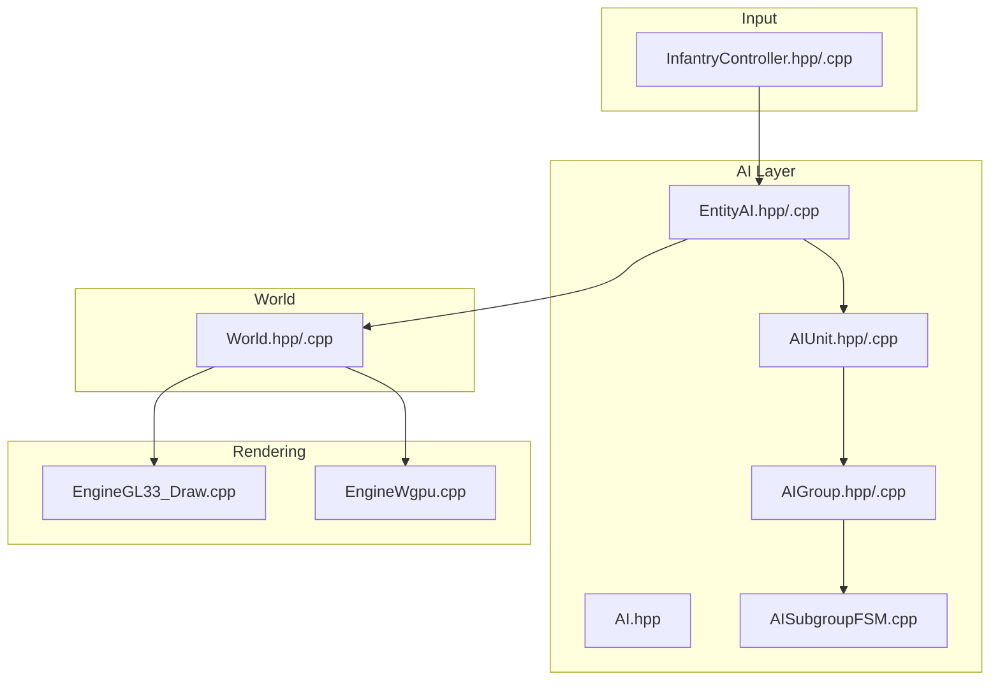
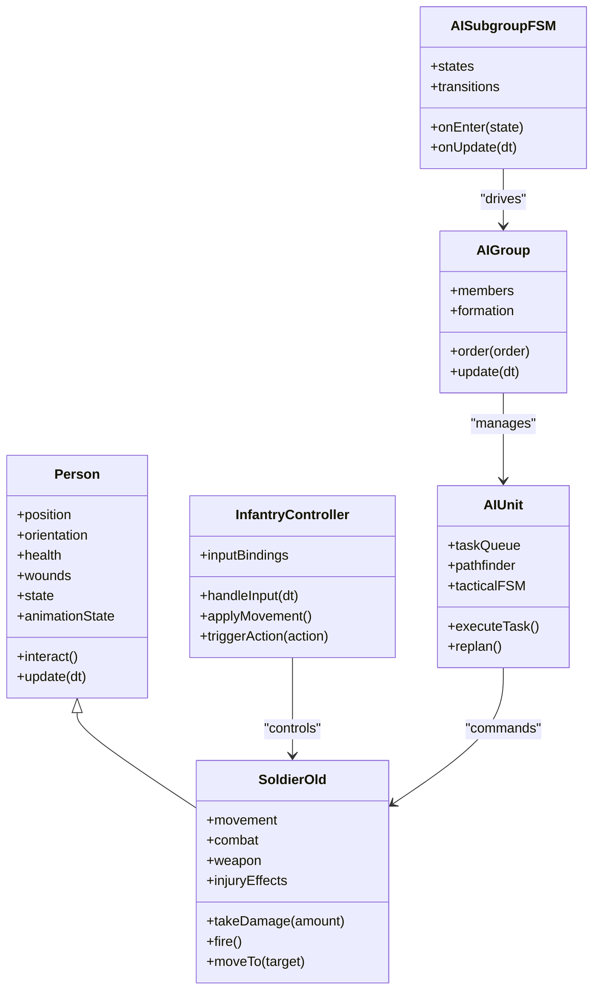
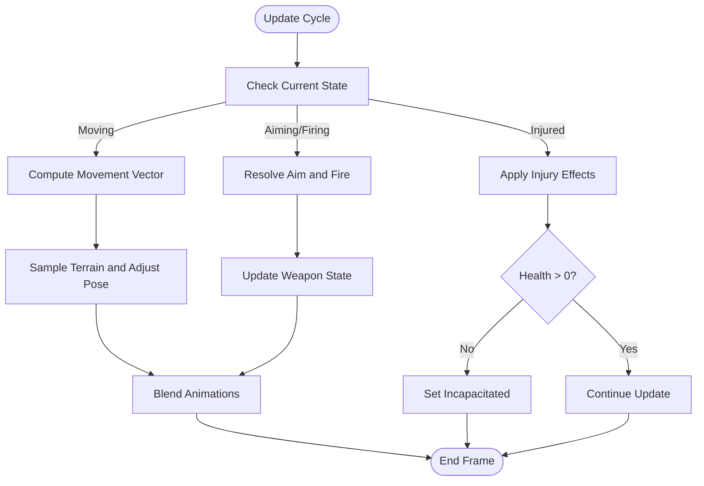
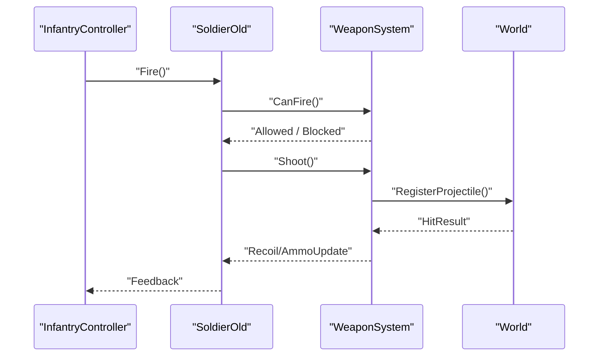
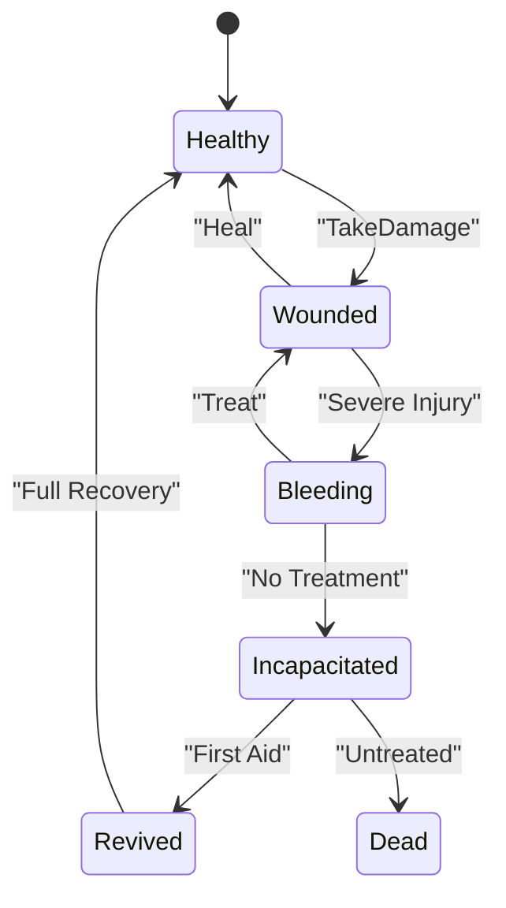
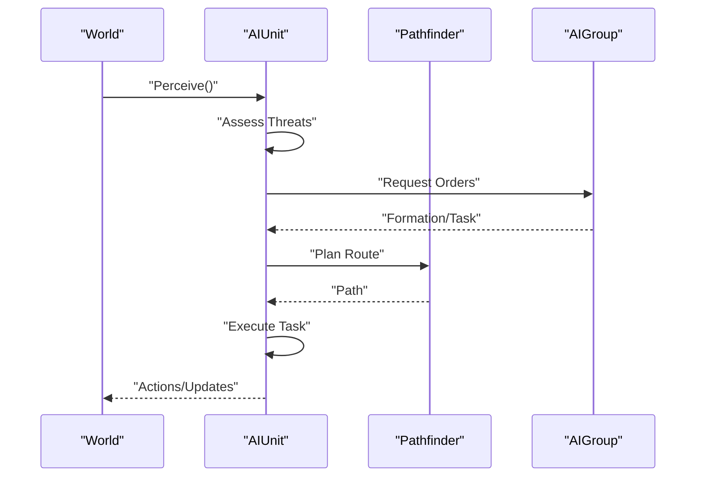
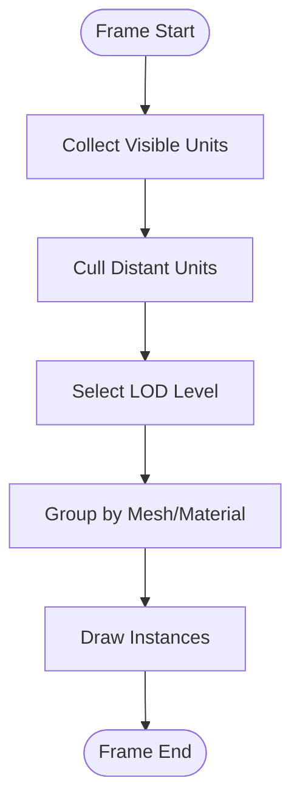
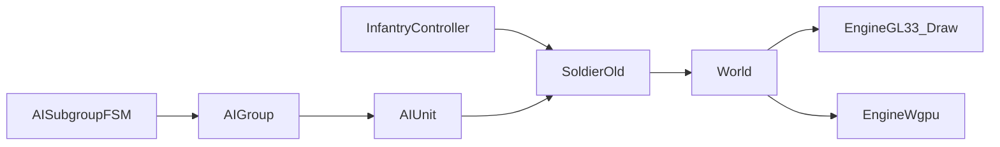

# Infantry Entity System

<cite>
**Referenced Files in This Document**
- [AI.hpp](file://engine/Poseidon/AI/AI.hpp)
- [EntityAI.hpp](file://engine/Poseidon/AI/EntityAI.hpp)
- [EntityAI.cpp](file://engine/Poseidon/AI/EntityAI.cpp)
- [AIUnit.hpp](file://engine/Poseidon/AI/AIUnit.hpp)
- [AIUnitImpl.cpp](file://engine/Poseidon/AI/AIUnitImpl.cpp)
- [AIGroup.hpp](file://engine/Poseidon/AI/AIGroup.hpp)
- [AIGroup.cpp](file://engine/Poseidon/AI/AIGroup.cpp)
- [AISubgroupFSM.cpp](file://engine/Poseidon/AI/AISubgroupFSM.cpp)
- [InfantryController.hpp](file://engine/Poseidon/Input/InfantryController.hpp)
- [InfantryController.cpp](file://engine/Poseidon/Input/InfantryController.cpp)
- [World.hpp](file://engine/Poseidon/World/World.hpp)
- [World.cpp](file://engine/Poseidon/World/World.cpp)
- [EngineGL33_Draw.cpp](file://engine/PoseidonGL33/EngineGL33_Draw.cpp)
- [EngineWgpu.cpp](file://engine/WgpuRenderer/EngineWgpu.cpp)
</cite>

## Table of Contents
1. [Introduction](#introduction)
2. [Project Structure](#project-structure)
3. [Core Components](#core-components)
4. [Architecture Overview](#architecture-overview)
5. [Detailed Component Analysis](#detailed-component-analysis)
6. [Dependency Analysis](#dependency-analysis)
7. [Performance Considerations](#performance-considerations)
8. [Troubleshooting Guide](#troubleshooting-guide)
9. [Conclusion](#conclusion)
10. [Appendices](#appendices)

## Introduction
This document explains the infantry entity system that manages human characters and soldiers. It covers the Person base class architecture, SoldierOld implementation details (movement, combat, health), character animation systems, weapon handling, environment interactions, wound/injury states, AI integration for squads and tactics, and guidance for creating custom soldier types, implementing abilities, and optimizing rendering for large numbers of units on screen.

## Project Structure
The infantry system spans several engine subsystems:
- AI layer defines entities, groups, and unit behaviors
- Input subsystem provides player control for infantry
- World subsystem hosts entities and simulation
- Rendering backends draw units efficiently

**Diagram sources**
- [AI.hpp](file://engine/Poseidon/AI/AI.hpp)
- [EntityAI.hpp](file://engine/Poseidon/AI/EntityAI.hpp)
- [EntityAI.cpp](file://engine/Poseidon/AI/EntityAI.cpp)
- [AIUnit.hpp](file://engine/Poseidon/AI/AIUnit.hpp)
- [AIGroup.hpp](file://engine/Poseidon/AI/AIGroup.hpp)
- [AIGroup.cpp](file://engine/Poseidon/AI/AIGroup.cpp)
- [AISubgroupFSM.cpp](file://engine/Poseidon/AI/AISubgroupFSM.cpp)
- [InfantryController.hpp](file://engine/Poseidon/Input/InfantryController.hpp)
- [InfantryController.cpp](file://engine/Poseidon/Input/InfantryController.cpp)
- [World.hpp](file://engine/Poseidon/World/World.hpp)
- [World.cpp](file://engine/Poseidon/World/World.cpp)
- [EngineGL33_Draw.cpp](file://engine/PoseidonGL33/EngineGL33_Draw.cpp)
- [EngineWgpu.cpp](file://engine/WgpuRenderer/EngineWgpu.cpp)

**Section sources**
- [AI.hpp](file://engine/Poseidon/AI/AI.hpp)
- [EntityAI.hpp](file://engine/Poseidon/AI/EntityAI.hpp)
- [EntityAI.cpp](file://engine/Poseidon/AI/EntityAI.cpp)
- [AIUnit.hpp](file://engine/Poseidon/AI/AIUnit.hpp)
- [AIGroup.hpp](file://engine/Poseidon/AI/AIGroup.hpp)
- [AIGroup.cpp](file://engine/Poseidon/AI/AIGroup.cpp)
- [AISubgroupFSM.cpp](file://engine/Poseidon/AI/AISubgroupFSM.cpp)
- [InfantryController.hpp](file://engine/Poseidon/Input/InfantryController.hpp)
- [InfantryController.cpp](file://engine/Poseidon/Input/InfantryController.cpp)
- [World.hpp](file://engine/Poseidon/World/World.hpp)
- [World.cpp](file://engine/Poseidon/World/World.cpp)
- [EngineGL33_Draw.cpp](file://engine/PoseidonGL33/EngineGL33_Draw.cpp)
- [EngineWgpu.cpp](file://engine/WgpuRenderer/EngineWgpu.cpp)

## Core Components
- Person base class: foundational data and behavior for all humanoid entities (position, orientation, state flags, health/wound fields, animation hooks).
- SoldierOld: concrete infantry type extending Person with movement mechanics, combat routines, weapon handling, and injury effects.
- AIUnit: AI-driven controller for infantry, integrating pathfinding, squad commands, and tactical FSM.
- AIGroup/AISubgroup: squad-level organization and formation management.
- InfantryController: input mapping for player-controlled infantry (move, aim, fire, interact).
- World: entity registry, update loop, and interaction queries.
- Rendering engines: batched drawing paths for many infantry models.

Key responsibilities:
- Movement: locomotion, stance transitions, collision, terrain adaptation
- Combat: aiming, firing, reloading, cover usage, suppression
- Health: damage model, wounds, incapacitation, recovery
- Animation: pose selection, blending, event-driven actions
- Weapons: loadout, ammo, accuracy modifiers, recoil
- Environment: line-of-sight, cover detection, interaction triggers
- AI: decision-making, group coordination, task execution

**Section sources**
- [EntityAI.hpp](file://engine/Poseidon/AI/EntityAI.hpp)
- [EntityAI.cpp](file://engine/Poseidon/AI/EntityAI.cpp)
- [AIUnit.hpp](file://engine/Poseidon/AI/AIUnit.hpp)
- [AIUnitImpl.cpp](file://engine/Poseidon/AI/AIUnitImpl.cpp)
- [AIGroup.hpp](file://engine/Poseidon/AI/AIGroup.hpp)
- [AIGroup.cpp](file://engine/Poseidon/AI/AIGroup.cpp)
- [AISubgroupFSM.cpp](file://engine/Poseidon/AI/AISubgroupFSM.cpp)
- [InfantryController.hpp](file://engine/Poseidon/Input/InfantryController.hpp)
- [InfantryController.cpp](file://engine/Poseidon/Input/InfantryController.cpp)
- [World.hpp](file://engine/Poseidon/World/World.hpp)
- [World.cpp](file://engine/Poseidon/World/World.cpp)

## Architecture Overview
The infantry system is layered:
- Data/state layer (Person/SoldierOld) holds entity state and capabilities
- Control layer (InfantryController for players, AIUnit for bots) drives behavior
- Group layer (AIGroup/AISubgroup) coordinates multiple units
- Simulation layer (World) updates entities and resolves interactions
- Rendering layer (GL33/WGPU) draws instances efficiently

**Diagram sources**
- [EntityAI.hpp](file://engine/Poseidon/AI/EntityAI.hpp)
- [AIUnit.hpp](file://engine/Poseidon/AI/AIUnit.hpp)
- [AIGroup.hpp](file://engine/Poseidon/AI/AIGroup.hpp)
- [AISubgroupFSM.cpp](file://engine/Poseidon/AI/AISubgroupFSM.cpp)
- [InfantryController.hpp](file://engine/Poseidon/Input/InfantryController.hpp)

## Detailed Component Analysis

### Person Base Class Architecture
Responsibilities:
- Holds core attributes: position, orientation, health, wounds, state flags, animation state
- Provides lifecycle hooks: update, interact, takeDamage, respawn
- Exposes query interfaces for visibility, collision, and environment checks

Design patterns:
- Composition over inheritance for weapons and animations
- State machine integration for posture and action states
- Event-driven hooks for animation and audio

Complexity considerations:
- O(1) access to core state; O(n) for neighbor queries via world
- Cache-friendly layout for frequent updates

Error handling:
- Defensive checks for null references and invalid states
- Graceful degradation when assets are missing

**Section sources**
- [EntityAI.hpp](file://engine/Poseidon/AI/EntityAI.hpp)
- [EntityAI.cpp](file://engine/Poseidon/AI/EntityAI.cpp)

### SoldierOld Implementation
Movement mechanics:
- Locomotion modes: walk, run, crawl, prone
- Stance transitions based on terrain and threats
- Collision and terrain sampling for smooth movement

Combat behaviors:
- Aim and fire logic with accuracy modifiers
- Reload cycles and ammo management
- Cover detection and suppression response

Health systems:
- Damage model with body zones
- Wound accumulation affecting performance
- Incapacitation and revival states

Animation system:
- Pose selection and blending
- Action events synced with gameplay
- Procedural adjustments for terrain and load

Weapon handling:
- Loadout configuration
- Recoil and spread modeling
- Interaction with attachments and magazines

Environment interaction:
- Line-of-sight and occlusion checks
- Interactable objects and pickups
- Stealth and noise generation

**Diagram sources**
- [EntityAI.cpp](file://engine/Poseidon/AI/EntityAI.cpp)
- [AIUnitImpl.cpp](file://engine/Poseidon/AI/AIUnitImpl.cpp)

**Section sources**
- [EntityAI.cpp](file://engine/Poseidon/AI/EntityAI.cpp)
- [AIUnitImpl.cpp](file://engine/Poseidon/AI/AIUnitImpl.cpp)

### Character Animation Systems
- Pose graph with states for idle, move, aim, fire, reload, prone
- Blending between poses using time-based interpolation
- Event-driven triggers for muzzle flash, footstep sounds, and camera shake
- LOD and culling strategies for distant or off-screen units

Optimization techniques:
- Batched animation updates per frame
- GPU skinning where supported
- Reduced update frequency for non-active units

**Section sources**
- [EntityAI.cpp](file://engine/Poseidon/AI/EntityAI.cpp)
- [EngineGL33_Draw.cpp](file://engine/PoseidonGL33/EngineGL33_Draw.cpp)
- [EngineWgpu.cpp](file://engine/WgpuRenderer/EngineWgpu.cpp)

### Weapon Handling and Interaction
- Weapon classes define stats: rate of fire, damage, accuracy, magazine size
- Ammo consumption and reload timing integrated into update cycle
- Interaction with attachments modifies stats and visuals
- Environmental factors: wind, gravity, and surface penetration

Interaction flow:
- Input triggers fire/reload
- Weapon validates state and applies effects
- World registers hits and spawns projectiles or impacts

**Diagram sources**
- [InfantryController.hpp](file://engine/Poseidon/Input/InfantryController.hpp)
- [EntityAI.cpp](file://engine/Poseidon/AI/EntityAI.cpp)
- [World.hpp](file://engine/Poseidon/World/World.hpp)

**Section sources**
- [InfantryController.hpp](file://engine/Poseidon/Input/InfantryController.hpp)
- [InfantryController.cpp](file://engine/Poseidon/Input/InfantryController.cpp)
- [EntityAI.cpp](file://engine/Poseidon/AI/EntityAI.cpp)
- [World.hpp](file://engine/Poseidon/World/World.hpp)

### Wound Systems, Injury Effects, and States
- Wound model tracks injuries by body region
- Injuries impose penalties: reduced speed, accuracy, stamina
- States include healthy, wounded, bleeding, incapacitated, dead
- Recovery mechanisms: first aid, medkits, time-based healing

State transitions:
- Healthy -> Wounded on damage
- Wounded -> Bleeding if severe
- Bleeding -> Incapacitated if untreated
- Incapacitated -> Revived or Dead

**Diagram sources**
- [EntityAI.cpp](file://engine/Poseidon/AI/EntityAI.cpp)

**Section sources**
- [EntityAI.cpp](file://engine/Poseidon/AI/EntityAI.cpp)

### AI Integration: Units, Squads, and Tactics
- AIUnit encapsulates decision-making, pathfinding, and task execution
- AIGroup organizes units into squads with formation rules
- AISubgroupFSM drives tactical behaviors like advance, suppress, flank
- Commands propagate from leaders to subordinates

Behavioral flow:
- Perception gathers targets and threats
- Planner selects tasks based on context
- Pathfinder computes routes avoiding obstacles
- Execution adjusts movement and combat actions

**Diagram sources**
- [AIUnit.hpp](file://engine/Poseidon/AI/AIUnit.hpp)
- [AIUnitImpl.cpp](file://engine/Poseidon/AI/AIUnitImpl.cpp)
- [AIGroup.hpp](file://engine/Poseidon/AI/AIGroup.hpp)
- [AISubgroupFSM.cpp](file://engine/Poseidon/AI/AISubgroupFSM.cpp)

**Section sources**
- [AIUnit.hpp](file://engine/Poseidon/AI/AIUnit.hpp)
- [AIUnitImpl.cpp](file://engine/Poseidon/AI/AIUnitImpl.cpp)
- [AIGroup.hpp](file://engine/Poseidon/AI/AIGroup.hpp)
- [AIGroup.cpp](file://engine/Poseidon/AI/AIGroup.cpp)
- [AISubgroupFSM.cpp](file://engine/Poseidon/AI/AISubgroupFSM.cpp)

### Creating Custom Soldier Types
Steps:
- Extend Person or SoldierOld to add new capabilities
- Define weapon loadouts and attachment points
- Implement custom animations and sound hooks
- Integrate with AIUnit for bot behavior or InfantryController for player control

Best practices:
- Keep data-driven configurations separate from code
- Use composition for modular features (e.g., stealth module)
- Test edge cases for injury and death transitions

**Section sources**
- [EntityAI.hpp](file://engine/Poseidon/AI/EntityAI.hpp)
- [EntityAI.cpp](file://engine/Poseidon/AI/EntityAI.cpp)
- [AIUnit.hpp](file://engine/Poseidon/AI/AIUnit.hpp)

### Implementing Character Abilities
Examples:
- Enhanced vision: increased detection range and night vision toggle
- Tactical skills: improved accuracy under stress, faster reloads
- Special equipment: smoke grenades, breaching charges

Implementation approach:
- Add ability flags and cooldowns to Person/SoldierOld
- Hook into update cycle for activation and effects
- Provide UI feedback and input bindings

**Section sources**
- [EntityAI.cpp](file://engine/Poseidon/AI/EntityAI.cpp)
- [InfantryController.hpp](file://engine/Poseidon/Input/InfantryController.hpp)

### Optimizing Character Rendering for Large Numbers of Units
Techniques:
- Instanced rendering for shared meshes and materials
- Frustum and distance culling to skip off-screen or far units
- LOD levels to reduce detail at distance
- Batched draw calls to minimize GPU overhead

Backend-specific notes:
- GL33 uses vertex buffers and shader programs for efficient drawing
- WGPU leverages modern pipelines and bindless textures for scalability

**Diagram sources**
- [EngineGL33_Draw.cpp](file://engine/PoseidonGL33/EngineGL33_Draw.cpp)
- [EngineWgpu.cpp](file://engine/WgpuRenderer/EngineWgpu.cpp)

**Section sources**
- [EngineGL33_Draw.cpp](file://engine/PoseidonGL33/EngineGL33_Draw.cpp)
- [EngineWgpu.cpp](file://engine/WgpuRenderer/EngineWgpu.cpp)

## Dependency Analysis
The infantry system exhibits clear separation of concerns:
- AI depends on World for queries and updates
- Controllers depend on SoldierOld for state manipulation
- Rendering depends on World for visible entity lists
- Groups depend on units for formation and command propagation

Potential coupling risks:
- Tight coupling between AI and animation could hinder modularity
- Shared state in Person may require careful synchronization in multiplayer

Mitigations:
- Interfaces for animation and weapon systems
- Event-driven communication to reduce direct dependencies

**Diagram sources**
- [InfantryController.hpp](file://engine/Poseidon/Input/InfantryController.hpp)
- [EntityAI.cpp](file://engine/Poseidon/AI/EntityAI.cpp)
- [AIGroup.hpp](file://engine/Poseidon/AI/AIGroup.hpp)
- [AISubgroupFSM.cpp](file://engine/Poseidon/AI/AISubgroupFSM.cpp)
- [World.hpp](file://engine/Poseidon/World/World.hpp)
- [EngineGL33_Draw.cpp](file://engine/PoseidonGL33/EngineGL33_Draw.cpp)
- [EngineWgpu.cpp](file://engine/WgpuRenderer/EngineWgpu.cpp)

**Section sources**
- [InfantryController.hpp](file://engine/Poseidon/Input/InfantryController.hpp)
- [EntityAI.cpp](file://engine/Poseidon/AI/EntityAI.cpp)
- [AIGroup.hpp](file://engine/Poseidon/AI/AIGroup.hpp)
- [AISubgroupFSM.cpp](file://engine/Poseidon/AI/AISubgroupFSM.cpp)
- [World.hpp](file://engine/Poseidon/World/World.hpp)
- [EngineGL33_Draw.cpp](file://engine/PoseidonGL33/EngineGL33_Draw.cpp)
- [EngineWgpu.cpp](file://engine/WgpuRenderer/EngineWgpu.cpp)

## Performance Considerations
- Update frequency: throttle non-critical updates for inactive units
- Memory layout: align frequently accessed fields for cache efficiency
- Rendering: use instancing, culling, and LOD to maintain frame rates
- AI: limit perception and planning scope to nearby entities
- Networking: compress state updates and prioritize critical data

[No sources needed since this section provides general guidance]

## Troubleshooting Guide
Common issues:
- Units stuck on geometry: verify collision and terrain sampling
- Animation glitches: check pose transitions and blend weights
- AI not responding: inspect task queue and pathfinder results
- Rendering artifacts: validate LOD selection and culling thresholds

Debugging steps:
- Log state transitions and key variables
- Visualize paths and LOS for AI debugging
- Profile update loops and draw calls

**Section sources**
- [EntityAI.cpp](file://engine/Poseidon/AI/EntityAI.cpp)
- [AIUnitImpl.cpp](file://engine/Poseidon/AI/AIUnitImpl.cpp)
- [EngineGL33_Draw.cpp](file://engine/PoseidonGL33/EngineGL33_Draw.cpp)
- [EngineWgpu.cpp](file://engine/WgpuRenderer/EngineWgpu.cpp)

## Conclusion
The infantry entity system combines robust data structures, flexible controllers, and scalable rendering to support realistic human characters and soldiers. By following the outlined patterns for extending Person/SoldierOld, integrating AI squads, and optimizing rendering, developers can create diverse infantry experiences while maintaining performance and stability.

[No sources needed since this section summarizes without analyzing specific files]

## Appendices
- Best practices for modding infantry types
- Tips for balancing AI difficulty and squad tactics
- References to related engine modules for deeper integration

[No sources needed since this section provides general guidance]