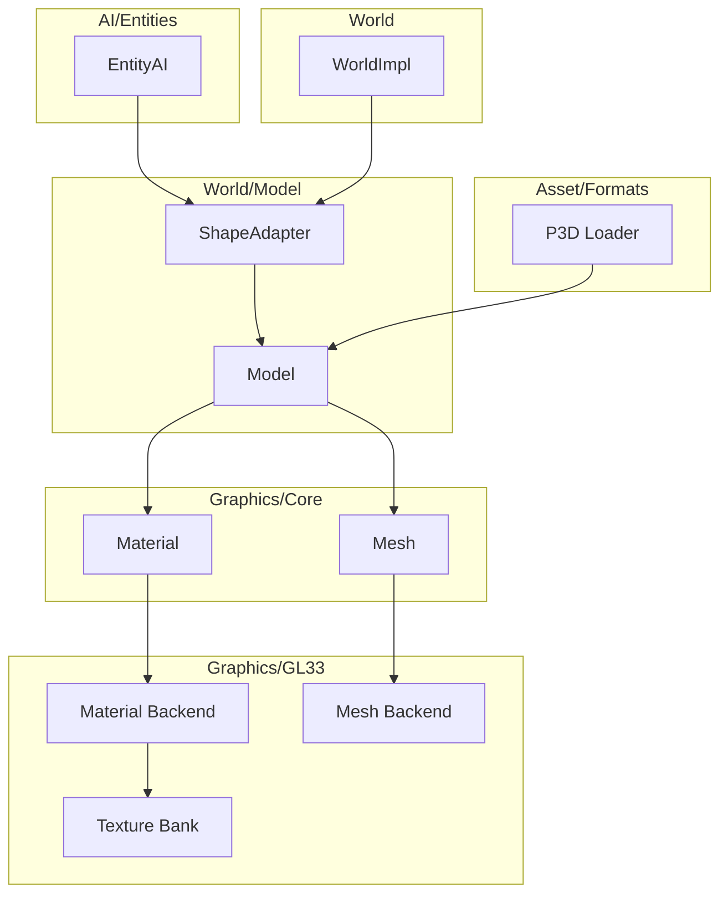
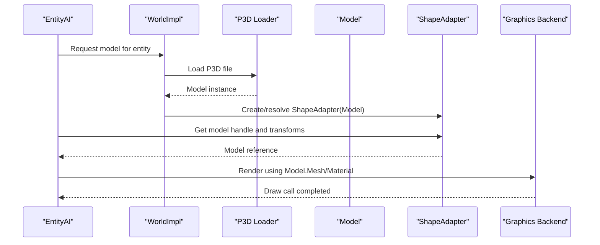
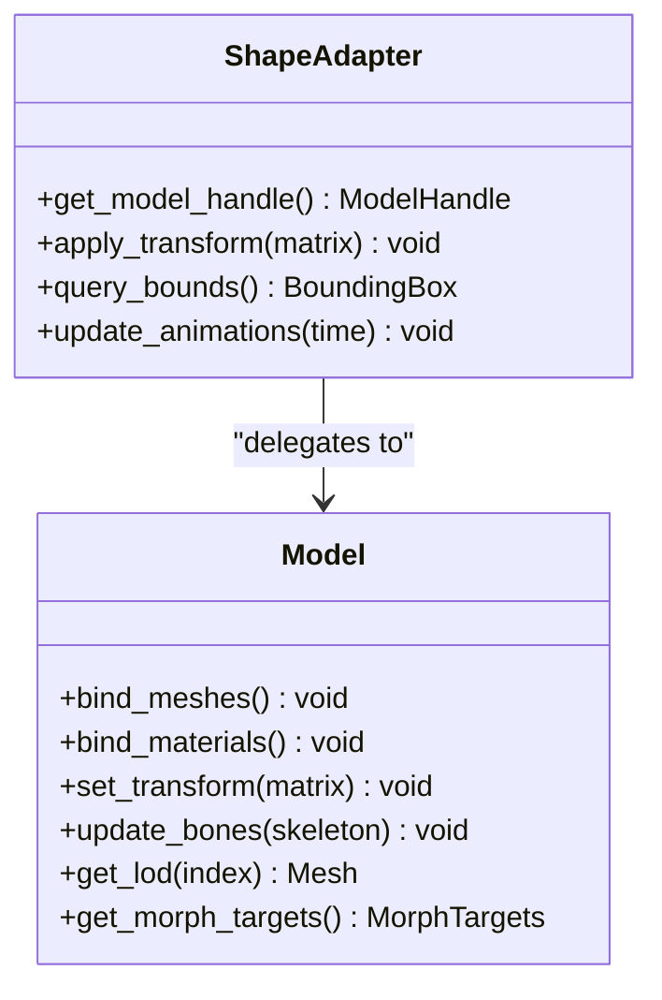
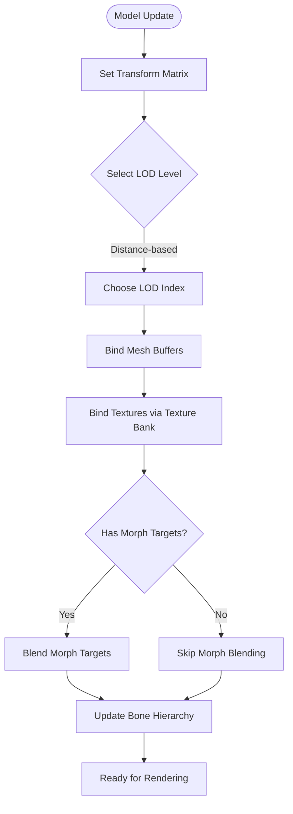
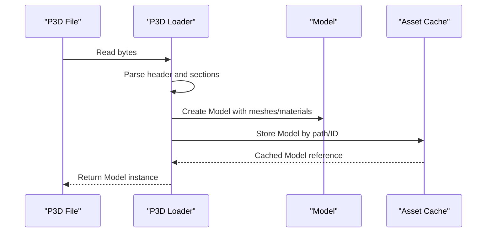
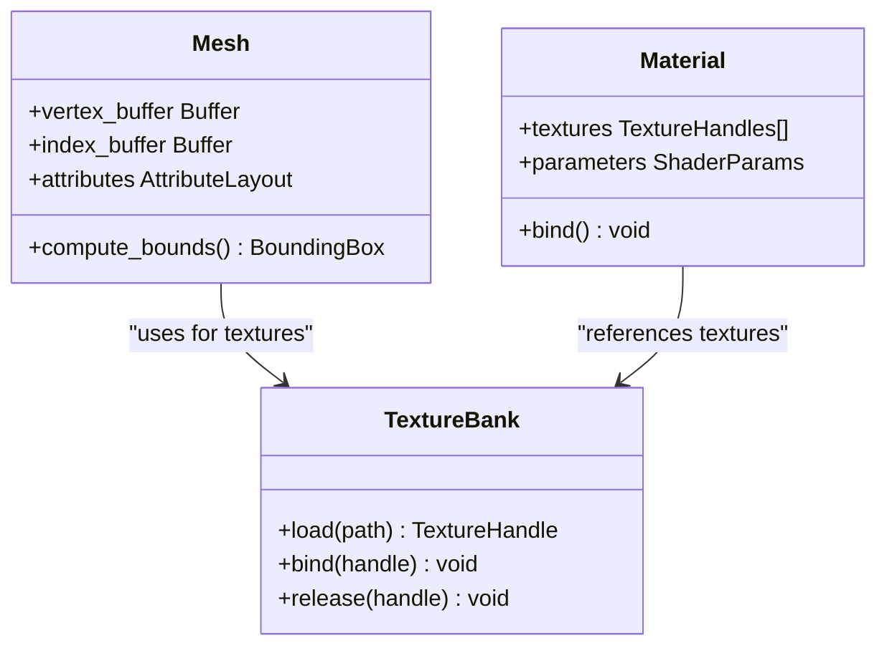
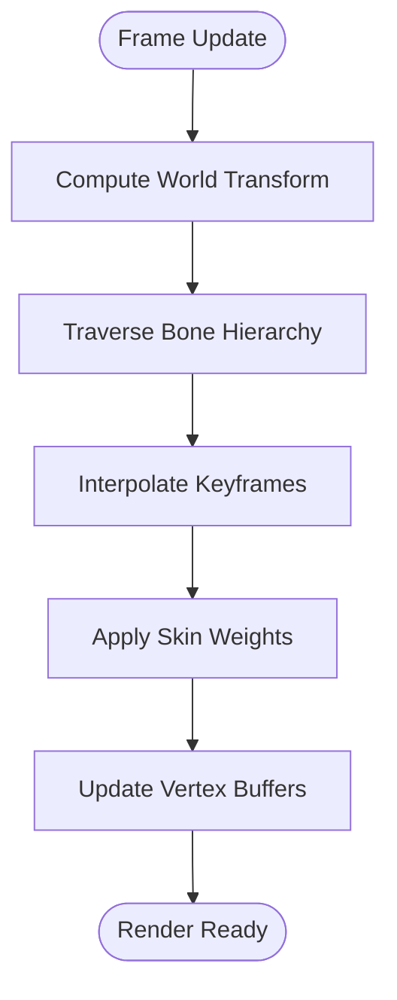
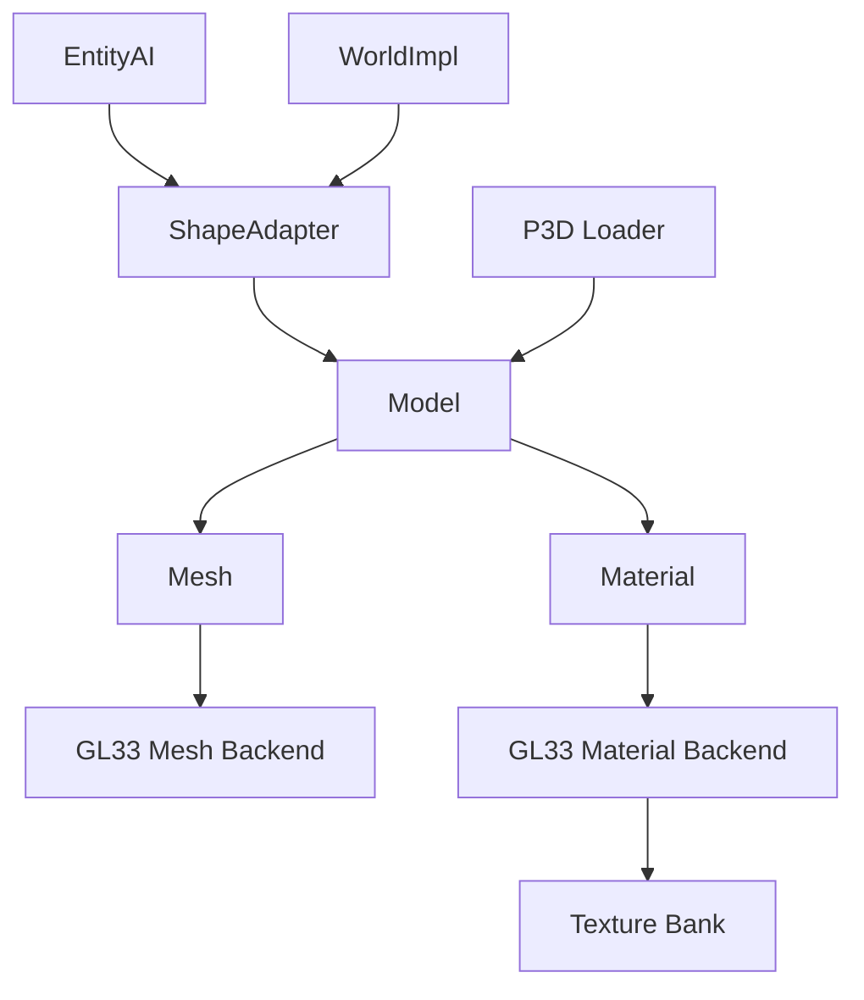

# Model Integration and Rendering

<cite>
**Referenced Files in This Document**
- [ShapeAdapter.hpp](file://engine/Poseidon/World/Model/ShapeAdapter.hpp)
- [ShapeAdapter.cpp](file://engine/Poseidon/World/Model/ShapeAdapter.cpp)
- [Model.hpp](file://engine/Poseidon/World/Model/Model.hpp)
- [Model.cpp](file://engine/Poseidon/World/Model/Model.cpp)
- [P3DLoader.hpp](file://engine/Poseidon/Asset/Formats/P3D/P3DLoader.hpp)
- [P3DLoader.cpp](file://engine/Poseidon/Asset/Formats/P3D/P3DLoader.cpp)
- [Mesh.hpp](file://engine/Poseidon/Graphics/Core/Mesh.hpp)
- [Material.hpp](file://engine/Poseidon/Graphics/Core/Material.hpp)
- [TextureBankGL33_Core.cpp](file://engine/PoseidonGL33/TextureBankGL33_Core.cpp)
- [EngineGL33_Material.cpp](file://engine/PoseidonGL33/EngineGL33_Material.cpp)
- [EngineGL33_Mesh.cpp](file://engine/PoseidonGL33/EngineGL33_Mesh.cpp)
- [EntityAI.hpp](file://engine/Poseidon/AI/EntityAI.hpp)
- [WorldImpl.cpp](file://engine/Poseidon/World/WorldImpl.cpp)
</cite>

## Table of Contents
1. [Introduction](#introduction)
2. [Project Structure](#project-structure)
3. [Core Components](#core-components)
4. [Architecture Overview](#architecture-overview)
5. [Detailed Component Analysis](#detailed-component-analysis)
6. [Dependency Analysis](#dependency-analysis)
7. [Performance Considerations](#performance-considerations)
8. [Troubleshooting Guide](#troubleshooting-guide)
9. [Conclusion](#conclusion)

## Introduction
This document explains the model integration system that bridges game entities with 3D rendering. It covers how models are loaded from P3D files, cached, and associated with entities through the ShapeAdapter interface. It also documents the Model class responsibilities for mesh data management, texture binding, material properties, LOD handling, morph animations, transformation matrices, bone animation systems, and performance optimizations. Practical guidance is provided for creating custom model adapters and debugging model loading issues.

## Project Structure
The model integration spans several engine subsystems:
- World/Model layer defines the runtime representation and adapter abstraction for shapes/models.
- Asset/Formats handles parsing of P3D model files into runtime structures.
- Graphics/Core provides Mesh and Material abstractions used by the renderer.
- Graphics backends (e.g., GL33) implement concrete rendering of meshes and materials.
- AI/Entities integrate models with game entities via ShapeAdapter.
- World implementation wires entity lifecycle to model loading and caching.

**Diagram sources**
- [ShapeAdapter.hpp](file://engine/Poseidon/World/Model/ShapeAdapter.hpp)
- [Model.hpp](file://engine/Poseidon/World/Model/Model.hpp)
- [P3DLoader.hpp](file://engine/Poseidon/Asset/Formats/P3D/P3DLoader.hpp)
- [Mesh.hpp](file://engine/Poseidon/Graphics/Core/Mesh.hpp)
- [Material.hpp](file://engine/Poseidon/Graphics/Core/Material.hpp)
- [TextureBankGL33_Core.cpp](file://engine/PoseidonGL33/TextureBankGL33_Core.cpp)
- [EngineGL33_Material.cpp](file://engine/PoseidonGL33/EngineGL33_Material.cpp)
- [EngineGL33_Mesh.cpp](file://engine/PoseidonGL33/EngineGL33_Mesh.cpp)
- [EntityAI.hpp](file://engine/Poseidon/AI/EntityAI.hpp)
- [WorldImpl.cpp](file://engine/Poseidon/World/WorldImpl.cpp)

**Section sources**
- [ShapeAdapter.hpp](file://engine/Poseidon/World/Model/ShapeAdapter.hpp)
- [Model.hpp](file://engine/Poseidon/World/Model/Model.hpp)
- [P3DLoader.hpp](file://engine/Poseidon/Asset/Formats/P3D/P3DLoader.hpp)
- [Mesh.hpp](file://engine/Poseidon/Graphics/Core/Mesh.hpp)
- [Material.hpp](file://engine/Poseidon/Graphics/Core/Material.hpp)
- [TextureBankGL33_Core.cpp](file://engine/PoseidonGL33/TextureBankGL33_Core.cpp)
- [EngineGL33_Material.cpp](file://engine/PoseidonGL33/EngineGL33_Material.cpp)
- [EngineGL33_Mesh.cpp](file://engine/PoseidonGL33/EngineGL33_Mesh.cpp)
- [EntityAI.hpp](file://engine/Poseidon/AI/EntityAI.hpp)
- [WorldImpl.cpp](file://engine/Poseidon/World/WorldImpl.cpp)

## Core Components
- ShapeAdapter: Interface that abstracts shape/model access for entities. It exposes methods to obtain a model handle, query geometry, and apply transformations.
- Model: Runtime representation of a loaded 3D asset. Manages meshes, materials, textures, LOD levels, morph targets, and animation skeletons. Provides APIs to bind resources and update per-frame transforms and bones.
- P3D Loader: Parses .p3d files into Model instances, including hierarchy, meshes, materials, textures, LOD definitions, and morph/animation data.
- Mesh and Material: Core graphics primitives encapsulating vertex/index buffers, attributes, and shader/material parameters.
- Texture Bank: Centralized texture cache and GPU resource manager for efficient texture binding and reuse.
- EntityAI: Game entity base that holds a ShapeAdapter reference to render its visual representation.
- WorldImpl: Orchestrates entity creation, model loading/caching, and lifecycle events.

Key responsibilities:
- Loading: P3D loader constructs Model objects; WorldImpl caches them by path or ID.
- Association: Entities hold a ShapeAdapter which resolves to a Model instance.
- Rendering: Model binds Mesh and Material resources; backend drivers perform GPU operations.
- Animation: Model updates transform matrices and bone hierarchies per frame.

**Section sources**
- [ShapeAdapter.hpp](file://engine/Poseidon/World/Model/ShapeAdapter.hpp)
- [Model.hpp](file://engine/Poseidon/World/Model/Model.hpp)
- [P3DLoader.hpp](file://engine/Poseidon/Asset/Formats/P3D/P3DLoader.hpp)
- [Mesh.hpp](file://engine/Poseidon/Graphics/Core/Mesh.hpp)
- [Material.hpp](file://engine/Poseidon/Graphics/Core/Material.hpp)
- [TextureBankGL33_Core.cpp](file://engine/PoseidonGL33/TextureBankGL33_Core.cpp)
- [EntityAI.hpp](file://engine/Poseidon/AI/EntityAI.hpp)
- [WorldImpl.cpp](file://engine/Poseidon/World/WorldImpl.cpp)

## Architecture Overview
The model integration follows a layered architecture:
- World/Model layer decouples entities from rendering specifics via ShapeAdapter.
- Asset layer converts P3D files into Model instances.
- Graphics layer provides Mesh/Material abstractions and backend implementations.
- Entity layer integrates visuals through ShapeAdapter.

**Diagram sources**
- [WorldImpl.cpp](file://engine/Poseidon/World/WorldImpl.cpp)
- [P3DLoader.hpp](file://engine/Poseidon/Asset/Formats/P3D/P3DLoader.hpp)
- [Model.hpp](file://engine/Poseidon/World/Model/Model.hpp)
- [ShapeAdapter.hpp](file://engine/Poseidon/World/Model/ShapeAdapter.hpp)

## Detailed Component Analysis

### ShapeAdapter Interface
Purpose:
- Provide a uniform interface for entities to access model data without direct coupling to Model internals.
- Expose methods to retrieve model handles, query geometry bounds, and apply transformations.

Key behaviors:
- Resolves a Model instance from an identifier or path.
- Caches adapters to avoid repeated lookups.
- Delegates transform application to the underlying Model.

**Diagram sources**
- [ShapeAdapter.hpp](file://engine/Poseidon/World/Model/ShapeAdapter.hpp)
- [Model.hpp](file://engine/Poseidon/World/Model/Model.hpp)

**Section sources**
- [ShapeAdapter.hpp](file://engine/Poseidon/World/Model/ShapeAdapter.hpp)
- [ShapeAdapter.cpp](file://engine/Poseidon/World/Model/ShapeAdapter.cpp)

### Model Class
Responsibilities:
- Manage mesh data: vertex buffers, index buffers, attribute layouts.
- Bind textures via Texture Bank and set material parameters.
- Handle LOD selection based on distance or platform constraints.
- Support morph animations by blending between target meshes.
- Maintain transformation matrices for world-space positioning and bone hierarchies.

Data structures and complexity:
- Mesh arrays: O(1) access per LOD level; LOD selection typically O(log n) with binary search over distance thresholds.
- Morph targets: Linear interpolation across multiple meshes; cost proportional to number of targets and vertices.
- Bone skeleton: Hierarchical transforms updated per frame; traversal cost O(b) where b is number of bones.

Optimization techniques:
- Batched draw calls per material/mesh combination.
- Texture atlas usage to reduce state changes.
- LOD culling and level-of-detail switching.
- Instancing for repeated geometry.

**Diagram sources**
- [Model.hpp](file://engine/Poseidon/World/Model/Model.hpp)
- [Model.cpp](file://engine/Poseidon/World/Model/Model.cpp)
- [TextureBankGL33_Core.cpp](file://engine/PoseidonGL33/TextureBankGL33_Core.cpp)

**Section sources**
- [Model.hpp](file://engine/Poseidon/World/Model/Model.hpp)
- [Model.cpp](file://engine/Poseidon/World/Model/Model.cpp)

### P3D Loader and Runtime Representation
Loading pipeline:
- Parse P3D header and metadata.
- Extract meshes, materials, textures, LOD definitions, and morph/animation data.
- Construct Model instances with validated resources.

Runtime mapping:
- P3D nodes map to Model components (meshes, materials).
- LOD entries map to selectable Mesh variants.
- Morph definitions map to blendable target meshes.
- Skeleton and keyframes map to bone animation controllers.

**Diagram sources**
- [P3DLoader.hpp](file://engine/Poseidon/Asset/Formats/P3D/P3DLoader.hpp)
- [P3DLoader.cpp](file://engine/Poseidon/Asset/Formats/P3D/P3DLoader.cpp)
- [Model.hpp](file://engine/Poseidon/World/Model/Model.hpp)

**Section sources**
- [P3DLoader.hpp](file://engine/Poseidon/Asset/Formats/P3D/P3DLoader.hpp)
- [P3DLoader.cpp](file://engine/Poseidon/Asset/Formats/P3D/P3DLoader.cpp)

### Mesh Data Management and Texture Binding
Mesh management:
- Vertex/index buffer allocation and updates.
- Attribute layout configuration (positions, normals, UVs, colors, skinning weights).
- Bounding volume computation for culling.

Texture binding:
- Texture Bank manages GPU textures and sampling states.
- Material references textures via handles; binding occurs during draw preparation.

Backend integration:
- GL33 backend implements buffer uploads and texture binding.
- State caching minimizes redundant driver calls.

**Diagram sources**
- [Mesh.hpp](file://engine/Poseidon/Graphics/Core/Mesh.hpp)
- [Material.hpp](file://engine/Poseidon/Graphics/Core/Material.hpp)
- [TextureBankGL33_Core.cpp](file://engine/PoseidonGL33/TextureBankGL33_Core.cpp)

**Section sources**
- [Mesh.hpp](file://engine/Poseidon/Graphics/Core/Mesh.hpp)
- [Material.hpp](file://engine/Poseidon/Graphics/Core/Material.hpp)
- [TextureBankGL33_Core.cpp](file://engine/PoseidonGL33/TextureBankGL33_Core.cpp)

### Transformation Matrices and Bone Animation Systems
Transformation matrices:
- Per-entity world matrix computed from position, rotation, scale.
- Hierarchical transforms propagated down bone chains.

Bone animation:
- Skeleton structure defines parent-child relationships.
- Keyframe interpolation produces per-bone transforms.
- Skinning applies bone influences to vertex positions.

**Diagram sources**
- [Model.hpp](file://engine/Poseidon/World/Model/Model.hpp)
- [Model.cpp](file://engine/Poseidon/World/Model/Model.cpp)

**Section sources**
- [Model.hpp](file://engine/Poseidon/World/Model/Model.hpp)
- [Model.cpp](file://engine/Poseidon/World/Model/Model.cpp)

### Creating Custom Model Adapters
Steps:
- Implement ShapeAdapter interface to wrap your custom model type.
- Provide methods to resolve model handles and apply transforms.
- Integrate with WorldImpl to register adapter factory.
- Ensure compatibility with existing entity logic.

Best practices:
- Cache adapter instances to avoid overhead.
- Validate model paths and resources before instantiation.
- Log errors during loading for easier debugging.

**Section sources**
- [ShapeAdapter.hpp](file://engine/Poseidon/World/Model/ShapeAdapter.hpp)
- [WorldImpl.cpp](file://engine/Poseidon/World/WorldImpl.cpp)

### Debugging Model Loading Issues
Common problems:
- Missing or corrupted P3D files.
- Texture path mismatches.
- Invalid mesh indices or malformed morph targets.
- Performance bottlenecks due to excessive draw calls.

Debugging steps:
- Enable detailed logging in P3D loader.
- Verify texture availability in Texture Bank.
- Use profiling tools to identify slow paths.
- Validate model integrity with test fixtures.

**Section sources**
- [P3DLoader.cpp](file://engine/Poseidon/Asset/Formats/P3D/P3DLoader.cpp)
- [TextureBankGL33_Core.cpp](file://engine/PoseidonGL33/TextureBankGL33_Core.cpp)

## Dependency Analysis
Component dependencies:
- ShapeAdapter depends on Model for core functionality.
- Model depends on Mesh and Material abstractions.
- P3D Loader creates Model instances and populates resources.
- Graphics backends implement Mesh and Material rendering.
- EntityAI uses ShapeAdapter to access models.
- WorldImpl orchestrates loading and caching.

**Diagram sources**
- [ShapeAdapter.hpp](file://engine/Poseidon/World/Model/ShapeAdapter.hpp)
- [Model.hpp](file://engine/Poseidon/World/Model/Model.hpp)
- [P3DLoader.hpp](file://engine/Poseidon/Asset/Formats/P3D/P3DLoader.hpp)
- [Mesh.hpp](file://engine/Poseidon/Graphics/Core/Mesh.hpp)
- [Material.hpp](file://engine/Poseidon/Graphics/Core/Material.hpp)
- [TextureBankGL33_Core.cpp](file://engine/PoseidonGL33/TextureBankGL33_Core.cpp)
- [EngineGL33_Material.cpp](file://engine/PoseidonGL33/EngineGL33_Material.cpp)
- [EngineGL33_Mesh.cpp](file://engine/PoseidonGL33/EngineGL33_Mesh.cpp)
- [EntityAI.hpp](file://engine/Poseidon/AI/EntityAI.hpp)
- [WorldImpl.cpp](file://engine/Poseidon/World/WorldImpl.cpp)

**Section sources**
- [ShapeAdapter.hpp](file://engine/Poseidon/World/Model/ShapeAdapter.hpp)
- [Model.hpp](file://engine/Poseidon/World/Model/Model.hpp)
- [P3DLoader.hpp](file://engine/Poseidon/Asset/Formats/P3D/P3DLoader.hpp)
- [Mesh.hpp](file://engine/Poseidon/Graphics/Core/Mesh.hpp)
- [Material.hpp](file://engine/Poseidon/Graphics/Core/Material.hpp)
- [TextureBankGL33_Core.cpp](file://engine/PoseidonGL33/TextureBankGL33_Core.cpp)
- [EngineGL33_Material.cpp](file://engine/PoseidonGL33/EngineGL33_Material.cpp)
- [EngineGL33_Mesh.cpp](file://engine/PoseidonGL33/EngineGL33_Mesh.cpp)
- [EntityAI.hpp](file://engine/Poseidon/AI/EntityAI.hpp)
- [WorldImpl.cpp](file://engine/Poseidon/World/WorldImpl.cpp)

## Performance Considerations
- Minimize state changes by batching draw calls per material/mesh.
- Use texture atlases to reduce texture binding overhead.
- Implement LOD culling to reduce geometry load at distance.
- Optimize morph blending by limiting target count and updating only visible meshes.
- Profile bone animation updates to avoid unnecessary recalculations.
- Leverage instancing for repeated geometry like foliage or debris.

[No sources needed since this section provides general guidance]

## Troubleshooting Guide
Symptoms and resolutions:
- Models not appearing: Check P3D file paths and ensure successful loading.
- Incorrect textures: Verify texture paths and availability in Texture Bank.
- Poor performance: Analyze draw call counts and consider LOD optimization.
- Animation glitches: Validate skeleton hierarchy and keyframe data.

Debugging utilities:
- Enable verbose logging in P3D loader and Texture Bank.
- Use profiler to identify bottlenecks in model update loops.
- Test with minimal models to isolate issues.

**Section sources**
- [P3DLoader.cpp](file://engine/Poseidon/Asset/Formats/P3D/P3DLoader.cpp)
- [TextureBankGL33_Core.cpp](file://engine/PoseidonGL33/TextureBankGL33_Core.cpp)

## Conclusion
The model integration system provides a robust framework for bridging game entities with 3D rendering through the ShapeAdapter interface and Model class. By leveraging P3D loading, mesh/material management, and backend-specific optimizations, it supports complex features like LOD and morph animations while maintaining performance. Proper debugging and customization enable developers to extend functionality and troubleshoot issues effectively.

[No sources needed since this section summarizes without analyzing specific files]