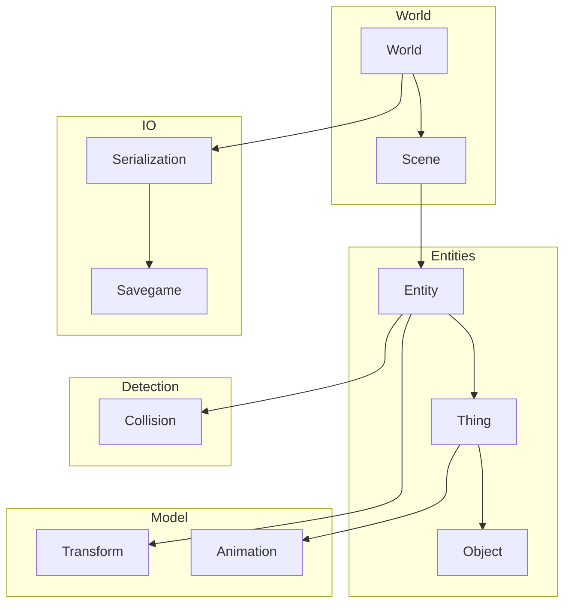
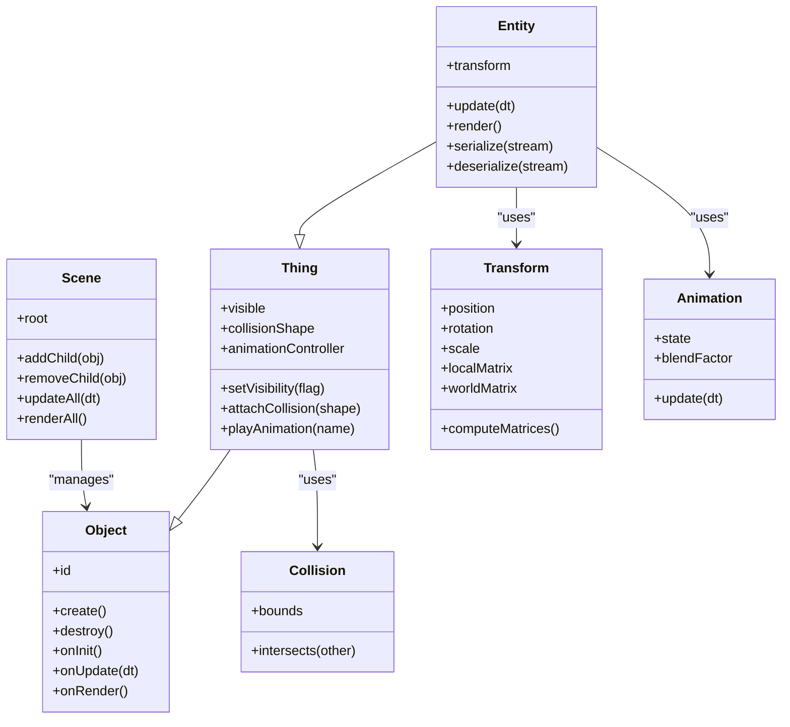
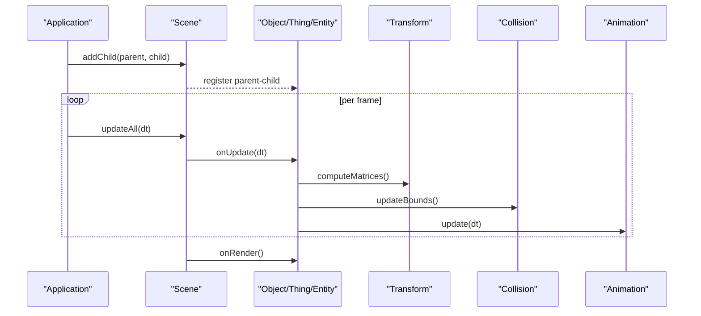
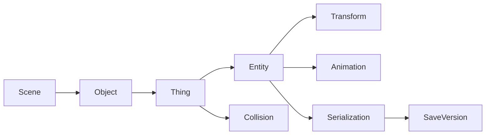

# Object Hierarchy and Base Classes

<cite>
**Referenced Files in This Document**
- [World.hpp](file://engine/Poseidon/World/World.hpp)
- [World.cpp](file://engine/Poseidon/World/World.cpp)
- [WorldImpl.cpp](file://engine/Poseidon/World/WorldImpl.cpp)
- [Scene.hpp](file://engine/Poseidon/World/Scene/Scene.hpp)
- [Scene.cpp](file://engine/Poseidon/World/Scene/Scene.cpp)
- [Entity.hpp](file://engine/Poseidon/World/Entities/Entity.hpp)
- [Entity.cpp](file://engine/Poseidon/World/Entities/Entity.cpp)
- [Transform.hpp](file://engine/Poseidon/World/Model/Transform.hpp)
- [Transform.cpp](file://engine/Poseidon/World/Model/Transform.cpp)
- [Collision.hpp](file://engine/Poseidon/World/Detection/Collision.hpp)
- [Animation.hpp](file://engine/Poseidon/World/Model/Animation.hpp)
- [Serialization.hpp](file://engine/Poseidon/IO/Serialization/Serialization.hpp)
- [Savegame.hpp](file://engine/Poseidon/Core/SaveVersion.hpp)
</cite>

## Table of Contents
1. [Introduction](#introduction)
2. [Project Structure](#project-structure)
3. [Core Components](#core-components)
4. [Architecture Overview](#architecture-overview)
5. [Detailed Component Analysis](#detailed-component-analysis)
6. [Dependency Analysis](#dependency-analysis)
7. [Performance Considerations](#performance-considerations)
8. [Troubleshooting Guide](#troubleshooting-guide)
9. [Conclusion](#conclusion)
10. [Appendices](#appendices)

## Introduction
This document explains the object hierarchy system that underpins all game entities in the engine. It focuses on the base Object architecture, the Thing intermediate layer, scene graph management, positioning and transformation matrices, lifecycle management (creation/destruction), parent-child relationships, coordinate transformations, extending the hierarchy for custom entities, and serialization for persistent storage. The goal is to provide both a conceptual overview and concrete implementation references so that developers can confidently extend and use the system.

## Project Structure
The object hierarchy lives primarily within the World subsystem and related modules:
- World orchestration and scene management
- Entity base class and derived types
- Transform and animation components
- Collision detection utilities
- Serialization and savegame integration

**Diagram sources**
- [World.hpp](file://engine/Poseidon/World/World.hpp)
- [Scene.hpp](file://engine/Poseidon/World/Scene/Scene.hpp)
- [Entity.hpp](file://engine/Poseidon/World/Entities/Entity.hpp)
- [Transform.hpp](file://engine/Poseidon/World/Model/Transform.hpp)
- [Animation.hpp](file://engine/Poseidon/World/Model/Animation.hpp)
- [Collision.hpp](file://engine/Poseidon/World/Detection/Collision.hpp)
- [Serialization.hpp](file://engine/Poseidon/IO/Serialization/Serialization.hpp)
- [SaveVersion.hpp](file://engine/Poseidon/Core/SaveVersion.hpp)

**Section sources**
- [World.hpp](file://engine/Poseidon/World/World.hpp)
- [Scene.hpp](file://engine/Poseidon/World/Scene/Scene.hpp)
- [Entity.hpp](file://engine/Poseidon/World/Entities/Entity.hpp)

## Core Components
- Object: The foundational entity type providing identity, basic state, and minimal lifecycle hooks.
- Thing: An intermediate layer over Object adding visibility flags, collision primitives, and animation support.
- Entity: The primary world entity that integrates transforms, animations, collisions, and scene membership.
- Scene: Manages the root node and traversal of the scene graph; coordinates updates and rendering culling.
- Transform: Encapsulates position, rotation, scale, and matrix computations for local and world space.
- Animation: Controls skeletal or procedural animation states and blending.
- Collision: Provides bounding volumes and intersection queries used by Things and Entities.
- Serialization: Handles reading/writing object state for persistence and network replication.

Key responsibilities:
- Object: Unique identification, creation/destruction lifecycle, registration callbacks.
- Thing: Visibility toggling, collision shape attachment, animation controller wiring.
- Entity: Full integration with transform, animation, collision, and scene update loops.
- Scene: Parent-child management, traversal order, update propagation, and draw ordering.

**Section sources**
- [Entity.hpp](file://engine/Poseidon/World/Entities/Entity.hpp)
- [Entity.cpp](file://engine/Poseidon/World/Entities/Entity.cpp)
- [Scene.hpp](file://engine/Poseidon/World/Scene/Scene.hpp)
- [Scene.cpp](file://engine/Poseidon/World/Scene/Scene.cpp)
- [Transform.hpp](file://engine/Poseidon/World/Model/Transform.hpp)
- [Transform.cpp](file://engine/Poseidon/World/Model/Transform.cpp)
- [Animation.hpp](file://engine/Poseidon/World/Model/Animation.hpp)
- [Collision.hpp](file://engine/Poseidon/World/Detection/Collision.hpp)

## Architecture Overview
The object hierarchy follows a layered design:
- Object is the base type for all world participants.
- Thing extends Object with features needed by most visible or interactive entities.
- Entity composes or inherits from Thing and adds full simulation capabilities.

Scene graph management:
- Objects are registered with a Scene via parent-child relationships.
- Coordinate transformations propagate from parent to child using Transform matrices.
- Updates flow through the scene graph each frame: input -> update -> animate -> collide -> render.

Lifecycle:
- Creation occurs through factory methods or scene APIs.
- Destruction is coordinated via the Scene to ensure safe removal and resource cleanup.
- Registration/unregistration hooks allow systems to react to object lifetime events.

**Diagram sources**
- [Entity.hpp](file://engine/Poseidon/World/Entities/Entity.hpp)
- [Scene.hpp](file://engine/Poseidon/World/Scene/Scene.hpp)
- [Transform.hpp](file://engine/Poseidon/World/Model/Transform.hpp)
- [Animation.hpp](file://engine/Poseidon/World/Model/Animation.hpp)
- [Collision.hpp](file://engine/Poseidon/World/Detection/Collision.hpp)

## Detailed Component Analysis

### Object Base Class
Responsibilities:
- Identity and lifecycle hooks for creation, initialization, update, and destruction.
- Minimal state required by higher layers.
- Registration points for scene integration.

Implementation highlights:
- Virtual lifecycle methods enable polymorphic behavior across derived types.
- Creation/destruction should be routed through controlled APIs to avoid leaks and dangling references.

Extending Object:
- Derive a new class and override lifecycle hooks as needed.
- Ensure proper construction order and resource acquisition in init.
- Release resources in destroy and unregister from any managers.

**Section sources**
- [Entity.hpp](file://engine/Poseidon/World/Entities/Entity.hpp)
- [Entity.cpp](file://engine/Poseidon/World/Entities/Entity.cpp)

### Thing Intermediate Layer
Responsibilities:
- Visibility control for rendering and culling.
- Collision shape attachment and query interfaces.
- Animation controller binding and playback methods.

Implementation highlights:
- Visibility flag influences update and render passes.
- Collision shapes are typically axis-aligned or sphere-based for fast broad-phase checks.
- Animation controller manages state transitions and blending.

Extending Thing:
- Add specialized collision shapes or animation sets.
- Provide helper methods for common behaviors like toggling interaction states.

**Section sources**
- [Entity.hpp](file://engine/Poseidon/World/Entities/Entity.hpp)
- [Animation.hpp](file://engine/Poseidon/World/Model/Animation.hpp)
- [Collision.hpp](file://engine/Poseidon/World/Detection/Collision.hpp)

### Entity and Scene Graph Management
Responsibilities:
- Full entity behavior: transform-driven positioning, animation updates, collision queries.
- Integration with Scene for parent-child relationships and traversal.

Scene operations:
- addChild(parent, child) establishes hierarchical relationships.
- removeChild(child) detaches nodes safely.
- updateAll(dt) propagates time-based updates down the tree.
- renderAll() traverses for drawing and culling.

Coordinate transformations:
- Each Transform computes local and world matrices.
- Child transforms multiply parent world matrices to compute final positions.

**Diagram sources**
- [Scene.hpp](file://engine/Poseidon/World/Scene/Scene.hpp)
- [Scene.cpp](file://engine/Poseidon/World/Scene/Scene.cpp)
- [Transform.hpp](file://engine/Poseidon/World/Model/Transform.hpp)
- [Animation.hpp](file://engine/Poseidon/World/Model/Animation.hpp)
- [Collision.hpp](file://engine/Poseidon/World/Detection/Collision.hpp)

**Section sources**
- [Scene.hpp](file://engine/Poseidon/World/Scene/Scene.hpp)
- [Scene.cpp](file://engine/Poseidon/World/Scene/Scene.cpp)
- [Transform.hpp](file://engine/Poseidon/World/Model/Transform.hpp)
- [Transform.cpp](file://engine/Poseidon/World/Model/Transform.cpp)

### Transform and Matrices
Responsibilities:
- Maintain position, rotation, and scale.
- Compute local and world transformation matrices efficiently.
- Support hierarchical transforms for parent-child relationships.

Key behaviors:
- Recompute world matrix when local transform changes or parent updates.
- Provide methods to convert between local and world coordinates.

Optimization tips:
- Cache dirty flags to avoid unnecessary recomputation.
- Use SIMD-friendly math where applicable.

**Section sources**
- [Transform.hpp](file://engine/Poseidon/World/Model/Transform.hpp)
- [Transform.cpp](file://engine/Poseidon/World/Model/Transform.cpp)

### Animation Support
Responsibilities:
- Manage animation states, blending, and playback speed.
- Integrate with entity update loop to advance frames.

Common patterns:
- State machines for idle, walk, run, attack sequences.
- Blending between overlapping animations for smooth transitions.

**Section sources**
- [Animation.hpp](file://engine/Poseidon/World/Model/Animation.hpp)

### Collision Detection
Responsibilities:
- Provide bounding volumes and intersection tests.
- Update bounds based on transform and animation pose.

Integration:
- Broad-phase checks use simple shapes (AABB/sphere).
- Narrow-phase may involve mesh-level tests for precise interactions.

**Section sources**
- [Collision.hpp](file://engine/Poseidon/World/Detection/Collision.hpp)

### Lifecycle Management: Creation and Destruction
Creation:
- Use Scene or factory APIs to instantiate objects.
- Initialize dependencies (transforms, animations, collisions) during construction.

Destruction:
- Remove from Scene before destroying to prevent dangling pointers.
- Release resources and clear references in destroy hooks.

Best practices:
- Centralize object pools for frequent creation/destruction.
- Validate parent-child relationships to avoid cycles.

**Section sources**
- [Entity.hpp](file://engine/Poseidon/World/Entities/Entity.hpp)
- [Entity.cpp](file://engine/Poseidon/World/Entities/Entity.cpp)
- [Scene.hpp](file://engine/Poseidon/World/Scene/Scene.hpp)

### Extending the Object Hierarchy
Steps to add a custom entity:
- Derive from Object for minimal behavior or from Thing/Entity for richer features.
- Override lifecycle hooks to integrate with update/render/collision pipelines.
- Attach necessary components (Transform, Animation, Collision).
- Register with Scene via addChild or factory methods.

Example pattern:
- CustomVehicle extends Entity, adds vehicle-specific physics and controls.
- CustomUIElement extends Thing, adds UI-specific visibility and interaction.

**Section sources**
- [Entity.hpp](file://engine/Poseidon/World/Entities/Entity.hpp)
- [Scene.hpp](file://engine/Poseidon/World/Scene/Scene.hpp)

### Serialization and Persistence
Responsibilities:
- Serialize object state for savegames and network replication.
- Deserialize to reconstruct objects consistently across sessions.

Mechanisms:
- Implement serialize/deserialize methods in Entity or Thing.
- Use Serialization utilities to write/read primitive types and containers.
- Versioning ensures compatibility across engine updates.

Persistence workflow:
- On save: traverse scene, collect serializable objects, write to stream.
- On load: read stream, instantiate objects, restore state, reattach to Scene.

**Section sources**
- [Serialization.hpp](file://engine/Poseidon/IO/Serialization/Serialization.hpp)
- [SaveVersion.hpp](file://engine/Poseidon/Core/SaveVersion.hpp)

## Dependency Analysis
The object hierarchy depends on several core subsystems:
- Scene manages object lifetimes and traversal.
- Transform provides spatial calculations.
- Animation drives visual state changes.
- Collision supports interaction queries.
- Serialization enables persistence.

**Diagram sources**
- [Scene.hpp](file://engine/Poseidon/World/Scene/Scene.hpp)
- [Entity.hpp](file://engine/Poseidon/World/Entities/Entity.hpp)
- [Transform.hpp](file://engine/Poseidon/World/Model/Transform.hpp)
- [Animation.hpp](file://engine/Poseidon/World/Model/Animation.hpp)
- [Collision.hpp](file://engine/Poseidon/World/Detection/Collision.hpp)
- [Serialization.hpp](file://engine/Poseidon/IO/Serialization/Serialization.hpp)
- [SaveVersion.hpp](file://engine/Poseidon/Core/SaveVersion.hpp)

**Section sources**
- [World.hpp](file://engine/Poseidon/World/World.hpp)
- [World.cpp](file://engine/Poseidon/World/World.cpp)
- [WorldImpl.cpp](file://engine/Poseidon/World/WorldImpl.cpp)

## Performance Considerations
- Minimize per-frame allocations in update loops; reuse buffers and objects where possible.
- Batch transform updates to reduce matrix recomputations.
- Use efficient collision broad-phase strategies to limit narrow-phase tests.
- Avoid deep scene graphs when possible; flatten where feasible for performance-critical paths.
- Profile serialization I/O and consider chunked writes for large scenes.

[No sources needed since this section provides general guidance]

## Troubleshooting Guide
Common issues and resolutions:
- Dangling references after destruction: Ensure objects are removed from Scene before deletion.
- Incorrect world transforms: Verify parent-child relationships and matrix update order.
- Animation not playing: Check animation state transitions and controller bindings.
- Collision misses: Confirm bounds updates and shape attachments.
- Serialization mismatches: Validate version numbers and field consistency.

Debugging tips:
- Log object lifecycle events (create/update/destroy).
- Visualize transforms and collision bounds during development.
- Use unit tests for transform math and collision queries.

**Section sources**
- [Entity.cpp](file://engine/Poseidon/World/Entities/Entity.cpp)
- [Scene.cpp](file://engine/Poseidon/World/Scene/Scene.cpp)
- [Transform.cpp](file://engine/Poseidon/World/Model/Transform.cpp)

## Conclusion
The object hierarchy provides a robust foundation for game entities through layered abstractions: Object as the base, Thing adding visibility and interaction, and Entity integrating transforms, animations, and collisions. Scene management ensures coherent updates and rendering, while serialization enables persistence. By following the extension patterns and best practices outlined here, developers can create scalable and maintainable game content.

[No sources needed since this section summarizes without analyzing specific files]

## Appendices
- Best practices for naming conventions and component composition.
- Recommended testing strategies for custom entities.
- References to additional engine documentation and examples.

[No sources needed since this section provides general guidance]