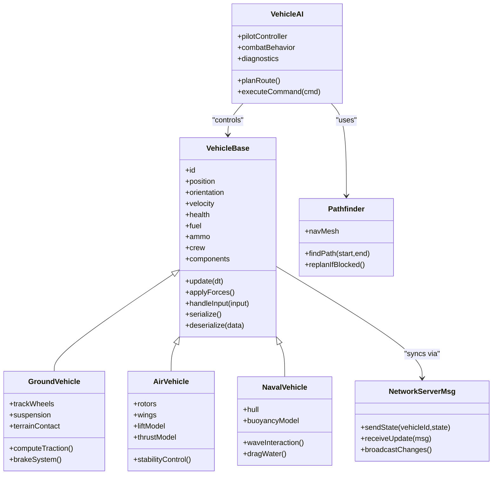
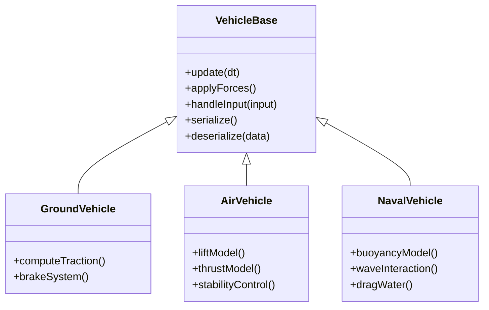
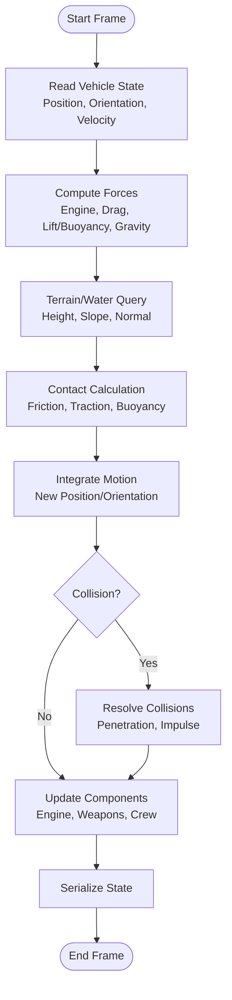
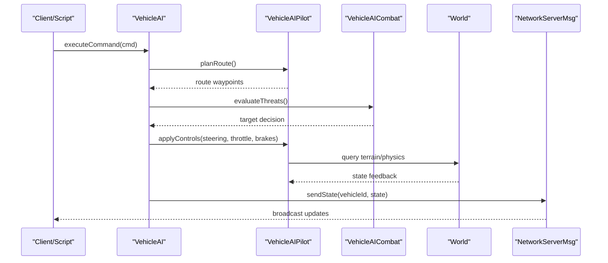
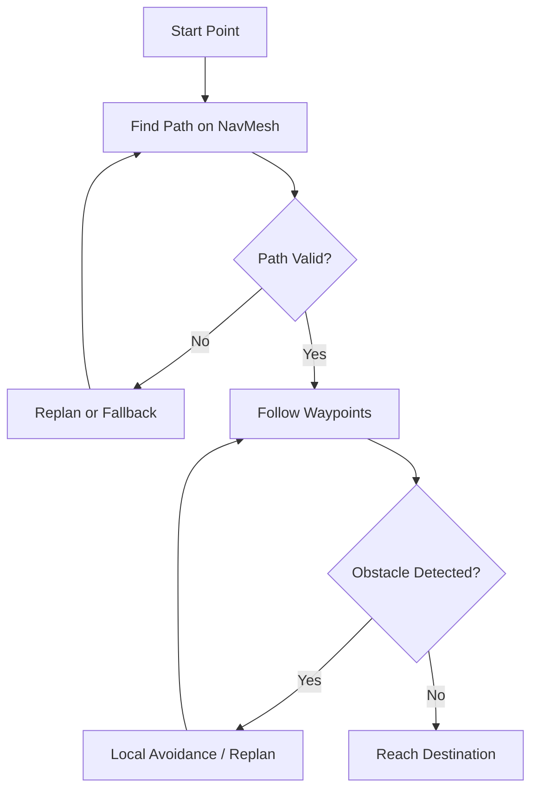
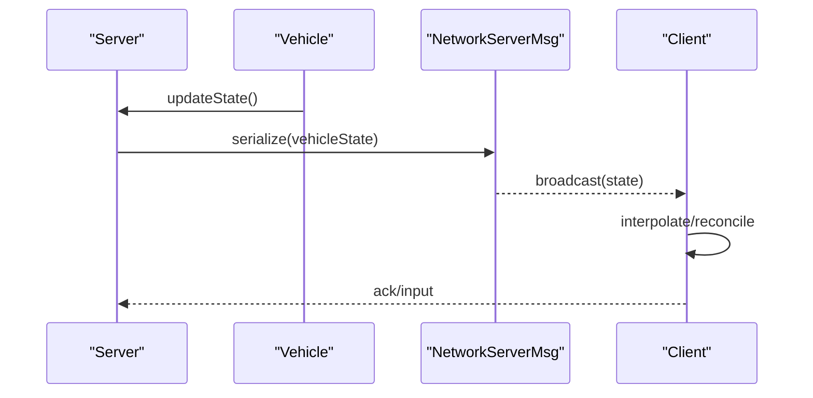
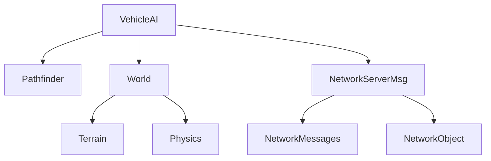

# Vehicle Entity System

<cite>
**Referenced Files in This Document**
- [VehicleAI.hpp](file://engine/Poseidon/AI/VehicleAI.hpp)
- [VehicleAI.cpp](file://engine/Poseidon/AI/VehicleAI.cpp)
- [VehicleAIPilot.cpp](file://engine/Poseidon/AI/VehicleAIPilot.cpp)
- [VehicleAICombat.cpp](file://engine/Poseidon/AI/VehicleAICombat.cpp)
- [VehicleAIDiag.cpp](file://engine/Poseidon/AI/VehicleAIDiag.cpp)
- [EntityAI.hpp](file://engine/Poseidon/AI/EntityAI.hpp)
- [EntityAIType.hpp](file://engine/Poseidon/AI/EntityAIType.hpp)
- [World.hpp](file://engine/Poseidon/World/World.hpp)
- [WorldImpl.cpp](file://engine/Poseidon/World/WorldImpl.cpp)
- [WorldSimHelpers.inc](file://engine/Poseidon/World/WorldSimHelpers.inc)
- [NetworkServerMsg.cpp](file://engine/Poseidon/Network/NetworkServerMsg.cpp)
- [NetworkMessages.hpp](file://engine/Poseidon/Network/NetworkMessages.hpp)
- [NetworkObject.hpp](file://engine/Poseidon/Network/NetworkObject.hpp)
- [Pathfinder.hpp](file://engine/Poseidon/AI/Path/Pathfinder.hpp)
- [NavMesh.hpp](file://engine/Poseidon/AI/Path/NavMesh.hpp)
- [Terrain.hpp](file://engine/Poseidon/World/Terrain/Terrain.hpp)
- [Physics.hpp](file://engine/Poseidon/World/Simulation/Physics/Physics.hpp)
</cite>

## Table of Contents
1. [Introduction](#introduction)
2. [Project Structure](#project-structure)
3. [Core Components](#core-components)
4. [Architecture Overview](#architecture-overview)
5. [Detailed Component Analysis](#detailed-component-analysis)
6. [Dependency Analysis](#dependency-analysis)
7. [Performance Considerations](#performance-considerations)
8. [Troubleshooting Guide](#troubleshooting-guide)
9. [Conclusion](#conclusion)
10. [Appendices](#appendices)

## Introduction
This document explains the vehicle entity system that manages all vehicular units in the simulation. It covers the base architecture for vehicles, specialization across ground (tanks, cars), air (helicopters, planes), and naval vessels, as well as physics simulation, movement mechanics, terrain interaction, components (engines, weapons, crew, damage), AI integration, pathfinding, and multiplayer synchronization. Guidance is provided for creating custom vehicle types, implementing behaviors, and optimizing performance at scale.

## Project Structure
The vehicle system spans multiple engine subsystems:
- AI layer: Vehicle AI controllers and behavior modules
- World layer: Entities, simulation helpers, terrain, and physics
- Network layer: Server message handling and object synchronization
- Pathfinding: Navigation mesh and path planning utilities

```mermaid
graph TB
subgraph "AI"
VAI["VehicleAI"]
Pilot["VehicleAIPilot"]
Combat["VehicleAICombat"]
Diag["VehicleAIDiag"]
end
subgraph "World"
World["World"]
Sim["Simulation Helpers"]
Terrain["Terrain"]
Physics["Physics"]
end
subgraph "Network"
NetMsg["NetworkServerMsg"]
NetObj["NetworkObject"]
NetMsgs["NetworkMessages"]
end
subgraph "Path"
PF["Pathfinder"]
Nav["NavMesh"]
end
VAI --> Pilot
VAI --> Combat
VAI --> Diag
VAI --> World
VAI --> PF
PF --> Nav
World --> Terrain
World --> Physics
NetMsg --> NetObj
NetMsg --> NetMsgs
VAI --> NetMsg
```

**Diagram sources**
- [VehicleAI.hpp](file://engine/Poseidon/AI/VehicleAI.hpp)
- [VehicleAIPilot.cpp](file://engine/Poseidon/AI/VehicleAIPilot.cpp)
- [VehicleAICombat.cpp](file://engine/Poseidon/AI/VehicleAICombat.cpp)
- [VehicleAIDiag.cpp](file://engine/Poseidon/AI/VehicleAIDiag.cpp)
- [World.hpp](file://engine/Poseidon/World/World.hpp)
- [WorldSimHelpers.inc](file://engine/Poseidon/World/WorldSimHelpers.inc)
- [NetworkServerMsg.cpp](file://engine/Poseidon/Network/NetworkServerMsg.cpp)
- [NetworkMessages.hpp](file://engine/Poseidon/Network/NetworkMessages.hpp)
- [NetworkObject.hpp](file://engine/Poseidon/Network/NetworkObject.hpp)
- [Pathfinder.hpp](file://engine/Poseidon/AI/Path/Pathfinder.hpp)
- [NavMesh.hpp](file://engine/Poseidon/AI/Path/NavMesh.hpp)

**Section sources**
- [VehicleAI.hpp](file://engine/Poseidon/AI/VehicleAI.hpp)
- [World.hpp](file://engine/Poseidon/World/World.hpp)
- [NetworkServerMsg.cpp](file://engine/Poseidon/Network/NetworkServerMsg.cpp)
- [Pathfinder.hpp](file://engine/Poseidon/AI/Path/Pathfinder.hpp)

## Core Components
- Vehicle base class: Provides common state, lifecycle, and interfaces for all vehicle types. Specializations include ground, air, and naval variants with domain-specific movement and interaction logic.
- Vehicle AI: Central controller coordinating pilot control, combat behaviors, and diagnostics.
- Simulation helpers: Utilities for physics updates, collision checks, and terrain queries used by vehicles.
- Networking: Message serialization and replication for vehicle state across clients and server.

Key responsibilities:
- State management: position, orientation, velocity, health, fuel, ammo, crew, component status
- Movement: acceleration, braking, steering, lift/thrust, buoyancy, drag, friction
- Interaction: terrain contact, water surface, obstacles, destructible objects
- Weapons: targeting, fire control, reload, ammo consumption, effects
- Crew: roles, morale, skill modifiers, incapacitation
- Damage: hit zones, armor, penetration, spalling, critical failures

**Section sources**
- [VehicleAI.hpp](file://engine/Poseidon/AI/VehicleAI.hpp)
- [WorldSimHelpers.inc](file://engine/Poseidon/World/WorldSimHelpers.inc)
- [NetworkMessages.hpp](file://engine/Poseidon/Network/NetworkMessages.hpp)

## Architecture Overview
The vehicle system follows a layered design:
- AI layer drives high-level decisions and low-level controls
- World layer provides simulation primitives and environment queries
- Network layer ensures consistent state across peers
- Pathfinding supplies routes and constraints for movement



**Diagram sources**
- [VehicleAI.hpp](file://engine/Poseidon/AI/VehicleAI.hpp)
- [Pathfinder.hpp](file://engine/Poseidon/AI/Path/Pathfinder.hpp)
- [NetworkServerMsg.cpp](file://engine/Poseidon/Network/NetworkServerMsg.cpp)

## Detailed Component Analysis

### Vehicle Base Class and Specializations
The base class encapsulates shared attributes and lifecycle methods. Specialized classes extend movement models and interactions appropriate to their domain:
- GroundVehicle: tracks/wheels, suspension, traction, braking, terrain slope handling
- AirVehicle: rotors/wings, lift, thrust, stability, stall behavior
- NavalVehicle: hull, buoyancy, wave forces, water drag



**Diagram sources**
- [VehicleAI.hpp](file://engine/Poseidon/AI/VehicleAI.hpp)

**Section sources**
- [VehicleAI.hpp](file://engine/Poseidon/AI/VehicleAI.hpp)

### Vehicle Physics and Movement Mechanics
Physics updates integrate forces, velocities, and collisions each frame. Vehicles interact with terrain through contact points, normal vectors, and friction coefficients. Water surfaces apply buoyancy and wave-induced forces.



**Diagram sources**
- [WorldSimHelpers.inc](file://engine/Poseidon/World/WorldSimHelpers.inc)
- [Physics.hpp](file://engine/Poseidon/World/Simulation/Physics/Physics.hpp)
- [Terrain.hpp](file://engine/Poseidon/World/Terrain/Terrain.hpp)

**Section sources**
- [WorldSimHelpers.inc](file://engine/Poseidon/World/WorldSimHelpers.inc)
- [Physics.hpp](file://engine/Poseidon/World/Simulation/Physics/Physics.hpp)
- [Terrain.hpp](file://engine/Poseidon/World/Terrain/Terrain.hpp)

### Engine, Weapons, Crew, and Damage Modeling
- Engines: throttle curves, power delivery, fuel consumption, overheating, failure modes
- Weapons: targeting systems, fire control, ammo types, reload timers, muzzle effects
- Crew: role assignments, skill modifiers, stress/morale, incapacitation and revival
- Damage: hit zones, armor layers, penetration, spalling, critical hits, cascading failures

These components are updated during the simulation step and exposed via the vehicle interface for AI and networking.

**Section sources**
- [VehicleAI.hpp](file://engine/Poseidon/AI/VehicleAI.hpp)
- [WorldSimHelpers.inc](file://engine/Poseidon/World/WorldSimHelpers.inc)

### Vehicle AI Integration
The VehicleAI orchestrates pilot control, combat behaviors, and diagnostics. It interprets commands, plans routes, and delegates low-level control to specialized modules.



**Diagram sources**
- [VehicleAI.cpp](file://engine/Poseidon/AI/VehicleAI.cpp)
- [VehicleAIPilot.cpp](file://engine/Poseidon/AI/VehicleAIPilot.cpp)
- [VehicleAICombat.cpp](file://engine/Poseidon/AI/VehicleAICombat.cpp)
- [NetworkServerMsg.cpp](file://engine/Poseidon/Network/NetworkServerMsg.cpp)

**Section sources**
- [VehicleAI.cpp](file://engine/Poseidon/AI/VehicleAI.cpp)
- [VehicleAIPilot.cpp](file://engine/Poseidon/AI/VehicleAIPilot.cpp)
- [VehicleAICombat.cpp](file://engine/Poseidon/AI/VehicleAICombat.cpp)
- [NetworkServerMsg.cpp](file://engine/Poseidon/Network/NetworkServerMsg.cpp)

### Pathfinding and Navigation
Pathfinding uses a navigation mesh to compute feasible routes and replans when blocked. Vehicles consume paths to generate control inputs.



**Diagram sources**
- [Pathfinder.hpp](file://engine/Poseidon/AI/Path/Pathfinder.hpp)
- [NavMesh.hpp](file://engine/Poseidon/AI/Path/NavMesh.hpp)

**Section sources**
- [Pathfinder.hpp](file://engine/Poseidon/AI/Path/Pathfinder.hpp)
- [NavMesh.hpp](file://engine/Poseidon/AI/Path/NavMesh.hpp)

### Multiplayer Synchronization
Vehicle state is serialized and broadcast from the server to clients. Messages include position, orientation, velocity, health, fuel, ammo, and component flags. Clients interpolate and reconcile to maintain smooth visuals.



**Diagram sources**
- [NetworkServerMsg.cpp](file://engine/Poseidon/Network/NetworkServerMsg.cpp)
- [NetworkMessages.hpp](file://engine/Poseidon/Network/NetworkMessages.hpp)
- [NetworkObject.hpp](file://engine/Poseidon/Network/NetworkObject.hpp)

**Section sources**
- [NetworkServerMsg.cpp](file://engine/Poseidon/Network/NetworkServerMsg.cpp)
- [NetworkMessages.hpp](file://engine/Poseidon/Network/NetworkMessages.hpp)
- [NetworkObject.hpp](file://engine/Poseidon/Network/NetworkObject.hpp)

### Creating Custom Vehicle Types
To add a new vehicle type:
- Extend the base vehicle class with domain-specific movement and interaction logic
- Implement required interfaces for physics queries, terrain contact, and serialization
- Register the type with the world/entity factory
- Provide AI behavior hooks for pilot/combat modules
- Ensure network messages include necessary fields for synchronization

Best practices:
- Keep heavy computations off the hot path; use precomputed tables where possible
- Use component composition for engines, weapons, and crew to reuse logic
- Validate configuration data at load time to avoid runtime errors

**Section sources**
- [VehicleAI.hpp](file://engine/Poseidon/AI/VehicleAI.hpp)
- [World.hpp](file://engine/Poseidon/World/World.hpp)
- [NetworkMessages.hpp](file://engine/Poseidon/Network/NetworkMessages.hpp)

### Implementing Vehicle Behaviors
Behaviors are implemented within AI modules:
- Pilot controller handles navigation, speed control, and stabilization
- Combat module manages targeting, firing, and evasion
- Diagnostics module monitors health, fuel, and component status

Steps:
- Define behavior states and transitions
- Hook into input processing and command execution
- Use world queries for environment-aware decisions
- Emit network updates for consistent state

**Section sources**
- [VehicleAIPilot.cpp](file://engine/Poseidon/AI/VehicleAIPilot.cpp)
- [VehicleAICombat.cpp](file://engine/Poseidon/AI/VehicleAICombat.cpp)
- [VehicleAIDiag.cpp](file://engine/Poseidon/AI/VehicleAIDiag.cpp)

### Optimizing Vehicle Performance
Recommendations:
- Batch physics updates and reduce per-frame allocations
- Use spatial partitioning for collision and terrain queries
- Limit AI decision frequency; cache results when stable
- Compress network payloads and prioritize critical state
- LOD for rendering and simulation detail based on distance and importance

[No sources needed since this section provides general guidance]

## Dependency Analysis
The vehicle system depends on AI, world simulation, networking, and pathfinding modules. Coupling is minimized through interfaces and message-based communication.



**Diagram sources**
- [VehicleAI.hpp](file://engine/Poseidon/AI/VehicleAI.hpp)
- [Pathfinder.hpp](file://engine/Poseidon/AI/Path/Pathfinder.hpp)
- [World.hpp](file://engine/Poseidon/World/World.hpp)
- [NetworkServerMsg.cpp](file://engine/Poseidon/Network/NetworkServerMsg.cpp)
- [NetworkMessages.hpp](file://engine/Poseidon/Network/NetworkMessages.hpp)
- [NetworkObject.hpp](file://engine/Poseidon/Network/NetworkObject.hpp)

**Section sources**
- [VehicleAI.hpp](file://engine/Poseidon/AI/VehicleAI.hpp)
- [World.hpp](file://engine/Poseidon/World/World.hpp)
- [NetworkServerMsg.cpp](file://engine/Poseidon/Network/NetworkServerMsg.cpp)

## Performance Considerations
- Physics: Use fixed timestep integration; coalesce force calculations; avoid repeated terrain queries
- AI: Decouple decision loops from rendering; use event-driven updates
- Networking: Prioritize latency-sensitive messages; implement client-side prediction and reconciliation
- Memory: Reuse buffers; minimize dynamic allocations in hot paths
- Rendering: Apply LOD and culling; share shaders and textures

[No sources needed since this section provides general guidance]

## Troubleshooting Guide
Common issues and resolutions:
- Stuttering during physics: Check for excessive collision checks; enable broad-phase culling
- AI jitter: Smooth control inputs; increase update frequency or add interpolation
- Desync in multiplayer: Verify serialization consistency; ensure deterministic updates
- Terrain penetration: Adjust contact point sampling; refine collision shapes
- Weapon misfire: Validate ammo and cooldown states; check targeting logic

Debugging tools:
- Vehicle diagnostics module for telemetry and logs
- Network message inspection for serialization mismatches
- World simulation helpers for querying terrain and physics state

**Section sources**
- [VehicleAIDiag.cpp](file://engine/Poseidon/AI/VehicleAIDiag.cpp)
- [NetworkServerMsg.cpp](file://engine/Poseidon/Network/NetworkServerMsg.cpp)
- [WorldSimHelpers.inc](file://engine/Poseidon/World/WorldSimHelpers.inc)

## Conclusion
The vehicle entity system integrates AI, physics, terrain, and networking to deliver robust vehicular simulation across ground, air, and naval domains. By following the outlined architecture and best practices, developers can create custom vehicle types, implement complex behaviors, and optimize performance for large-scale simulations.

[No sources needed since this section summarizes without analyzing specific files]

## Appendices
- API references: Vehicle base interfaces, AI controllers, network messages
- Configuration schemas: Vehicle definitions, component parameters
- Examples: Sample mission scripts demonstrating vehicle spawning and control

[No sources needed since this section provides general guidance]