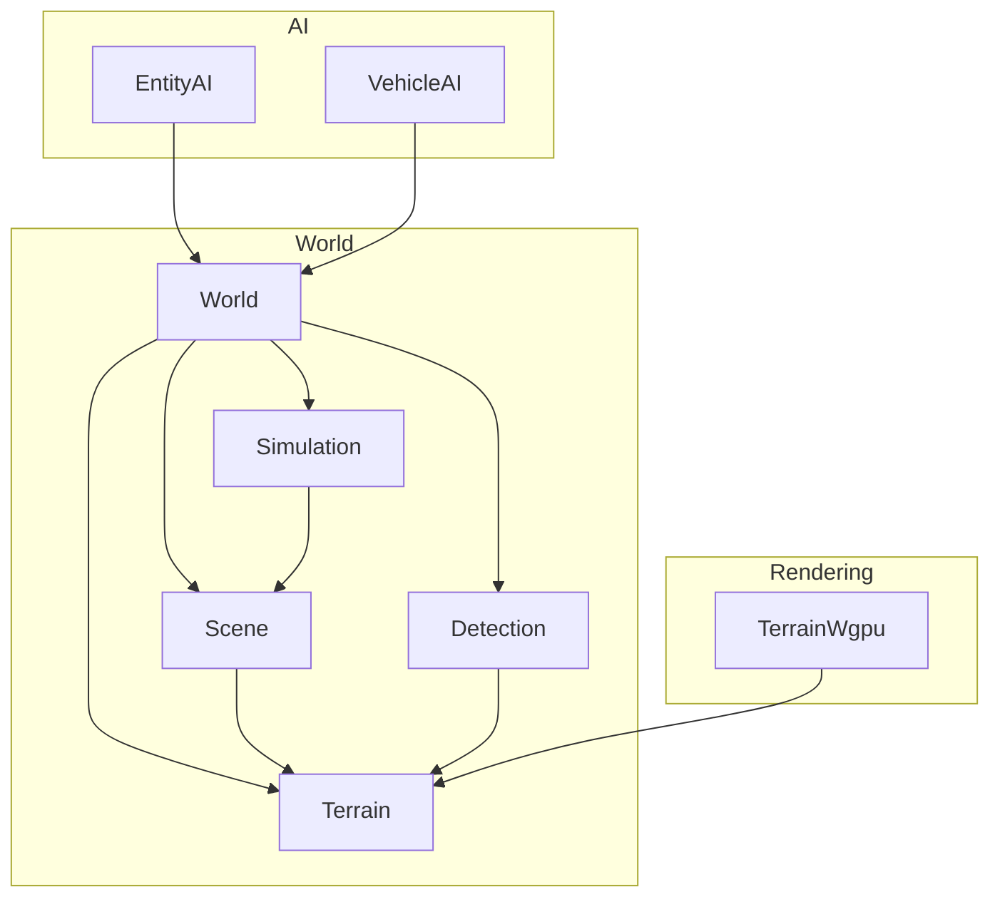
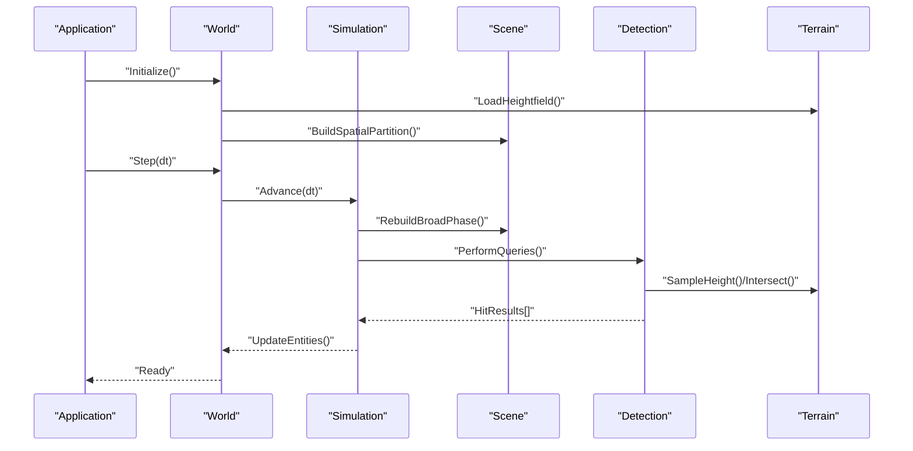
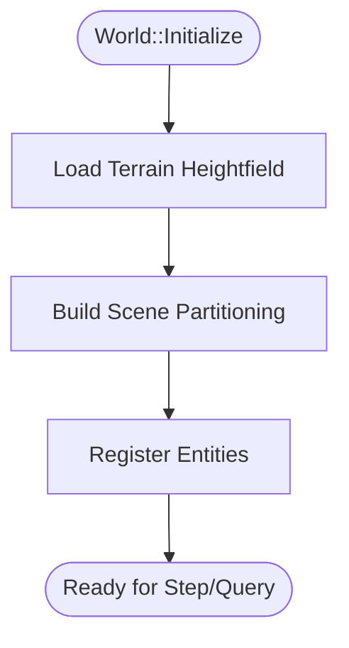
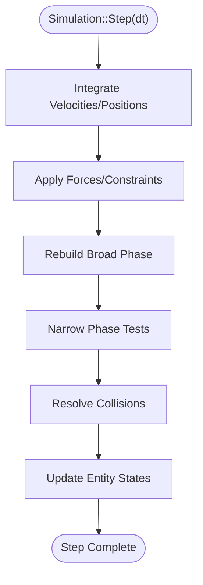
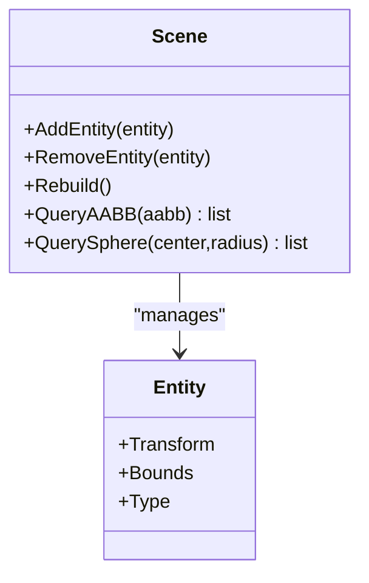
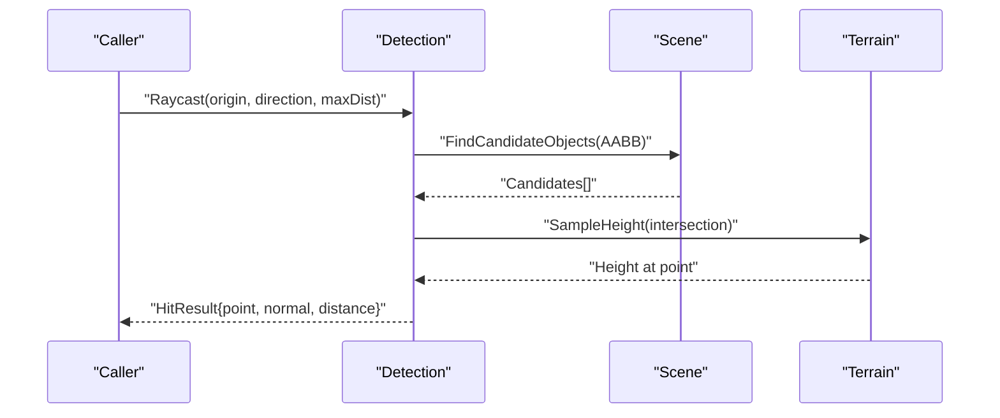
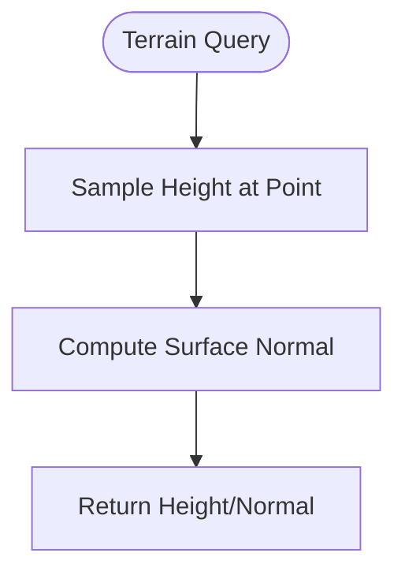
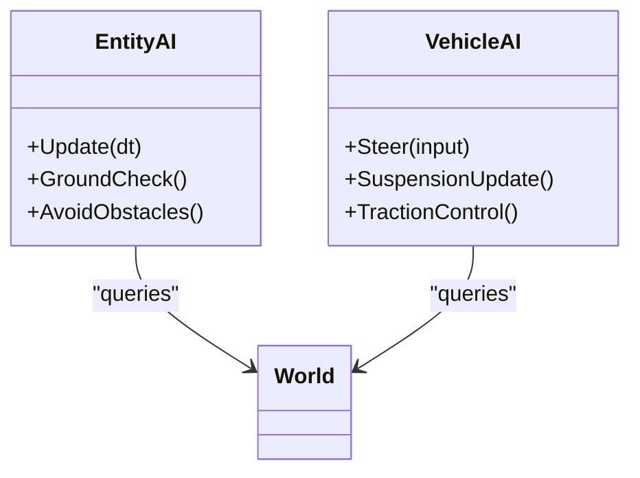
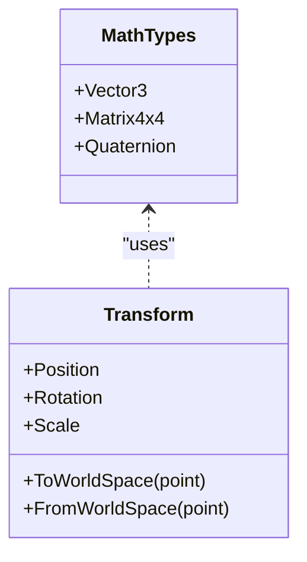
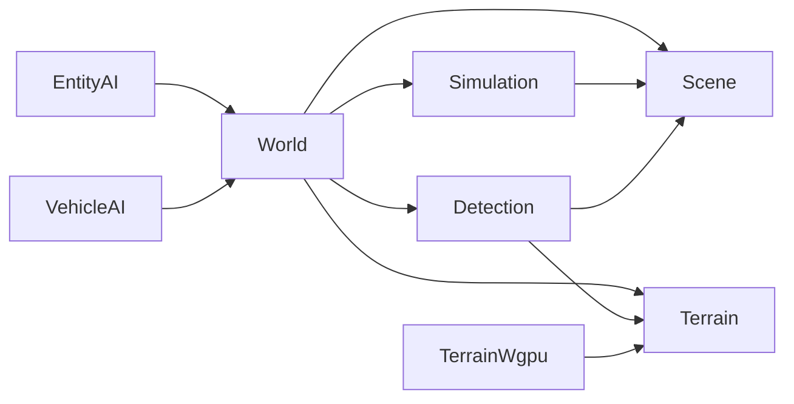

# Physics and Collision

<cite>
**Referenced Files in This Document**
- [World.hpp](file://engine/Poseidon/World/World.hpp)
- [World.cpp](file://engine/Poseidon/World/World.cpp)
- [WorldImpl.cpp](file://engine/Poseidon/World/WorldImpl.cpp)
- [WorldInit.cpp](file://engine/Poseidon/World/WorldInit.cpp)
- [WorldSimHelpers.inc](file://engine/Poseidon/World/WorldSimHelpers.inc)
- [WorldShared.hpp](file://engine/Poseidon/World/WorldShared.hpp)
- [Terrain.hpp](file://engine/Poseidon/World/Terrain/Terrain.hpp)
- [Terrain.cpp](file://engine/Poseidon/World/Terrain/Terrain.cpp)
- [TerrainWgpu.hpp](file://engine/WgpuRenderer/TerrainWgpu.hpp)
- [TerrainWgpu.cpp](file://engine/WgpuRenderer/TerrainWgpu.cpp)
- [Scene.hpp](file://engine/Poseidon/World/Scene/Scene.hpp)
- [Scene.cpp](file://engine/Poseidon/World/Scene/Scene.cpp)
- [EntityAI.hpp](file://engine/Poseidon/AI/EntityAI.hpp)
- [VehicleAI.hpp](file://engine/Poseidon/AI/VehicleAI.hpp)
- [VehicleAI.cpp](file://engine/Poseidon/AI/VehicleAI.cpp)
- [Detection.hpp](file://engine/Poseidon/World/Detection/Detection.hpp)
- [Detection.cpp](file://engine/Poseidon/World/Detection/Detection.cpp)
- [Simulation.hpp](file://engine/Poseidon/World/Simulation/Simulation.hpp)
- [Simulation.cpp](file://engine/Poseidon/World/Simulation/Simulation.cpp)
- [MathTypes.hpp](file://engine/Poseidon/Foundation/Math/MathTypes.hpp)
- [MathTransform.hpp](file://engine/Poseidon/Foundation/Math/MathTransform.hpp)
</cite>

## Table of Contents
1. [Introduction](#introduction)
2. [Project Structure](#project-structure)
3. [Core Components](#core-components)
4. [Architecture Overview](#architecture-overview)
5. [Detailed Component Analysis](#detailed-component-analysis)
6. [Dependency Analysis](#dependency-analysis)
7. [Performance Considerations](#performance-considerations)
8. [Troubleshooting Guide](#troubleshooting-guide)
9. [Conclusion](#conclusion)
10. [Appendices](#appendices)

## Introduction
This document explains the physics and collision detection systems implemented in the engine, focusing on how entities interact with terrain and collision boundaries. It covers intersection testing, raycasting, sphere tests, bounding volume hierarchies, and simulation updates. It also describes integration points for vehicle movement, projectile trajectories, and environmental interactions, along with practical guidance for custom collision shapes, query optimization, and debugging techniques.

## Project Structure
The physics and collision subsystems are primarily located under the World module and related rendering components:
- World core and initialization orchestrate scene state, simulation steps, and queries.
- Terrain provides heightfield sampling and collision surfaces.
- Scene manages spatial organization and broad-phase structures.
- Detection encapsulates raycasting and shape tests.
- Simulation coordinates time-stepping and physics updates.
- AI modules (EntityAI, VehicleAI) consume physics results to drive behavior.
- Rendering backends expose terrain geometry used by collision queries.

**Diagram sources**
- [World.hpp](file://engine/Poseidon/World/World.hpp)
- [Simulation.hpp](file://engine/Poseidon/World/Simulation/Simulation.hpp)
- [Scene.hpp](file://engine/Poseidon/World/Scene/Scene.hpp)
- [Detection.hpp](file://engine/Poseidon/World/Detection/Detection.hpp)
- [Terrain.hpp](file://engine/Poseidon/World/Terrain/Terrain.hpp)
- [TerrainWgpu.hpp](file://engine/WgpuRenderer/TerrainWgpu.hpp)
- [EntityAI.hpp](file://engine/Poseidon/AI/EntityAI.hpp)
- [VehicleAI.hpp](file://engine/Poseidon/AI/VehicleAI.hpp)

**Section sources**
- [World.hpp](file://engine/Poseidon/World/World.hpp)
- [World.cpp](file://engine/Poseidon/World/World.cpp)
- [WorldImpl.cpp](file://engine/Poseidon/World/WorldImpl.cpp)
- [WorldInit.cpp](file://engine/Poseidon/World/WorldInit.cpp)
- [Scene.hpp](file://engine/Poseidon/World/Scene/Scene.hpp)
- [Terrain.hpp](file://engine/Poseidon/World/Terrain/Terrain.hpp)
- [TerrainWgpu.hpp](file://engine/WgpuRenderer/TerrainWgpu.hpp)
- [EntityAI.hpp](file://engine/Poseidon/AI/EntityAI.hpp)
- [VehicleAI.hpp](file://engine/Poseidon/AI/VehicleAI.hpp)

## Core Components
- World: Central coordinator for simulation lifecycle, scene management, and high-level queries. It initializes terrain, registers entities, and drives per-frame updates.
- Simulation: Time-stepping engine that advances positions, velocities, and applies forces or constraints. It invokes broad-phase and narrow-phase collision routines.
- Scene: Spatial partitioning and entity registry; maintains bounding volumes and accelerators for efficient queries.
- Detection: Raycasting and shape intersection utilities; exposes APIs for line/sphere/capsule tests against terrain and scene objects.
- Terrain: Heightfield representation with sampling functions and collision surface generation; integrates with rendering for consistent geometry.
- EntityAI and VehicleAI: Consume physics outputs to compute movement, steering, and interaction with environment.

Key responsibilities:
- Broad-phase culling via spatial partitioning (e.g., grids or BVH).
- Narrow-phase intersection tests between primitives and meshes.
- Consistent world-space transforms and coordinate frames.
- Deterministic stepping and rollback-friendly state snapshots.

**Section sources**
- [World.hpp](file://engine/Poseidon/World/World.hpp)
- [World.cpp](file://engine/Poseidon/World/World.cpp)
- [WorldImpl.cpp](file://engine/Poseidon/World/WorldImpl.cpp)
- [WorldInit.cpp](file://engine/Poseidon/World/WorldInit.cpp)
- [Simulation.hpp](file://engine/Poseidon/World/Simulation/Simulation.hpp)
- [Simulation.cpp](file://engine/Poseidon/World/Simulation/Simulation.cpp)
- [Scene.hpp](file://engine/Poseidon/World/Scene/Scene.hpp)
- [Scene.cpp](file://engine/Poseidon/World/Scene/Scene.cpp)
- [Detection.hpp](file://engine/Poseidon/World/Detection/Detection.hpp)
- [Detection.cpp](file://engine/Poseidon/World/Detection/Detection.cpp)
- [Terrain.hpp](file://engine/Poseidon/World/Terrain/Terrain.hpp)
- [Terrain.cpp](file://engine/Poseidon/World/Terrain/Terrain.cpp)
- [TerrainWgpu.hpp](file://engine/WgpuRenderer/TerrainWgpu.hpp)
- [TerrainWgpu.cpp](file://engine/WgpuRenderer/TerrainWgpu.cpp)
- [EntityAI.hpp](file://engine/Poseidon/AI/EntityAI.hpp)
- [VehicleAI.hpp](file://engine/Poseidon/AI/VehicleAI.hpp)

## Architecture Overview
The system follows a layered architecture:
- Application layer calls World methods to perform queries and update simulation.
- Simulation orchestrates time steps and delegates to Scene for spatial queries.
- Detection implements specific intersection algorithms using Scene and Terrain.
- Terrain provides geometric primitives and height sampling.
- Rendering ensures visual consistency with collision geometry.

**Diagram sources**
- [World.cpp](file://engine/Poseidon/World/World.cpp)
- [Simulation.cpp](file://engine/Poseidon/World/Simulation/Simulation.cpp)
- [Scene.cpp](file://engine/Poseidon/World/Scene/Scene.cpp)
- [Detection.cpp](file://engine/Poseidon/World/Detection/Detection.cpp)
- [Terrain.cpp](file://engine/Poseidon/World/Terrain/Terrain.cpp)

**Section sources**
- [World.cpp](file://engine/Poseidon/World/World.cpp)
- [Simulation.cpp](file://engine/Poseidon/World/Simulation/Simulation.cpp)
- [Scene.cpp](file://engine/Poseidon/World/Scene/Scene.cpp)
- [Detection.cpp](file://engine/Poseidon/World/Detection/Detection.cpp)
- [Terrain.cpp](file://engine/Poseidon/World/Terrain/Terrain.cpp)

## Detailed Component Analysis

### World and Initialization
World coordinates terrain loading, scene setup, and simulation lifecycle. It exposes entry points for stepping, querying, and entity registration. Initialization builds the terrain heightfield and constructs spatial partitions for broad-phase culling.

**Diagram sources**
- [WorldInit.cpp](file://engine/Poseidon/World/WorldInit.cpp)
- [World.cpp](file://engine/Poseidon/World/World.cpp)

**Section sources**
- [WorldInit.cpp](file://engine/Poseidon/World/WorldInit.cpp)
- [World.cpp](file://engine/Poseidon/World/World.cpp)
- [WorldImpl.cpp](file://engine/Poseidon/World/WorldImpl.cpp)

### Simulation Updates
Simulation advances the world state each frame:
- Integrates velocities and positions.
- Applies forces and constraints.
- Invokes broad-phase rebuild and narrow-phase collision checks.
- Produces hit results consumed by AI and gameplay logic.

**Diagram sources**
- [Simulation.cpp](file://engine/Poseidon/World/Simulation/Simulation.cpp)
- [WorldSimHelpers.inc](file://engine/Poseidon/World/WorldSimHelpers.inc)

**Section sources**
- [Simulation.cpp](file://engine/Poseidon/World/Simulation/Simulation.cpp)
- [WorldSimHelpers.inc](file://engine/Poseidon/World/WorldSimHelpers.inc)

### Scene and Spatial Partitioning
Scene manages entity lists and spatial acceleration structures:
- Maintains bounding volumes per entity.
- Builds hierarchical structures (e.g., grid, BVH) for broad-phase queries.
- Supports dynamic updates when entities move or change bounds.

**Diagram sources**
- [Scene.hpp](file://engine/Poseidon/World/Scene/Scene.hpp)
- [Scene.cpp](file://engine/Poseidon/World/Scene/Scene.cpp)

**Section sources**
- [Scene.hpp](file://engine/Poseidon/World/Scene/Scene.hpp)
- [Scene.cpp](file://engine/Poseidon/World/Scene/Scene.cpp)

### Detection: Raycasting and Shape Tests
Detection provides APIs for:
- Raycast against terrain and scene objects.
- Sphere tests for proximity checks and penetration depth.
- Capsule or box tests for character and vehicle collisions.

**Diagram sources**
- [Detection.hpp](file://engine/Poseidon/World/Detection/Detection.hpp)
- [Detection.cpp](file://engine/Poseidon/World/Detection/Detection.cpp)
- [Terrain.hpp](file://engine/Poseidon/World/Terrain/Terrain.hpp)
- [Terrain.cpp](file://engine/Poseidon/World/Terrain/Terrain.cpp)

**Section sources**
- [Detection.hpp](file://engine/Poseidon/World/Detection/Detection.hpp)
- [Detection.cpp](file://engine/Poseidon/World/Detection/Detection.cpp)
- [Terrain.hpp](file://engine/Poseidon/World/Terrain/Terrain.hpp)
- [Terrain.cpp](file://engine/Poseidon/World/Terrain/Terrain.cpp)

### Terrain Integration
Terrain supplies heightfield data and collision surfaces:
- Height sampling at arbitrary world positions.
- Normal computation for stable contact resolution.
- LOD-aware sampling to balance accuracy and performance.

**Diagram sources**
- [Terrain.hpp](file://engine/Poseidon/World/Terrain/Terrain.hpp)
- [Terrain.cpp](file://engine/Poseidon/World/Terrain/Terrain.cpp)
- [TerrainWgpu.hpp](file://engine/WgpuRenderer/TerrainWgpu.hpp)
- [TerrainWgpu.cpp](file://engine/WgpuRenderer/TerrainWgpu.cpp)

**Section sources**
- [Terrain.hpp](file://engine/Poseidon/World/Terrain/Terrain.hpp)
- [Terrain.cpp](file://engine/Poseidon/World/Terrain/Terrain.cpp)
- [TerrainWgpu.hpp](file://engine/WgpuRenderer/TerrainWgpu.hpp)
- [TerrainWgpu.cpp](file://engine/WgpuRenderer/TerrainWgpu.cpp)

### AI Integration: Entity and Vehicle Movement
EntityAI and VehicleAI use physics results to control motion:
- EntityAI performs ground checks and obstacle avoidance.
- VehicleAI computes steering, traction, and suspension responses based on terrain normals and collision contacts.

**Diagram sources**
- [EntityAI.hpp](file://engine/Poseidon/AI/EntityAI.hpp)
- [VehicleAI.hpp](file://engine/Poseidon/AI/VehicleAI.hpp)
- [VehicleAI.cpp](file://engine/Poseidon/AI/VehicleAI.cpp)

**Section sources**
- [EntityAI.hpp](file://engine/Poseidon/AI/EntityAI.hpp)
- [VehicleAI.hpp](file://engine/Poseidon/AI/VehicleAI.hpp)
- [VehicleAI.cpp](file://engine/Poseidon/AI/VehicleAI.cpp)

### Data Models and Transforms
Consistent math types and transforms ensure accurate collision calculations:
- Vector, matrix, and quaternion operations.
- Transform composition for world-space positioning.
- Bounding volume definitions for broad-phase culling.

**Diagram sources**
- [MathTypes.hpp](file://engine/Poseidon/Foundation/Math/MathTypes.hpp)
- [MathTransform.hpp](file://engine/Poseidon/Foundation/Math/MathTransform.hpp)

**Section sources**
- [MathTypes.hpp](file://engine/Poseidon/Foundation/Math/MathTypes.hpp)
- [MathTransform.hpp](file://engine/Poseidon/Foundation/Math/MathTransform.hpp)

## Dependency Analysis
The following diagram shows key dependencies among physics and collision components:

**Diagram sources**
- [World.hpp](file://engine/Poseidon/World/World.hpp)
- [Simulation.hpp](file://engine/Poseidon/World/Simulation/Simulation.hpp)
- [Scene.hpp](file://engine/Poseidon/World/Scene/Scene.hpp)
- [Detection.hpp](file://engine/Poseidon/World/Detection/Detection.hpp)
- [Terrain.hpp](file://engine/Poseidon/World/Terrain/Terrain.hpp)
- [TerrainWgpu.hpp](file://engine/WgpuRenderer/TerrainWgpu.hpp)
- [EntityAI.hpp](file://engine/Poseidon/AI/EntityAI.hpp)
- [VehicleAI.hpp](file://engine/Poseidon/AI/VehicleAI.hpp)

**Section sources**
- [World.hpp](file://engine/Poseidon/World/World.hpp)
- [Simulation.hpp](file://engine/Poseidon/World/Simulation/Simulation.hpp)
- [Scene.hpp](file://engine/Poseidon/World/Scene/Scene.hpp)
- [Detection.hpp](file://engine/Poseidon/World/Detection/Detection.hpp)
- [Terrain.hpp](file://engine/Poseidon/World/Terrain/Terrain.hpp)
- [TerrainWgpu.hpp](file://engine/WgpuRenderer/TerrainWgpu.hpp)
- [EntityAI.hpp](file://engine/Poseidon/AI/EntityAI.hpp)
- [VehicleAI.hpp](file://engine/Poseidon/AI/VehicleAI.hpp)

## Performance Considerations
- Broad-phase optimization: Use spatial grids or BVH to reduce candidate sets for narrow-phase tests.
- Batched queries: Group raycasts and sphere tests to amortize overhead.
- LOD sampling: Downsample terrain heightfields for distant queries.
- Culling strategies: Early-out on bounding volume tests before expensive mesh intersections.
- Memory locality: Store entity data in contiguous arrays to improve cache performance.
- Parallelism: Distribute independent queries across threads where safe.
- Determinism: Maintain fixed-point or consistent floating-point behavior for reproducible simulations.

[No sources needed since this section provides general guidance]

## Troubleshooting Guide
Common issues and remedies:
- Tunneling: Increase step frequency or use continuous collision detection for fast-moving objects.
- Stuttering: Rebuild spatial partitions less frequently; use incremental updates.
- Incorrect normals: Verify terrain sampling resolution and normal computation method.
- Inconsistent heights: Ensure world-space transforms are applied consistently across queries.
- Debugging: Visualize candidate sets, bounding volumes, and hit points to identify bottlenecks.

Practical tips:
- Log query counts and average times per frame.
- Use visualization tools to render rays, spheres, and collision normals.
- Isolate problematic entities by disabling them temporarily.

[No sources needed since this section provides general guidance]

## Conclusion
The physics and collision system integrates World orchestration, Simulation stepping, Scene spatial partitioning, Detection algorithms, and Terrain sampling to deliver robust interactions for entities, vehicles, and projectiles. By leveraging efficient broad-phase structures, precise narrow-phase tests, and consistent transforms, the engine supports large-scale environments and real-time performance. Following the optimization and debugging recommendations will help maintain stability and responsiveness under load.

[No sources needed since this section summarizes without analyzing specific files]

## Appendices

### Practical Examples

#### Implementing Custom Collision Shapes
- Define a new shape type with bounding volume and intersection routine.
- Register the shape with Detection to participate in broad-phase and narrow-phase tests.
- Validate with unit tests covering edge cases (degenerate inputs, extreme scales).

[No sources needed since this section provides general guidance]

#### Optimizing Collision Queries
- Prefer batched raycasting over individual calls.
- Use conservative bounding volumes to prune candidates early.
- Cache repeated queries when possible (e.g., static obstacles).

[No sources needed since this section provides general guidance]

#### Debugging Collision Issues
- Enable debug overlays for rays, spheres, and normals.
- Record frames around failures for replay analysis.
- Reduce scenario complexity to isolate root causes.

[No sources needed since this section provides general guidance]