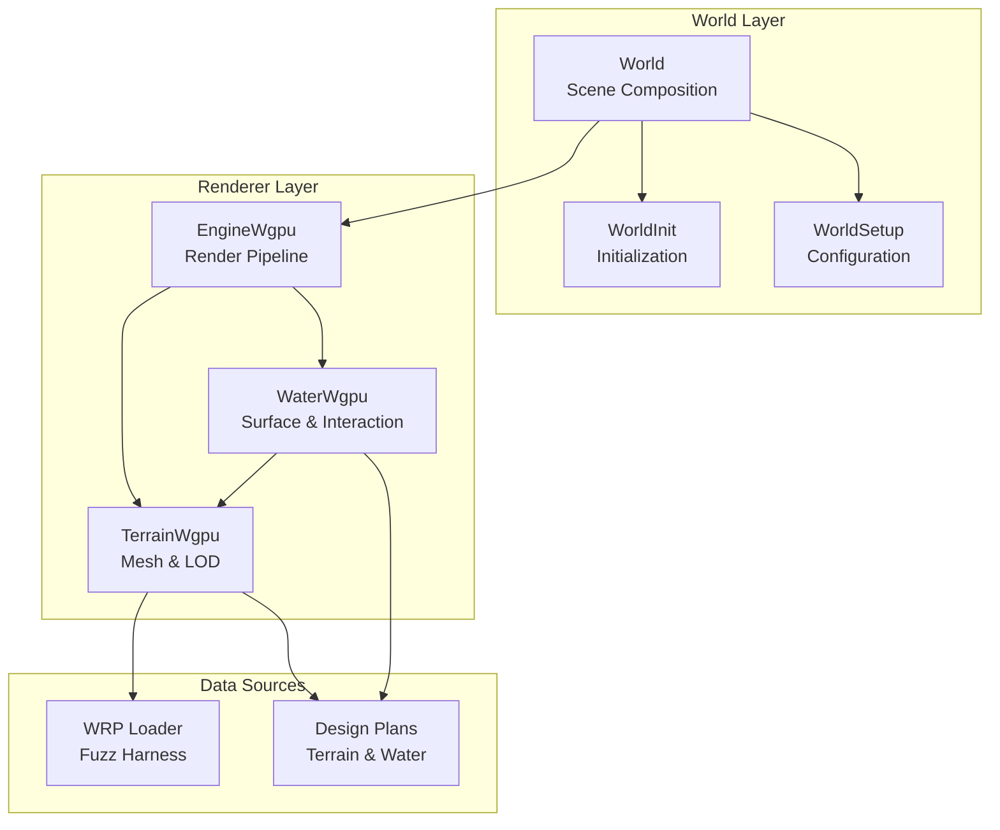
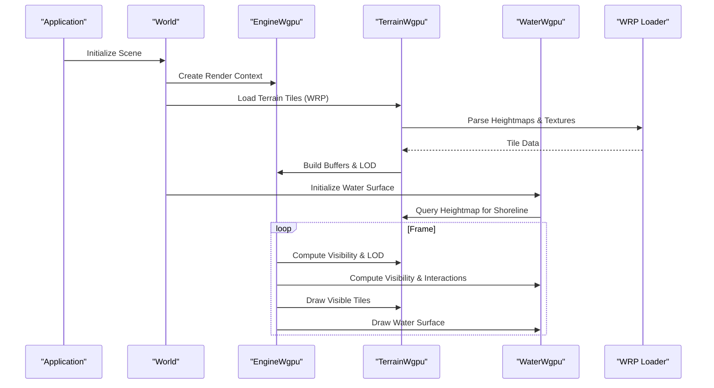
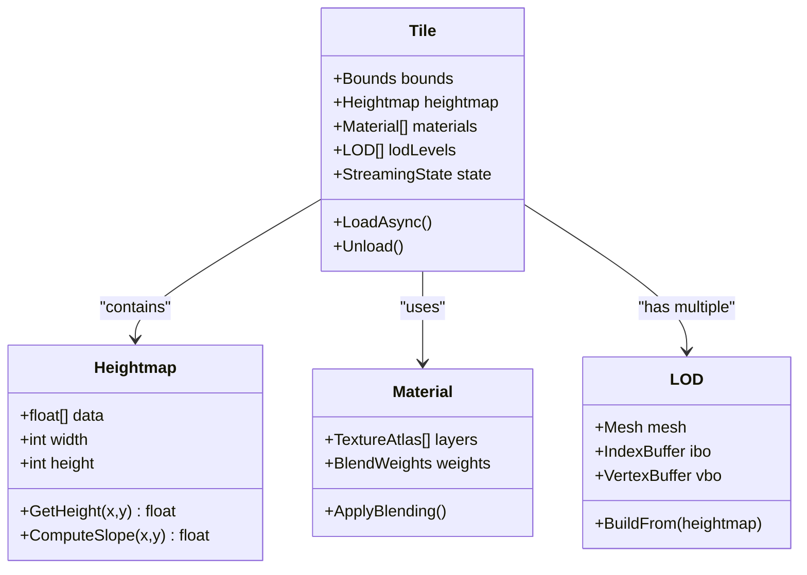
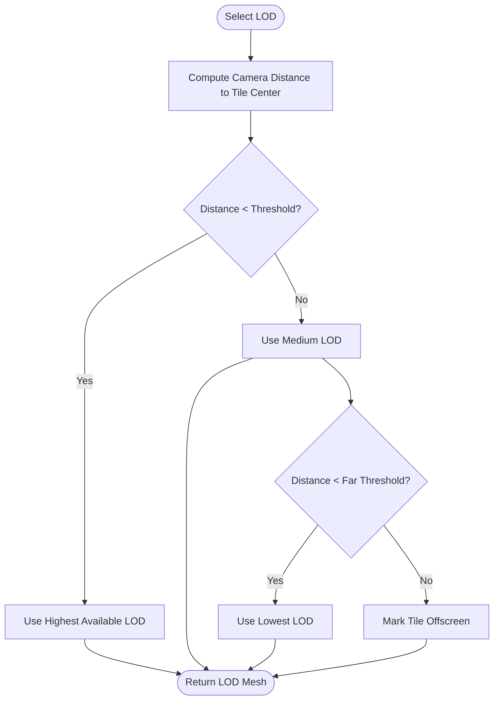
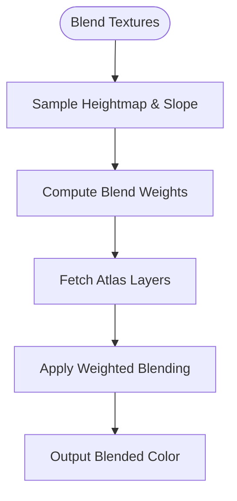
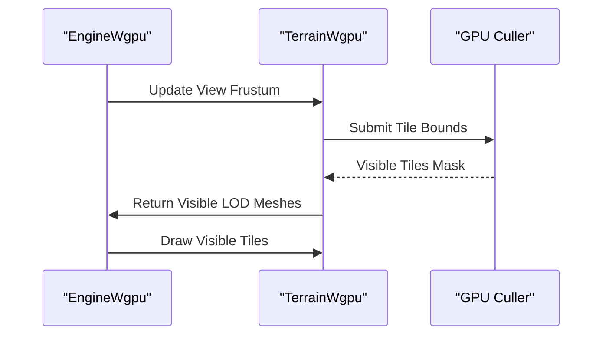
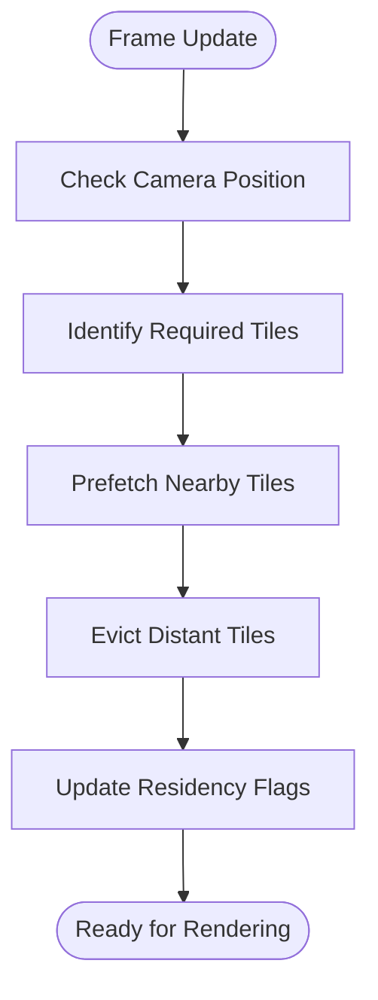
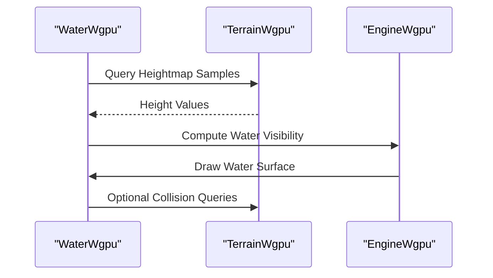
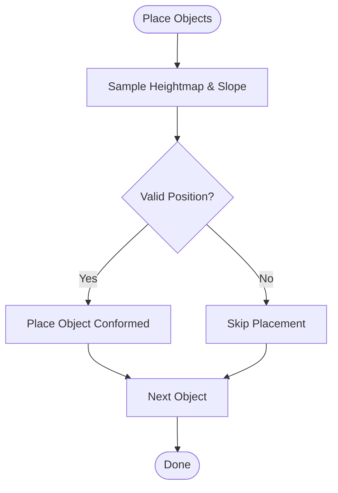
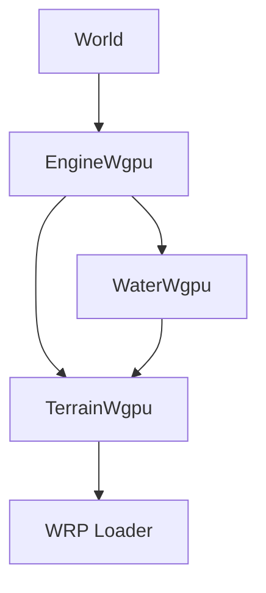

# Terrain Management

<cite>
**Referenced Files in This Document**
- [World.hpp](file://engine/Poseidon/World/World.hpp)
- [World.cpp](file://engine/Poseidon/World/World.cpp)
- [WorldInit.cpp](file://engine/Poseidon/World/WorldInit.cpp)
- [WorldSetup.cpp](file://engine/Poseidon/World/WorldSetup.cpp)
- [TerrainWgpu.hpp](file://engine/WgpuRenderer/TerrainWgpu.hpp)
- [TerrainWgpu.cpp](file://engine/WgpuRenderer/TerrainWgpu.cpp)
- [WaterWgpu.hpp](file://engine/WgpuRenderer/WaterWgpu.hpp)
- [WaterWgpu.cpp](file://engine/WgpuRenderer/WaterWgpu.cpp)
- [EngineWgpu.hpp](file://engine/WgpuRenderer/EngineWgpu.hpp)
- [EngineWgpu.cpp](file://engine/WgpuRenderer/EngineWgpu.cpp)
- [fuzz_wrp.cpp](file://apps/fuzzers/Fuzzer/fuzz_wrp.cpp)
- [terrain-fractal-detail-plan.md](file://engine/WgpuRenderer/docs/terrain-fractal-detail-plan.md)
- [terrain-conform-vegetation-roads-plan.md](file://engine/WgpuRenderer/docs/terrain-conform-vegetation-roads-plan.md)
- [gpu-culling-and-depth-plan.md](file://engine/WgpuRenderer/docs/gpu-culling-and-depth-plan.md)
- [water-rendering-plan.md](file://engine/WgpuRenderer/docs/water-rendering-plan.md)
</cite>

## Table of Contents
1. [Introduction](#introduction)
2. [Project Structure](#project-structure)
3. [Core Components](#core-components)
4. [Architecture Overview](#architecture-overview)
5. [Detailed Component Analysis](#detailed-component-analysis)
6. [Dependency Analysis](#dependency-analysis)
7. [Performance Considerations](#performance-considerations)
8. [Troubleshooting Guide](#troubleshooting-guide)
9. [Conclusion](#conclusion)
10. [Appendices](#appendices)

## Introduction
This document explains the terrain management system responsible for landscape rendering and interaction. It covers terrain data structures, loading from WRP files, level-of-detail (LOD) management, and the relationships between geometry, heightmaps, and texture blending. It also documents occlusion culling, visibility calculations, streaming optimization, integration with water systems, vegetation placement, and road networks. Practical guidance is provided for terrain modification, custom generation, performance tuning, memory management, streaming strategies, and debugging techniques.

## Project Structure
The terrain subsystem spans the World layer and the WGPU renderer:
- World layer: world initialization, setup, and high-level scene composition.
- Renderer layer: terrain mesh generation, LOD selection, batching, and GPU resource management.
- Water subsystem: water surface rendering and interaction with terrain.
- Documentation plans: detailed design notes for terrain features like fractal detail, vegetation/road conformity, and GPU culling.

**Diagram sources**
- [World.hpp](file://engine/Poseidon/World/World.hpp)
- [World.cpp](file://engine/Poseidon/World/World.cpp)
- [WorldInit.cpp](file://engine/Poseidon/World/WorldInit.cpp)
- [WorldSetup.cpp](file://engine/Poseidon/World/WorldSetup.cpp)
- [EngineWgpu.hpp](file://engine/WgpuRenderer/EngineWgpu.hpp)
- [EngineWgpu.cpp](file://engine/WgpuRenderer/EngineWgpu.cpp)
- [TerrainWgpu.hpp](file://engine/WgpuRenderer/TerrainWgpu.hpp)
- [TerrainWgpu.cpp](file://engine/WgpuRenderer/TerrainWgpu.cpp)
- [WaterWgpu.hpp](file://engine/WgpuRenderer/WaterWgpu.hpp)
- [WaterWgpu.cpp](file://engine/WgpuRenderer/WaterWgpu.cpp)
- [fuzz_wrp.cpp](file://apps/fuzzers/Fuzzer/fuzz_wrp.cpp)
- [terrain-fractal-detail-plan.md](file://engine/WgpuRenderer/docs/terrain-fractal-detail-plan.md)
- [terrain-conform-vegetation-roads-plan.md](file://engine/WgpuRenderer/docs/terrain-conform-vegetation-roads-plan.md)
- [gpu-culling-and-depth-plan.md](file://engine/WgpuRenderer/docs/gpu-culling-and-depth-plan.md)
- [water-rendering-plan.md](file://engine/WgpuRenderer/docs/water-rendering-plan.md)

**Section sources**
- [World.hpp](file://engine/Poseidon/World/World.hpp)
- [World.cpp](file://engine/Poseidon/World/World.cpp)
- [WorldInit.cpp](file://engine/Poseidon/World/WorldInit.cpp)
- [WorldSetup.cpp](file://engine/Poseidon/World/WorldSetup.cpp)
- [EngineWgpu.hpp](file://engine/WgpuRenderer/EngineWgpu.hpp)
- [EngineWgpu.cpp](file://engine/WgpuRenderer/EngineWgpu.cpp)
- [TerrainWgpu.hpp](file://engine/WgpuRenderer/TerrainWgpu.hpp)
- [TerrainWgpu.cpp](file://engine/WgpuRenderer/TerrainWgpu.cpp)
- [WaterWgpu.hpp](file://engine/WgpuRenderer/WaterWgpu.hpp)
- [WaterWgpu.cpp](file://engine/WgpuRenderer/WaterWgpu.cpp)
- [fuzz_wrp.cpp](file://apps/fuzzers/Fuzzer/fuzz_wrp.cpp)
- [terrain-fractal-detail-plan.md](file://engine/WgpuRenderer/docs/terrain-fractal-detail-plan.md)
- [terrain-conform-vegetation-roads-plan.md](file://engine/WgpuRenderer/docs/terrain-conform-vegetation-roads-plan.md)
- [gpu-culling-and-depth-plan.md](file://engine/WgpuRenderer/docs/gpu-culling-and-depth-plan.md)
- [water-rendering-plan.md](file://engine/WgpuRenderer/docs/water-rendering-plan.md)

## Core Components
- World: orchestrates scene composition, including terrain and water entities, and coordinates initialization and updates.
- TerrainWgpu: manages terrain meshes, LODs, texture atlases, blending, and GPU buffers; participates in culling and draw batching.
- WaterWgpu: renders water surfaces, computes interactions with terrain (e.g., shoreline blending), and integrates with lighting/shadows.
- EngineWgpu: provides the render pipeline, resource lifecycle, and dispatches draw calls to terrain and water subsystems.
- WRP loader harness: validates and fuzzes WRP parsing paths used by terrain loading.

Key responsibilities:
- Terrain data structures: heightmap grids, texture atlas indices, material definitions, and tile metadata.
- Loading pipeline: parse WRP, build heightmaps, generate or load textures, construct LOD hierarchy.
- Rendering pipeline: compute visibility, select LOD, blend textures, batch draws, integrate with water.
- Streaming: manage tile lifecycles, prefetch nearby tiles, evict distant tiles based on camera position and memory budgets.

**Section sources**
- [World.hpp](file://engine/Poseidon/World/World.hpp)
- [World.cpp](file://engine/Poseidon/World/World.cpp)
- [TerrainWgpu.hpp](file://engine/WgpuRenderer/TerrainWgpu.hpp)
- [TerrainWgpu.cpp](file://engine/WgpuRenderer/TerrainWgpu.cpp)
- [WaterWgpu.hpp](file://engine/WgpuRenderer/WaterWgpu.hpp)
- [WaterWgpu.cpp](file://engine/WgpuRenderer/WaterWgpu.cpp)
- [EngineWgpu.hpp](file://engine/WgpuRenderer/EngineWgpu.hpp)
- [EngineWgpu.cpp](file://engine/WgpuRenderer/EngineWgpu.cpp)
- [fuzz_wrp.cpp](file://apps/fuzzers/Fuzzer/fuzz_wrp.cpp)

## Architecture Overview
The terrain system follows a layered architecture:
- World layer composes terrain and water into the scene graph.
- Renderer layer implements GPU-specific logic for terrain and water.
- Data layer loads WRP assets and supplies heightmaps and texture references.
- Planning documents define advanced features such as fractal detail, vegetation/road conformity, and GPU culling.

**Diagram sources**
- [World.cpp](file://engine/Poseidon/World/World.cpp)
- [EngineWgpu.cpp](file://engine/WgpuRenderer/EngineWgpu.cpp)
- [TerrainWgpu.cpp](file://engine/WgpuRenderer/TerrainWgpu.cpp)
- [WaterWgpu.cpp](file://engine/WgpuRenderer/WaterWgpu.cpp)
- [fuzz_wrp.cpp](file://apps/fuzzers/Fuzzer/fuzz_wrp.cpp)

## Detailed Component Analysis

### Terrain Data Structures and Loading
- Heightmaps: stored as grid arrays per tile; resolution varies by LOD.
- Texture Atlases: tile materials reference atlas regions; blending uses multiple texture layers.
- Tile Metadata: includes bounds, LOD levels, streaming state, and material indices.
- WRP Parsing: validated via fuzzer harness; produces heightmaps and texture references.

Implementation highlights:
- Tile construction builds vertex buffers and index buffers per LOD.
- Material blending combines multiple textures based on weights derived from height and slope.
- Streaming manager tracks tile residency and triggers async loading/unloading.

**Diagram sources**
- [TerrainWgpu.hpp](file://engine/WgpuRenderer/TerrainWgpu.hpp)
- [TerrainWgpu.cpp](file://engine/WgpuRenderer/TerrainWgpu.cpp)
- [fuzz_wrp.cpp](file://apps/fuzzers/Fuzzer/fuzz_wrp.cpp)

**Section sources**
- [TerrainWgpu.hpp](file://engine/WgpuRenderer/TerrainWgpu.hpp)
- [TerrainWgpu.cpp](file://engine/WgpuRenderer/TerrainWgpu.cpp)
- [fuzz_wrp.cpp](file://apps/fuzzers/Fuzzer/fuzz_wrp.cpp)

### LOD Management
- LOD selection is distance-based and view-dependent; higher resolutions near the camera, lower resolutions at distance.
- Each tile maintains multiple LOD meshes; switching occurs when thresholds are crossed.
- Fractal detail plan adds micro-geometry enhancements for close-up views.

**Diagram sources**
- [TerrainWgpu.cpp](file://engine/WgpuRenderer/TerrainWgpu.cpp)
- [terrain-fractal-detail-plan.md](file://engine/WgpuRenderer/docs/terrain-fractal-detail-plan.md)

**Section sources**
- [TerrainWgpu.cpp](file://engine/WgpuRenderer/TerrainWgpu.cpp)
- [terrain-fractal-detail-plan.md](file://engine/WgpuRenderer/docs/terrain-fractal-detail-plan.md)

### Texture Blending
- Multiple texture layers are blended per tile using weights derived from height and slope.
- Atlas regions map to biomes or surface types; blending ensures smooth transitions.
- Material definitions control blend factors and texture sampling parameters.

**Diagram sources**
- [TerrainWgpu.cpp](file://engine/WgpuRenderer/TerrainWgpu.cpp)

**Section sources**
- [TerrainWgpu.cpp](file://engine/WgpuRenderer/TerrainWgpu.cpp)

### Occlusion Culling and Visibility
- GPU-driven culling reduces overdraw and improves performance.
- Visibility calculations consider camera frustum, tile bounds, and occlusion queries.
- Depth prepass and hierarchical culling accelerate early rejection.

**Diagram sources**
- [EngineWgpu.cpp](file://engine/WgpuRenderer/EngineWgpu.cpp)
- [TerrainWgpu.cpp](file://engine/WgpuRenderer/TerrainWgpu.cpp)
- [gpu-culling-and-depth-plan.md](file://engine/WgpuRenderer/docs/gpu-culling-and-depth-plan.md)

**Section sources**
- [EngineWgpu.cpp](file://engine/WgpuRenderer/EngineWgpu.cpp)
- [TerrainWgpu.cpp](file://engine/WgpuRenderer/TerrainWgpu.cpp)
- [gpu-culling-and-depth-plan.md](file://engine/WgpuRenderer/docs/gpu-culling-and-depth-plan.md)

### Streaming Optimization
- Streaming manager loads tiles asynchronously based on camera movement and memory budget.
- Prefetching anticipates next tiles; eviction removes distant tiles to free memory.
- Tile residency flags ensure consistent state across frames.

**Diagram sources**
- [TerrainWgpu.cpp](file://engine/WgpuRenderer/TerrainWgpu.cpp)

**Section sources**
- [TerrainWgpu.cpp](file://engine/WgpuRenderer/TerrainWgpu.cpp)

### Integration with Water Systems
- Water surface interacts with terrain heightmaps for shoreline blending and reflections.
- Water shader samples terrain height to compute foam and edge effects.
- Water rendering pipeline integrates with terrain culling to avoid redundant work.

**Diagram sources**
- [WaterWgpu.cpp](file://engine/WgpuRenderer/WaterWgpu.cpp)
- [TerrainWgpu.cpp](file://engine/WgpuRenderer/TerrainWgpu.cpp)
- [water-rendering-plan.md](file://engine/WgpuRenderer/docs/water-rendering-plan.md)

**Section sources**
- [WaterWgpu.cpp](file://engine/WgpuRenderer/WaterWgpu.cpp)
- [TerrainWgpu.cpp](file://engine/WgpuRenderer/TerrainWgpu.cpp)
- [water-rendering-plan.md](file://engine/WgpuRenderer/docs/water-rendering-plan.md)

### Vegetation Placement and Road Networks
- Vegetation conforms to terrain height and slope; roads follow terrain contours.
- Placement algorithms sample heightmaps to determine valid positions and orientations.
- Conformity ensures seamless integration between terrain and placed objects.

**Diagram sources**
- [terrain-conform-vegetation-roads-plan.md](file://engine/WgpuRenderer/docs/terrain-conform-vegetation-roads-plan.md)

**Section sources**
- [terrain-conform-vegetation-roads-plan.md](file://engine/WgpuRenderer/docs/terrain-conform-vegetation-roads-plan.md)

## Dependency Analysis
The terrain system depends on:
- World layer for scene composition and lifecycle.
- EngineWgpu for render pipeline and resource management.
- TerrainWgpu for mesh generation, LOD, and culling.
- WaterWgpu for water rendering and terrain interaction.
- WRP loader for asset parsing and validation.

**Diagram sources**
- [World.cpp](file://engine/Poseidon/World/World.cpp)
- [EngineWgpu.cpp](file://engine/WgpuRenderer/EngineWgpu.cpp)
- [TerrainWgpu.cpp](file://engine/WgpuRenderer/TerrainWgpu.cpp)
- [WaterWgpu.cpp](file://engine/WgpuRenderer/WaterWgpu.cpp)
- [fuzz_wrp.cpp](file://apps/fuzzers/Fuzzer/fuzz_wrp.cpp)

**Section sources**
- [World.cpp](file://engine/Poseidon/World/World.cpp)
- [EngineWgpu.cpp](file://engine/WgpuRenderer/EngineWgpu.cpp)
- [TerrainWgpu.cpp](file://engine/WgpuRenderer/TerrainWgpu.cpp)
- [WaterWgpu.cpp](file://engine/WgpuRenderer/WaterWgpu.cpp)
- [fuzz_wrp.cpp](file://apps/fuzzers/Fuzzer/fuzz_wrp.cpp)

## Performance Considerations
- Use GPU-driven culling to minimize overdraw and improve throughput.
- Implement hierarchical LOD to reduce vertex processing at distance.
- Stream tiles asynchronously to avoid frame stalls.
- Optimize texture atlas usage to reduce state changes.
- Profile memory usage to prevent excessive allocations during streaming.

[No sources needed since this section provides general guidance]

## Troubleshooting Guide
Common issues and remedies:
- Missing heightmaps: verify WRP parsing and tile metadata.
- Incorrect LOD transitions: check distance thresholds and camera projection.
- Texture blending artifacts: validate weight computation and atlas sampling.
- Water-shoreline mismatches: ensure heightmap queries align with water plane.
- Memory spikes: monitor tile residency and adjust eviction policies.

Debugging tools:
- Use fuzzer harness to validate WRP inputs.
- Inspect tile bounds and visibility masks during rendering.
- Log streaming events to track load/unload cycles.

**Section sources**
- [fuzz_wrp.cpp](file://apps/fuzzers/Fuzzer/fuzz_wrp.cpp)
- [TerrainWgpu.cpp](file://engine/WgpuRenderer/TerrainWgpu.cpp)
- [WaterWgpu.cpp](file://engine/WgpuRenderer/WaterWgpu.cpp)

## Conclusion
The terrain management system integrates heightmap-based geometry, texture blending, LOD management, and streaming to deliver efficient landscape rendering. Coupled with water interaction, vegetation placement, and road conformity, it forms a cohesive environment simulation. Proper culling, memory management, and debugging practices ensure scalability and stability for large terrains.

[No sources needed since this section summarizes without analyzing specific files]

## Appendices
- Practical examples:
  - Terrain modification: update heightmaps and rebuild affected tiles.
  - Custom generation: implement procedural heightmap generators and register with terrain loader.
  - Performance tuning: adjust LOD thresholds, streaming budgets, and culling parameters.

[No sources needed since this section provides general guidance]