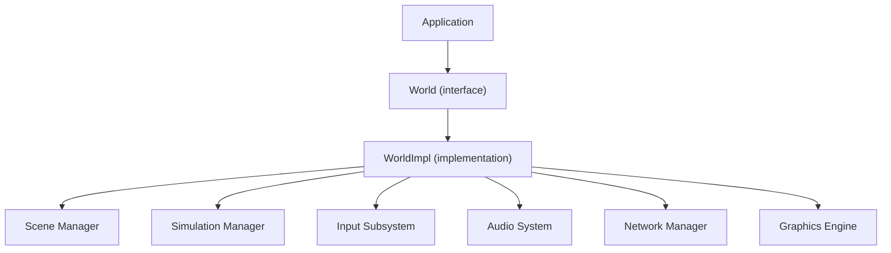
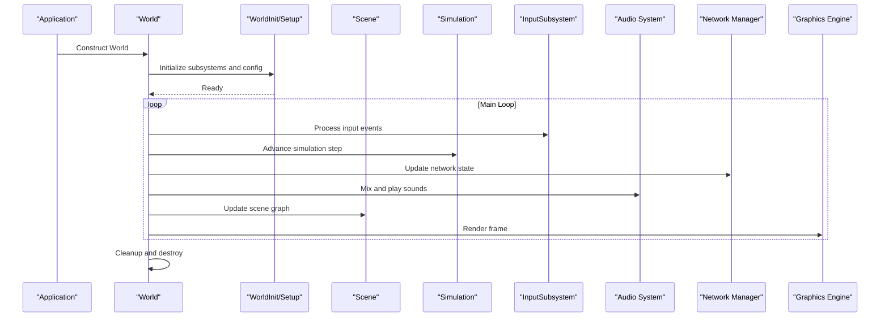
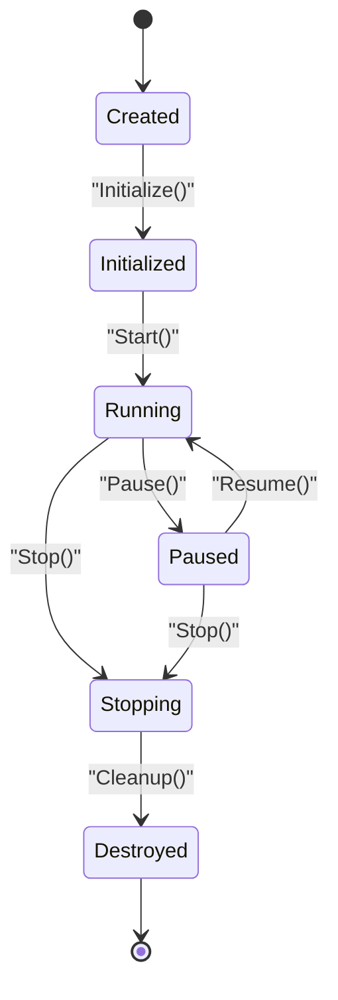
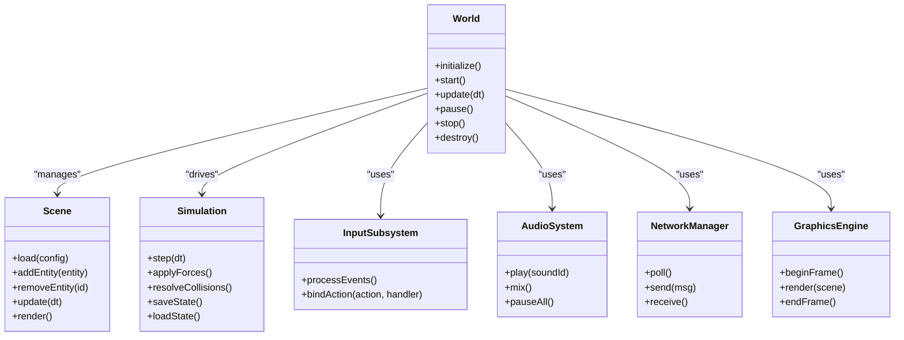
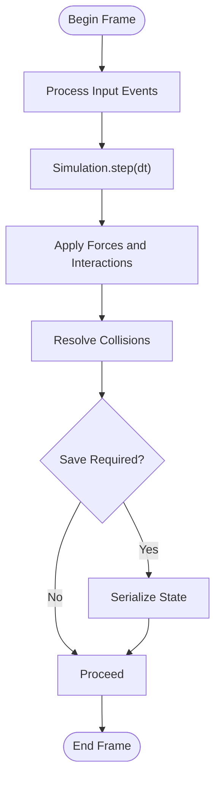
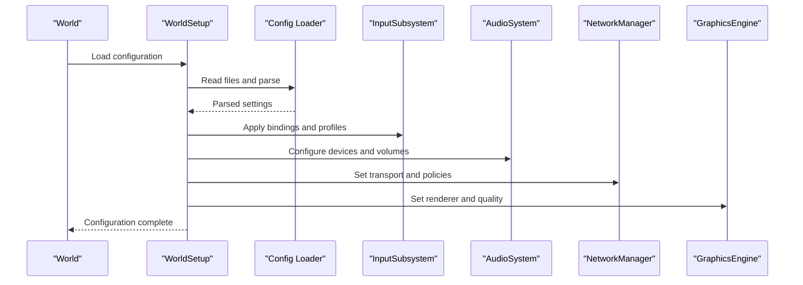
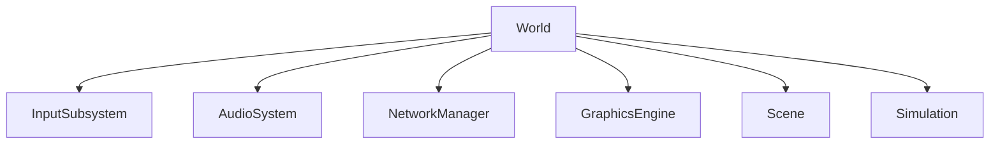

# World Core Architecture

<cite>
**Referenced Files in This Document**
- [World.hpp](file://engine/Poseidon/World/World.hpp)
- [World.cpp](file://engine/Poseidon/World/World.cpp)
- [WorldImpl.cpp](file://engine/Poseidon/World/WorldImpl.cpp)
- [WorldInit.cpp](file://engine/Poseidon/World/WorldInit.cpp)
- [WorldSetup.cpp](file://engine/Poseidon/World/WorldSetup.cpp)
- [WorldShared.hpp](file://engine/Poseidon/World/WorldShared.hpp)
- [WorldInputContext.hpp](file://engine/Poseidon/World/WorldInputContext.hpp)
- [WorldChatInput.hpp](file://engine/Poseidon/World/WorldChatInput.hpp)
- [Application.hpp](file://engine/Poseidon/Core/Application.hpp)
- [EngineGL33.hpp](file://engine/PoseidonGL33/EngineGL33.hpp)
- [SoundSystemOAL.hpp](file://engine/PoseidonOpenAL/SoundSystemOAL.hpp)
- [NetworkManagerState.hpp](file://engine/Poseidon/Network/NetworkManagerState.hpp)
- [InputSubsystem.hpp](file://engine/Poseidon/Input/InputSubsystem.hpp)
- [Scene.hpp](file://engine/Poseidon/World/Scene/Scene.hpp)
- [Simulation.hpp](file://engine/Poseidon/World/Simulation/Simulation.hpp)
</cite>

## Table of Contents
1. [Introduction](#introduction)
2. [Project Structure](#project-structure)
3. [Core Components](#core-components)
4. [Architecture Overview](#architecture-overview)
5. [Detailed Component Analysis](#detailed-component-analysis)
6. [Dependency Analysis](#dependency-analysis)
7. [Performance Considerations](#performance-considerations)
8. [Troubleshooting Guide](#troubleshooting-guide)
9. [Conclusion](#conclusion)
10. [Appendices](#appendices)

## Introduction
This document explains the World core architecture that underpins the game simulation. It covers the World class hierarchy, initialization and lifecycle management, and how World coordinates subsystems such as rendering, audio, input, and networking. It also documents scene and simulation state management, configuration loading, system integration points, and provides practical examples for world setup, scene management, and custom extensions. Performance considerations, memory strategies, and debugging techniques are included to support large-scale simulations.

## Project Structure
The World subsystem resides under engine/Poseidon/World and integrates with core engine components:
- World core interfaces and implementation files define the public API and internal orchestration.
- Scene and Simulation subdirectories encapsulate scene graph and simulation loop/state.
- Input, Audio, Graphics, and Network modules provide subsystem backends accessed via World.
- Application layer bootstraps World and manages lifecycle transitions.

**Diagram sources**
- [World.hpp](file://engine/Poseidon/World/World.hpp)
- [WorldImpl.cpp](file://engine/Poseidon/World/WorldImpl.cpp)
- [Application.hpp](file://engine/Poseidon/Core/Application.hpp)
- [InputSubsystem.hpp](file://engine/Poseidon/Input/InputSubsystem.hpp)
- [SoundSystemOAL.hpp](file://engine/PoseidonOpenAL/SoundSystemOAL.hpp)
- [NetworkManagerState.hpp](file://engine/Poseidon/Network/NetworkManagerState.hpp)
- [EngineGL33.hpp](file://engine/PoseidonGL33/EngineGL33.hpp)

**Section sources**
- [World.hpp](file://engine/Poseidon/World/World.hpp)
- [World.cpp](file://engine/Poseidon/World/World.cpp)
- [WorldImpl.cpp](file://engine/Poseidon/World/WorldImpl.cpp)
- [WorldInit.cpp](file://engine/Poseidon/World/WorldInit.cpp)
- [WorldSetup.cpp](file://engine/Poseidon/World/WorldSetup.cpp)
- [WorldShared.hpp](file://engine/Poseidon/World/WorldShared.hpp)

## Core Components
- World interface: Defines the primary API for creating, configuring, and running a simulation world. It exposes methods for scene control, simulation stepping, input binding, and subsystem accessors.
- WorldImpl: Implements the World interface, orchestrating initialization, configuration loading, subsystem wiring, and the main loop. It maintains references to Scene, Simulation, Input, Audio, Network, and Graphics backends.
- WorldInit and WorldSetup: Provide entry points and step-by-step setup routines for constructing a World instance, loading configuration, and preparing subsystems.
- WorldShared: Contains shared types, enums, and utilities used across World components.
- WorldInputContext and WorldChatInput: Manage input contexts and chat-related interactions within the World scope.

Key responsibilities:
- Lifecycle: Create, initialize, run, pause, and destroy World instances.
- Configuration: Load mission/world configs, apply runtime flags, and bind subsystem options.
- Coordination: Drive the simulation tick, render frame, process input, handle network events, and manage audio playback.
- State: Maintain current scene, active simulation state, and transition between states.

**Section sources**
- [World.hpp](file://engine/Poseidon/World/World.hpp)
- [World.cpp](file://engine/Poseidon/World/World.cpp)
- [WorldImpl.cpp](file://engine/Poseidon/World/WorldImpl.cpp)
- [WorldInit.cpp](file://engine/Poseidon/World/WorldInit.cpp)
- [WorldSetup.cpp](file://engine/Poseidon/World/WorldSetup.cpp)
- [WorldShared.hpp](file://engine/Poseidon/World/WorldShared.hpp)
- [WorldInputContext.hpp](file://engine/Poseidon/World/WorldInputContext.hpp)
- [WorldChatInput.hpp](file://engine/Poseidon/World/WorldChatInput.hpp)

## Architecture Overview
The World acts as the central coordinator for all subsystems. The Application constructs a World instance, which then initializes its dependencies and enters the main loop. During each frame, World advances the simulation, processes input, updates networking, and delegates rendering to the graphics backend. Audio is managed through an audio system abstraction. Networking is handled by a network manager that synchronizes multiplayer state.

**Diagram sources**
- [World.hpp](file://engine/Poseidon/World/World.hpp)
- [WorldImpl.cpp](file://engine/Poseidon/World/WorldImpl.cpp)
- [WorldInit.cpp](file://engine/Poseidon/World/WorldInit.cpp)
- [WorldSetup.cpp](file://engine/Poseidon/World/WorldSetup.cpp)
- [InputSubsystem.hpp](file://engine/Poseidon/Input/InputSubsystem.hpp)
- [SoundSystemOAL.hpp](file://engine/PoseidonOpenAL/SoundSystemOAL.hpp)
- [NetworkManagerState.hpp](file://engine/Poseidon/Network/NetworkManagerState.hpp)
- [EngineGL33.hpp](file://engine/PoseidonGL33/EngineGL33.hpp)

## Detailed Component Analysis

### World Class Hierarchy and Lifecycle
- World interface defines the contract for lifecycle operations: create, configure, start, update, pause, stop, and destroy.
- WorldImpl implements these operations, managing internal state and delegating to subsystems.
- Initialization sequence:
  - Application calls World constructor.
  - WorldInit sets up logging, platform services, and resource paths.
  - WorldSetup loads configuration files, applies runtime flags, and binds subsystem options.
  - World registers input contexts, audio devices, network transports, and graphics context.
- Lifecycle transitions:
  - Running: Simulation steps per frame; input processed; network polled; audio mixed; rendered.
  - Paused: Simulation halted; input may still be processed for UI; audio paused; rendering minimal.
  - Destroy: Unbind subsystems, release resources, and finalize cleanup.

**Diagram sources**
- [World.hpp](file://engine/Poseidon/World/World.hpp)
- [WorldImpl.cpp](file://engine/Poseidon/World/WorldImpl.cpp)
- [WorldInit.cpp](file://engine/Poseidon/World/WorldInit.cpp)
- [WorldSetup.cpp](file://engine/Poseidon/World/WorldSetup.cpp)

**Section sources**
- [World.hpp](file://engine/Poseidon/World/World.hpp)
- [WorldImpl.cpp](file://engine/Poseidon/World/WorldImpl.cpp)
- [WorldInit.cpp](file://engine/Poseidon/World/WorldInit.cpp)
- [WorldSetup.cpp](file://engine/Poseidon/World/WorldSetup.cpp)

### Scene Management
- Scene encapsulates the world’s spatial and logical entities, including objects, terrain, lighting, and camera state.
- World holds a Scene manager that can load scenes, switch active scenes, and update entity hierarchies.
- Typical operations:
  - Load scene from configuration or mission data.
  - Add/remove entities and update transforms.
  - Query scene graphs for culling and rendering.
  - Persist scene state for save/load.

**Diagram sources**
- [World.hpp](file://engine/Poseidon/World/World.hpp)
- [Scene.hpp](file://engine/Poseidon/World/Scene/Scene.hpp)
- [Simulation.hpp](file://engine/Poseidon/World/Simulation/Simulation.hpp)
- [InputSubsystem.hpp](file://engine/Poseidon/Input/InputSubsystem.hpp)
- [SoundSystemOAL.hpp](file://engine/PoseidonOpenAL/SoundSystemOAL.hpp)
- [NetworkManagerState.hpp](file://engine/Poseidon/Network/NetworkManagerState.hpp)
- [EngineGL33.hpp](file://engine/PoseidonGL33/EngineGL33.hpp)

**Section sources**
- [World.hpp](file://engine/Poseidon/World/World.hpp)
- [Scene.hpp](file://engine/Poseidon/World/Scene/Scene.hpp)
- [Simulation.hpp](file://engine/Poseidon/World/Simulation/Simulation.hpp)

### Simulation State Management
- Simulation encapsulates physics, AI, and game logic updates.
- World drives Simulation.step(dt) each frame, ensuring deterministic updates where required.
- State persistence includes serialization of entity positions, velocities, and game flags.
- Collision resolution and force application are batched to optimize performance.

**Diagram sources**
- [WorldImpl.cpp](file://engine/Poseidon/World/WorldImpl.cpp)
- [Simulation.hpp](file://engine/Poseidon/World/Simulation/Simulation.hpp)

**Section sources**
- [WorldImpl.cpp](file://engine/Poseidon/World/WorldImpl.cpp)
- [Simulation.hpp](file://engine/Poseidon/World/Simulation/Simulation.hpp)

### Configuration Loading and System Integration
- WorldSetup reads configuration files (mission/world settings), applies runtime flags, and configures subsystems.
- Integration points:
  - Input: Bind actions to handlers and set device preferences.
  - Audio: Select device, set volume, and configure streaming buffers.
  - Network: Configure transport, authentication, and session policies.
  - Graphics: Set renderer, resolution, and quality presets.
- Errors during configuration are logged and may trigger fallback defaults.

**Diagram sources**
- [WorldSetup.cpp](file://engine/Poseidon/World/WorldSetup.cpp)
- [WorldInit.cpp](file://engine/Poseidon/World/WorldInit.cpp)
- [InputSubsystem.hpp](file://engine/Poseidon/Input/InputSubsystem.hpp)
- [SoundSystemOAL.hpp](file://engine/PoseidonOpenAL/SoundSystemOAL.hpp)
- [NetworkManagerState.hpp](file://engine/Poseidon/Network/NetworkManagerState.hpp)
- [EngineGL33.hpp](file://engine/PoseidonGL33/EngineGL33.hpp)

**Section sources**
- [WorldSetup.cpp](file://engine/Poseidon/World/WorldSetup.cpp)
- [WorldInit.cpp](file://engine/Poseidon/World/WorldInit.cpp)

### Practical Examples
- World initialization:
  - Construct World, call initialize(), then start().
  - Use WorldSetup to load mission configurations and apply runtime flags.
- Scene management:
  - Load a scene via Scene.load(config).
  - Switch scenes using World.switchScene(newScene).
  - Update and render within the main loop.
- Custom world extensions:
  - Extend WorldImpl to add custom subsystems or hooks.
  - Register new input actions and audio effects.
  - Integrate custom network protocols or rendering passes.

[No sources needed since this section provides general guidance]

## Dependency Analysis
World depends on multiple subsystems, each abstracted behind interfaces:
- InputSubsystem handles user input events and action mapping.
- AudioSystem manages sound playback and mixing.
- NetworkManager coordinates multiplayer communication and synchronization.
- GraphicsEngine renders the Scene and manages GPU resources.

**Diagram sources**
- [World.hpp](file://engine/Poseidon/World/World.hpp)
- [InputSubsystem.hpp](file://engine/Poseidon/Input/InputSubsystem.hpp)
- [SoundSystemOAL.hpp](file://engine/PoseidonOpenAL/SoundSystemOAL.hpp)
- [NetworkManagerState.hpp](file://engine/Poseidon/Network/NetworkManagerState.hpp)
- [EngineGL33.hpp](file://engine/PoseidonGL33/EngineGL33.hpp)
- [Scene.hpp](file://engine/Poseidon/World/Scene/Scene.hpp)
- [Simulation.hpp](file://engine/Poseidon/World/Simulation/Simulation.hpp)

**Section sources**
- [World.hpp](file://engine/Poseidon/World/World.hpp)
- [WorldImpl.cpp](file://engine/Poseidon/World/WorldImpl.cpp)

## Performance Considerations
- Simulation batching: Group physics and AI updates to minimize CPU overhead.
- Rendering optimization: Use frustum culling, instancing, and texture atlases.
- Memory management: Employ object pools for frequently created/destroyed entities.
- Asynchronous loading: Stream assets and missions to reduce frame stalls.
- Network efficiency: Compress messages, use delta updates, and limit bandwidth.
- Audio streaming: Buffer and stream audio data to avoid blocking.

[No sources needed since this section provides general guidance]

## Troubleshooting Guide
Common issues and debugging techniques:
- Initialization failures: Check logs from WorldInit and WorldSetup for missing configs or invalid flags.
- Input not responding: Verify input bindings and device selection in InputSubsystem.
- Audio glitches: Inspect audio device configuration and buffer sizes in AudioSystem.
- Network desync: Review message ordering, packet loss handling, and state synchronization in NetworkManager.
- Rendering artifacts: Validate graphics backend settings and shader compilation in GraphicsEngine.
- Memory leaks: Use sanitizers and profiling tools to detect leaks in World and subsystems.

**Section sources**
- [WorldInit.cpp](file://engine/Poseidon/World/WorldInit.cpp)
- [WorldSetup.cpp](file://engine/Poseidon/World/WorldSetup.cpp)
- [InputSubsystem.hpp](file://engine/Poseidon/Input/InputSubsystem.hpp)
- [SoundSystemOAL.hpp](file://engine/PoseidonOpenAL/SoundSystemOAL.hpp)
- [NetworkManagerState.hpp](file://engine/Poseidon/Network/NetworkManagerState.hpp)
- [EngineGL33.hpp](file://engine/PoseidonGL33/EngineGL33.hpp)

## Conclusion
The World core architecture provides a robust foundation for game simulation by coordinating subsystems through a clear interface and lifecycle. Proper initialization, configuration, and scene/simulation management enable scalable and maintainable game engines. Following the performance and debugging guidelines ensures stable operation even in large-scale simulations.

[No sources needed since this section summarizes without analyzing specific files]

## Appendices
- Best practices for extending World:
  - Keep subsystems decoupled via interfaces.
  - Use dependency injection for testability.
  - Log critical state changes for traceability.
- Recommended tools:
  - Profilers for CPU/GPU analysis.
  - Memory debuggers for leak detection.
  - Network analyzers for latency and packet inspection.

[No sources needed since this section provides general guidance]