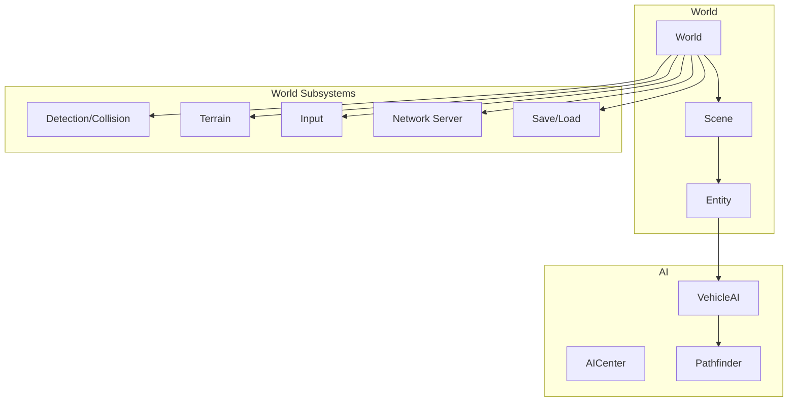
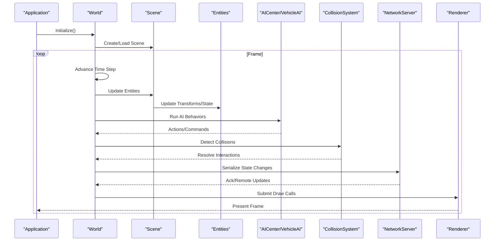
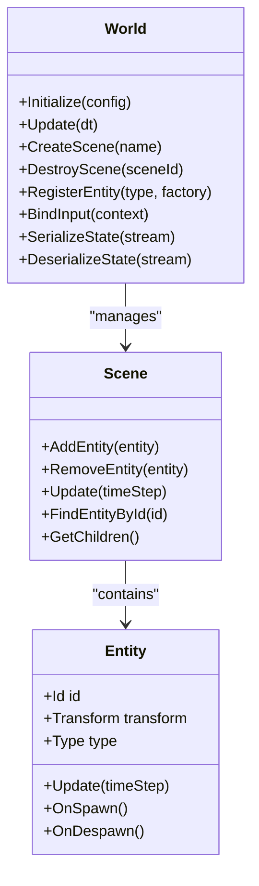
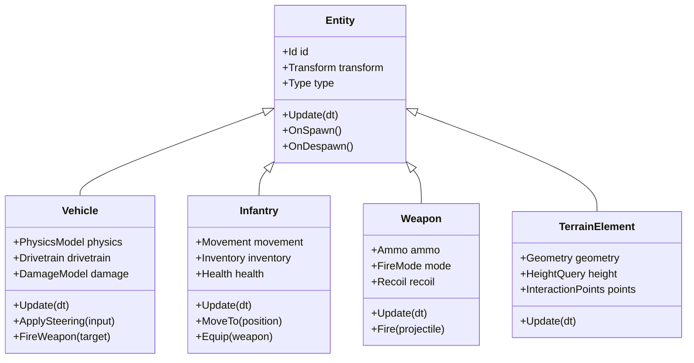
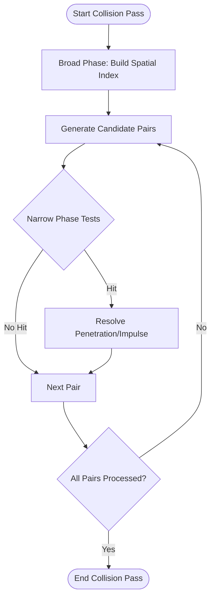
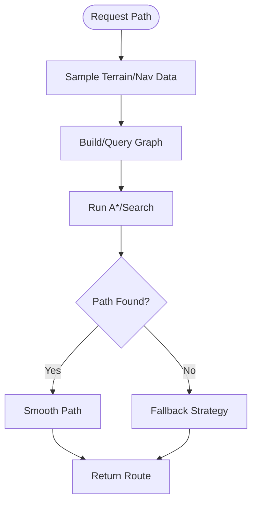
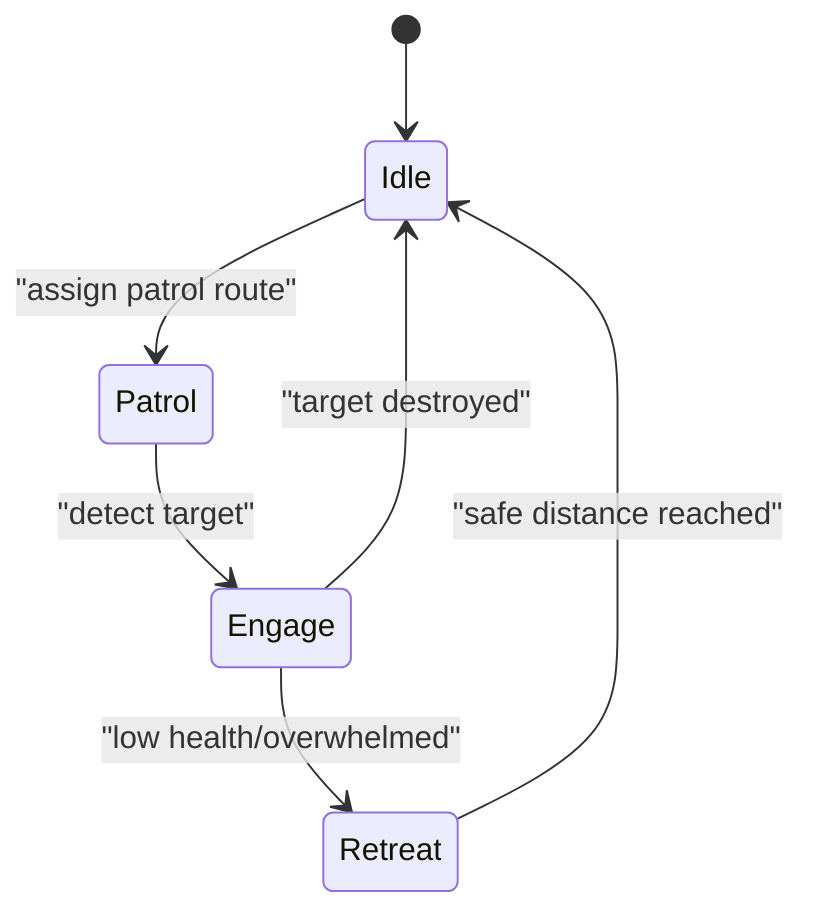
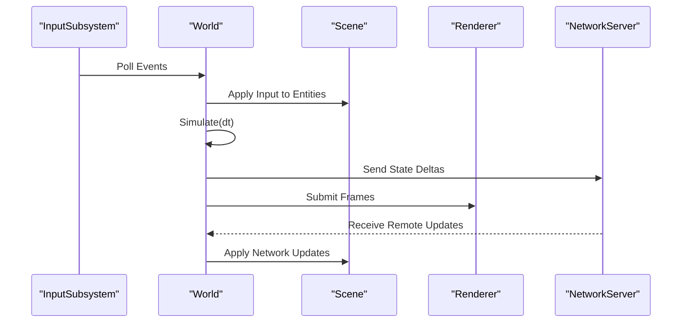
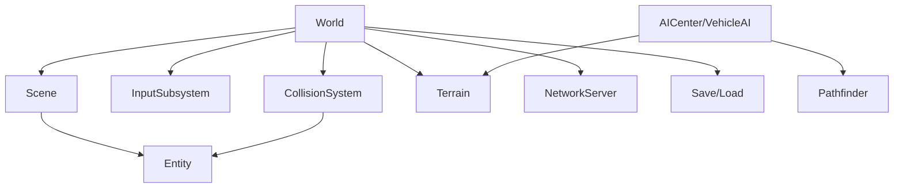

# World Simulation

<cite>
**Referenced Files in This Document**
- [World.hpp](file://engine/Poseidon/World/World.hpp)
- [World.cpp](file://engine/Poseidon/World/World.cpp)
- [WorldImpl.cpp](file://engine/Poseidon/World/WorldImpl.cpp)
- [WorldInit.cpp](file://engine/Poseidon/World/WorldInit.cpp)
- [WorldSetup.cpp](file://engine/Poseidon/World/WorldSetup.cpp)
- [WorldShared.hpp](file://engine/Poseidon/World/WorldShared.hpp)
- [WorldSimHelpers.inc](file://engine/Poseidon/World/WorldSimHelpers.inc)
- [Scene.hpp](file://engine/Poseidon/World/Scene/Scene.hpp)
- [Scene.cpp](file://engine/Poseidon/World/Scene/Scene.cpp)
- [Entity.hpp](file://engine/Poseidon/World/Entities/Entity.hpp)
- [Entity.cpp](file://engine/Poseidon/World/Entities/Entity.cpp)
- [VehicleAI.hpp](file://engine/Poseidon/AI/VehicleAI.hpp)
- [AICenter.hpp](file://engine/Poseidon/AI/AICenter.hpp)
- [Pathfinder.hpp](file://engine/Poseidon/AI/Path/Pathfinder.hpp)
- [TerrainManager.hpp](file://engine/Poseidon/World/Terrain/TerrainManager.hpp)
- [CollisionSystem.hpp](file://engine/Poseidon/World/Detection/CollisionSystem.hpp)
- [InputSubsystem.hpp](file://engine/Poseidon/Input/InputSubsystem.hpp)
- [NetworkServer.hpp](file://engine/Poseidon/Network/NetworkServer.hpp)
- [SaveGame.hpp](file://engine/Poseidon/Core/SaveVersion.hpp)
</cite>

## Table of Contents
1. [Introduction](#introduction)
2. [Project Structure](#project-structure)
3. [Core Components](#core-components)
4. [Architecture Overview](#architecture-overview)
5. [Detailed Component Analysis](#detailed-component-analysis)
6. [Dependency Analysis](#dependency-analysis)
7. [Performance Considerations](#performance-considerations)
8. [Troubleshooting Guide](#troubleshooting-guide)
9. [Conclusion](#conclusion)
10. [Appendices](#appendices)

## Introduction
This document explains the world simulation system that manages game objects, entities, and simulation state. It focuses on the World and Scene architecture for organizing entities such as vehicles, infantry, weapons, and terrain elements. It also covers collision detection, pathfinding, AI behavior systems, and how simulation updates integrate with rendering and input processing. Practical guidance is provided for creating custom entities, implementing vehicle physics, integrating AI behaviors, optimizing performance for large-scale simulations, saving and loading state, synchronizing over the network, and debugging simulation issues.

## Project Structure
The world simulation subsystem resides under the Poseidon engine’s World module, with supporting components in AI, Detection (collision), Terrain, Input, Network, and Core modules. The key files include:
- World orchestration and lifecycle
- Scene management for entity hierarchies
- Entity base classes and types
- AI centers, vehicle AI, and pathfinding
- Collision detection utilities
- Terrain accessors
- Input subsystem integration
- Network server synchronization
- Save/load versioning and serialization helpers

**Diagram sources**
- [World.hpp:1-200](file://engine/Poseidon/World/World.hpp#L1-L200)
- [Scene.hpp:1-200](file://engine/Poseidon/World/Scene/Scene.hpp#L1-L200)
- [Entity.hpp:1-200](file://engine/Poseidon/World/Entities/Entity.hpp#L1-L200)
- [AICenter.hpp:1-200](file://engine/Poseidon/AI/AICenter.hpp#L1-L200)
- [VehicleAI.hpp:1-200](file://engine/Poseidon/AI/VehicleAI.hpp#L1-L200)
- [Pathfinder.hpp:1-200](file://engine/Poseidon/AI/Path/Pathfinder.hpp#L1-L200)
- [CollisionSystem.hpp:1-200](file://engine/Poseidon/World/Detection/CollisionSystem.hpp#L1-L200)
- [TerrainManager.hpp:1-200](file://engine/Poseidon/World/Terrain/TerrainManager.hpp#L1-L200)
- [InputSubsystem.hpp:1-200](file://engine/Poseidon/Input/InputSubsystem.hpp#L1-L200)
- [NetworkServer.hpp:1-200](file://engine/Poseidon/Network/NetworkServer.hpp#L1-L200)
- [SaveVersion.hpp:1-200](file://engine/Poseidon/Core/SaveVersion.hpp#L1-L200)

**Section sources**
- [World.hpp:1-200](file://engine/Poseidon/World/World.hpp#L1-L200)
- [Scene.hpp:1-200](file://engine/Poseidon/World/Scene/Scene.hpp#L1-L200)
- [Entity.hpp:1-200](file://engine/Poseidon/World/Entities/Entity.hpp#L1-L200)

## Core Components
- World: Central orchestrator for simulation time, scene graph, entity registry, and cross-system coordination. It initializes scenes, drives update loops, and integrates input, networking, and save/load operations.
- Scene: Hierarchical container for entities and subsystems within a world context. Manages entity creation, destruction, and traversal.
- Entity: Base type for all sim objects (vehicles, infantry, weapons, terrain features). Provides identity, transforms, component-like extensions, and lifecycle hooks.
- AICenter: Aggregates AI logic for groups and units; coordinates decision-making and task distribution.
- VehicleAI: Specialized AI for driving, navigation, and combat behaviors for vehicles.
- Pathfinder: Path computation and steering utilities used by AI to navigate terrain and avoid obstacles.
- CollisionSystem: Broad/narrow collision detection and response utilities for entities and environment.
- Terrain: Heightfield and surface queries for movement, visibility, and environmental interactions.
- InputSubsystem: Maps user actions to entity controls and camera/viewer behavior.
- NetworkServer: Replicates simulation state across clients, handles authoritative updates, and message routing.
- Save/Load: Serialization interfaces and versioning to persist world state.

**Section sources**
- [World.cpp:1-300](file://engine/Poseidon/World/World.cpp#L1-L300)
- [WorldImpl.cpp:1-300](file://engine/Poseidon/World/WorldImpl.cpp#L1-L300)
- [WorldInit.cpp:1-200](file://engine/Poseidon/World/WorldInit.cpp#L1-L200)
- [WorldSetup.cpp:1-200](file://engine/Poseidon/World/WorldSetup.cpp#L1-L200)
- [WorldShared.hpp:1-200](file://engine/Poseidon/World/WorldShared.hpp#L1-L200)
- [WorldSimHelpers.inc:1-200](file://engine/Poseidon/World/WorldSimHelpers.inc#L1-L200)

## Architecture Overview
The simulation loop is driven by the World, which advances time, updates scenes, processes input, runs AI, performs collision checks, and renders frames. Entities live in Scenes and are updated through their lifecycle methods. AI centers coordinate higher-level behaviors, while VehicleAI specializes in driving and combat. Pathfinding provides routes based on terrain data. Collision detection ensures physical plausibility. Networking replicates state changes, and save/load persists the world.

**Diagram sources**
- [World.cpp:1-300](file://engine/Poseidon/World/World.cpp#L1-L300)
- [Scene.cpp:1-300](file://engine/Poseidon/World/Scene/Scene.cpp#L1-L300)
- [Entity.cpp:1-300](file://engine/Poseidon/World/Entities/Entity.cpp#L1-L300)
- [AICenter.hpp:1-200](file://engine/Poseidon/AI/AICenter.hpp#L1-L200)
- [VehicleAI.hpp:1-200](file://engine/Poseidon/AI/VehicleAI.hpp#L1-L200)
- [CollisionSystem.hpp:1-200](file://engine/Poseidon/World/Detection/CollisionSystem.hpp#L1-L200)
- [NetworkServer.hpp:1-200](file://engine/Poseidon/Network/NetworkServer.hpp#L1-L200)

## Detailed Component Analysis

### World and Scene Architecture
- World responsibilities:
  - Lifecycle management: initialization, configuration, update loop, shutdown.
  - Scene orchestration: create, load, switch, and destroy scenes.
  - Cross-cutting services: input binding, networking integration, save/load hooks.
  - Simulation timing: fixed or variable timestep control, delta accumulation.
- Scene responsibilities:
  - Entity hierarchy: parent-child relationships, traversal, and scoping.
  - Entity factory: instantiation from definitions/templates.
  - Update scheduling: per-frame updates, culling, and batching.
  - Resource scoping: assets and subsystems local to a scene.

**Diagram sources**
- [World.hpp:1-200](file://engine/Poseidon/World/World.hpp#L1-L200)
- [Scene.hpp:1-200](file://engine/Poseidon/World/Scene/Scene.hpp#L1-L200)
- [Entity.hpp:1-200](file://engine/Poseidon/World/Entities/Entity.hpp#L1-L200)

**Section sources**
- [World.cpp:1-300](file://engine/Poseidon/World/World.cpp#L1-L300)
- [WorldImpl.cpp:1-300](file://engine/Poseidon/World/WorldImpl.cpp#L1-L300)
- [WorldInit.cpp:1-200](file://engine/Poseidon/World/WorldInit.cpp#L1-L200)
- [WorldSetup.cpp:1-200](file://engine/Poseidon/World/WorldSetup.cpp#L1-L200)
- [WorldShared.hpp:1-200](file://engine/Poseidon/World/WorldShared.hpp#L1-L200)
- [Scene.cpp:1-300](file://engine/Poseidon/World/Scene/Scene.cpp#L1-L300)

### Entity Hierarchy: Vehicles, Infantry, Weapons, Terrain
- Entity base provides identity, transform, and lifecycle hooks. Derived types specialize:
  - Vehicle: physics parameters, drivetrain, suspension, fuel, damage model.
  - Infantry: movement, stamina, weapon handling, cover usage.
  - Weapon: projectile generation, ammo, fire modes, recoil.
  - Terrain element: static geometry, height queries, interaction points.
- Composition patterns:
  - Components extend entity capabilities (e.g., health, inventory, AI controller).
  - Parent-child relationships define logical grouping (e.g., squad members under a leader).

**Diagram sources**
- [Entity.hpp:1-200](file://engine/Poseidon/World/Entities/Entity.hpp#L1-L200)
- [Entity.cpp:1-300](file://engine/Poseidon/World/Entities/Entity.cpp#L1-L300)

**Section sources**
- [Entity.hpp:1-200](file://engine/Poseidon/World/Entities/Entity.hpp#L1-L200)
- [Entity.cpp:1-300](file://engine/Poseidon/World/Entities/Entity.cpp#L1-L300)

### Collision Detection
- Broad-phase: spatial partitioning (grid/quadtree/BVH) to reduce candidate pairs.
- Narrow-phase: precise intersection tests per pair (AABB, OBB, sphere, mesh).
- Response: penetration resolution, impulse application, contact normals, friction.
- Integration: called during World update after entity transforms are advanced.

**Diagram sources**
- [CollisionSystem.hpp:1-200](file://engine/Poseidon/World/Detection/CollisionSystem.hpp#L1-L200)

**Section sources**
- [CollisionSystem.hpp:1-200](file://engine/Poseidon/World/Detection/CollisionSystem.hpp#L1-L200)

### Pathfinding Algorithms
- Pathfinder computes routes using terrain data and obstacle avoidance.
- Common algorithms: A* on navmesh or heightfield, waypoint graphs, flow fields.
- Steering: smooth paths, dynamic obstacle avoidance, group cohesion.
- Integration: AI requests paths; results feed into VehicleAI and Infantry movement.

**Diagram sources**
- [Pathfinder.hpp:1-200](file://engine/Poseidon/AI/Path/Pathfinder.hpp#L1-L200)

**Section sources**
- [Pathfinder.hpp:1-200](file://engine/Poseidon/AI/Path/Pathfinder.hpp#L1-L200)

### AI Behavior Systems
- AICenter coordinates unit/group decisions, assigns tasks, and manages states.
- VehicleAI implements driving, target acquisition, and combat tactics.
- FSM/state machines drive behavior transitions (patrol, engage, retreat).
- Inputs: perception (line-of-sight, hearing), goals, constraints.

**Diagram sources**
- [AICenter.hpp:1-200](file://engine/Poseidon/AI/AICenter.hpp#L1-L200)
- [VehicleAI.hpp:1-200](file://engine/Poseidon/AI/VehicleAI.hpp#L1-L200)

**Section sources**
- [AICenter.hpp:1-200](file://engine/Poseidon/AI/AICenter.hpp#L1-L200)
- [VehicleAI.hpp:1-200](file://engine/Poseidon/AI/VehicleAI.hpp#L1-L200)

### Simulation, Rendering, and Input Integration
- Simulation updates occur at fixed or adaptive timesteps; inputs are sampled and queued.
- Rendering reads transformed entity states and submits draw calls.
- Input binds to entity controls (camera, vehicle steering, infantry commands).
- Networking serializes state deltas and applies remote updates deterministically.

**Diagram sources**
- [InputSubsystem.hpp:1-200](file://engine/Poseidon/Input/InputSubsystem.hpp#L1-L200)
- [NetworkServer.hpp:1-200](file://engine/Poseidon/Network/NetworkServer.hpp#L1-L200)
- [World.cpp:1-300](file://engine/Poseidon/World/World.cpp#L1-L300)

**Section sources**
- [InputSubsystem.hpp:1-200](file://engine/Poseidon/Input/InputSubsystem.hpp#L1-L200)
- [NetworkServer.hpp:1-200](file://engine/Poseidon/Network/NetworkServer.hpp#L1-L200)

### Practical Examples

#### Creating Custom Entities
- Steps:
  - Define a new Entity-derived type with required components.
  - Register the type with World’s entity factory.
  - Implement Update and lifecycle hooks (OnSpawn/OnDespawn).
  - Add scene-scoped resources and initial configuration.
- References:
  - Entity base and lifecycle hooks
  - World entity registration and scene instantiation

**Section sources**
- [Entity.hpp:1-200](file://engine/Poseidon/World/Entities/Entity.hpp#L1-L200)
- [Entity.cpp:1-300](file://engine/Poseidon/World/Entities/Entity.cpp#L1-L300)
- [World.cpp:1-300](file://engine/Poseidon/World/World.cpp#L1-L300)
- [Scene.cpp:1-300](file://engine/Poseidon/World/Scene/Scene.cpp#L1-L300)

#### Implementing Vehicle Physics
- Steps:
  - Configure drivetrain, suspension, mass, and friction parameters.
  - Integrate forces and torques in Update; apply steering/throttle inputs.
  - Use collision responses for ground contact and obstacles.
  - Hook into VehicleAI for autonomous driving and combat behaviors.
- References:
  - Vehicle entity specialization
  - CollisionSystem for contact resolution
  - VehicleAI for behavior integration

**Section sources**
- [Entity.hpp:1-200](file://engine/Poseidon/World/Entities/Entity.hpp#L1-L200)
- [CollisionSystem.hpp:1-200](file://engine/Poseidon/World/Detection/CollisionSystem.hpp#L1-L200)
- [VehicleAI.hpp:1-200](file://engine/Poseidon/AI/VehicleAI.hpp#L1-L200)

#### Integrating AI Behaviors
- Steps:
  - Attach an AI controller to the entity.
  - Configure perception thresholds and goals.
  - Use AICenter to assign tasks and manage group dynamics.
  - Leverage Pathfinder for navigation and VehicleAI for execution.
- References:
  - AICenter coordination
  - Pathfinder route computation
  - VehicleAI behavior implementation

**Section sources**
- [AICenter.hpp:1-200](file://engine/Poseidon/AI/AICenter.hpp#L1-L200)
- [Pathfinder.hpp:1-200](file://engine/Poseidon/AI/Path/Pathfinder.hpp#L1-L200)
- [VehicleAI.hpp:1-200](file://engine/Poseidon/AI/VehicleAI.hpp#L1-L200)

## Dependency Analysis
- World depends on Scene, Entity, InputSubsystem, CollisionSystem, Terrain, NetworkServer, and Save/Load.
- Scene depends on Entity and resource managers scoped to the scene.
- AI subsystems depend on Pathfinder and Terrain for navigation.
- CollisionSystem depends on spatial indices and entity bounding volumes.
- NetworkServer depends on deterministic serialization and state reconciliation.

**Diagram sources**
- [World.hpp:1-200](file://engine/Poseidon/World/World.hpp#L1-L200)
- [Scene.hpp:1-200](file://engine/Poseidon/World/Scene/Scene.hpp#L1-L200)
- [Entity.hpp:1-200](file://engine/Poseidon/World/Entities/Entity.hpp#L1-L200)
- [AICenter.hpp:1-200](file://engine/Poseidon/AI/AICenter.hpp#L1-L200)
- [VehicleAI.hpp:1-200](file://engine/Poseidon/AI/VehicleAI.hpp#L1-L200)
- [Pathfinder.hpp:1-200](file://engine/Poseidon/AI/Path/Pathfinder.hpp#L1-L200)
- [CollisionSystem.hpp:1-200](file://engine/Poseidon/World/Detection/CollisionSystem.hpp#L1-L200)
- [TerrainManager.hpp:1-200](file://engine/Poseidon/World/Terrain/TerrainManager.hpp#L1-L200)
- [InputSubsystem.hpp:1-200](file://engine/Poseidon/Input/InputSubsystem.hpp#L1-L200)
- [NetworkServer.hpp:1-200](file://engine/Poseidon/Network/NetworkServer.hpp#L1-L200)
- [SaveVersion.hpp:1-200](file://engine/Poseidon/Core/SaveVersion.hpp#L1-L200)

**Section sources**
- [World.cpp:1-300](file://engine/Poseidon/World/World.cpp#L1-L300)
- [Scene.cpp:1-300](file://engine/Poseidon/World/Scene/Scene.cpp#L1-L300)
- [Entity.cpp:1-300](file://engine/Poseidon/World/Entities/Entity.cpp#L1-L300)

## Performance Considerations
- Simulation updates:
  - Use fixed timestep with accumulator for deterministic behavior.
  - Batch entity updates and minimize allocations per frame.
  - Employ object pooling for frequently created/destroyed entities (projectiles, particles).
- Memory optimization:
  - Prefer contiguous storage for components (SoA) where applicable.
  - Reuse buffers and avoid per-frame allocations in hot paths.
  - Compress or stream large datasets (terrain, textures).
- Culling and LOD:
  - Frustum and occlusion culling for rendering.
  - Level-of-detail for AI and physics (reduce complexity far from camera).
- Parallelism:
  - Offload broad-phase collision and pathfinding to worker threads.
  - Ensure thread-safe access to shared state via locks or lock-free structures.
- Networking:
  - Delta compression and selective replication to reduce bandwidth.
  - Deterministic simulation to prevent desynchronization.

[No sources needed since this section provides general guidance]

## Troubleshooting Guide
- Common issues:
  - Desynchronization: verify deterministic updates and consistent random seeds.
  - Stuttering: identify allocation spikes and optimize hot paths.
  - AI stuck: check pathfinding validity and terrain sampling accuracy.
  - Collision jitter: tune restitution, damping, and solver iterations.
- Debugging tools:
  - Log entity lifecycle events and state transitions.
  - Visualize collision shapes and path routes.
  - Profile CPU/GPU usage per subsystem.
  - Replay saves to reproduce issues deterministically.

**Section sources**
- [WorldSimHelpers.inc:1-200](file://engine/Poseidon/World/WorldSimHelpers.inc#L1-L200)
- [SaveVersion.hpp:1-200](file://engine/Poseidon/Core/SaveVersion.hpp#L1-L200)

## Conclusion
The world simulation system combines a robust World/Scene architecture with specialized Entity types, AI, collision, terrain, input, networking, and save/load facilities. By following the outlined patterns and optimizations, developers can build scalable simulations with responsive AI, accurate physics, and efficient rendering. Practical examples guide customization and integration, while troubleshooting advice helps maintain stability and performance.

[No sources needed since this section summarizes without analyzing specific files]

## Appendices

### Save/Load Functionality
- Persist world state including entity positions, AI states, and scene configurations.
- Version compatibility checks ensure forward/backward compatibility.
- Stream large datasets incrementally to avoid memory spikes.

**Section sources**
- [SaveVersion.hpp:1-200](file://engine/Poseidon/Core/SaveVersion.hpp#L1-L200)

### Network Synchronization
- Authoritative server model with client prediction and reconciliation.
- Deterministic simulation steps and snapshot interpolation.
- Bandwidth optimization via delta compression and interest management.

**Section sources**
- [NetworkServer.hpp:1-200](file://engine/Poseidon/Network/NetworkServer.hpp#L1-L200)